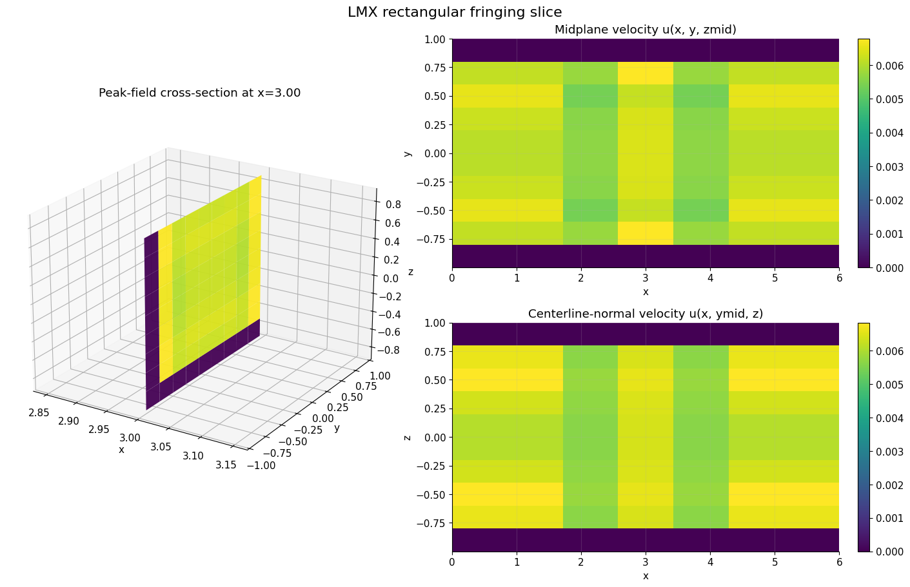
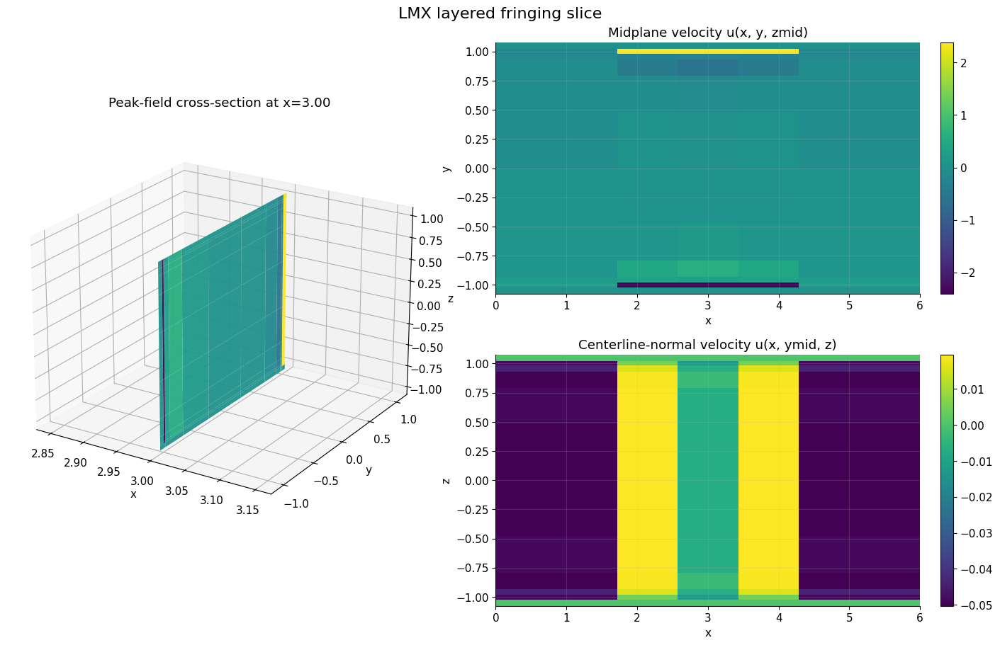

# LMX

[](https://github.com/uwplasma/LMX/actions/workflows/ci.yml)
[](https://github.com/uwplasma/LMX/actions/workflows/docs.yml)


LMX is a JAX-native inductionless MHD code for structured meshes. It ships a
validated fully developed solver family, a retained 3D `extruded_inductionless`
fringing-field lane, restartable CLI workflows, strong-scaling tooling, and a
differentiable workflow for sensitivity analysis and inverse design.

## Why use LMX

- Fully developed Hartmann, Shercliff, and Hunt workflows
- Rectangular, layered, and mapped-pipe geometry support
- JAX-based CPU and GPU execution
- Explicit conservation diagnostics for charge closure and boundary-current audits
- Input-file and Python-driver workflows
- Publication-oriented plots, movies, and validation reports
- Autodiff examples for inverse design and sensitivity analysis

## Installation

Minimal install:

```bash
git clone https://github.com/uwplasma/LMX
cd LMX
python -m pip install -e .
```

Full development install:

```bash
python -m pip install -e '.[dev,plotting,docs,extras]'
```

LMX supports Python `3.10+`, falls back to `tomli` on Python `3.10`, and works
with the installed JAX/JAXLIB pair rather than pinning a narrow runtime window.

## Quick start

CLI:

```bash
lmx examples/hartmann_case.toml
lmx examples/hunt_case.toml
lmx examples/fringing_rect_case.toml
lmx run fringing_layered --ha 20 --nx-stations 21 --wall-cells 1 --insulator-cells 1 --output out/fringing_layered
```

Python:

```python
from lmx.cases import make_hartmann_case
from lmx.solvers import solve_steady

case = make_hartmann_case(ha=20.0, ny=48, nz=48)
solution = solve_steady(case)
print(solution.diagnostics.residual_history[-1])
```

Backend selection from the shell:

```bash
JAX_PLATFORMS=cpu OMP_NUM_THREADS=8 lmx examples/hartmann_case.toml
CUDA_VISIBLE_DEVICES=0 JAX_PLATFORMS=cuda lmx examples/hunt_case.toml
XLA_FLAGS=--xla_force_host_platform_device_count=8 JAX_PLATFORMS=cpu OMP_NUM_THREADS=1 lmx examples/hartmann_case.toml
```

For publication-style scaling studies, use:

```bash
python examples/strong_scaling_demo.py --output artifacts/examples/strong_scaling_cpu
python examples/strong_scaling_demo.py --remote-host office --output artifacts/examples/strong_scaling_full
```

## Showcase

### Geometries

LMX currently ships rectangular ducts, layered ducts, and mapped pipe O-grids.


### 2D and 3D startup movies

These README assets are generated from the retained `examples/readme_showcase_demo.py`
workflow and show a short Hunt startup sequence in 2D and 3D.

<p align="center">
  
  
</p>

### 3D fringing-field figures

The retained publication set currently includes rectangular and layered 3D
fringing figures. The mapped-pipe lane is validated on conservation metrics and
kept qualitative on external profile comparison.

<p align="center">
  
  
</p>

### Scaling and autodiff


## Validation status

The current retained validation surface includes:

- fast CI under a five-minute routine budget
- strict docs build
- restartable TOML and CLI workflows
- internal conservation and fringing-physics gates on `rect_duct`, `layered_duct`, and `pipe_ogrid`
- mapped-pipe external comparison kept explicitly qualitative
- widened bounded manual fringing campaign at `Ha = 10, 20, 30`, `resolution = 8`

The widened bounded manual campaign is intentionally stricter than the release
gate. On the current tree it confirms the 3D fringing set at `Ha = 10, 20, 30`
for `rect_duct`, `layered_duct`, and `pipe_ogrid`, and it also exposes one
remaining fully developed issue: Hunt at `Ha = 10`, `resolution = 8` still
fails the heavier interface-current threshold.

The heavier retained 3D validation campaign is generated with:

```bash
python examples/extruded_validation_campaign.py --output artifacts/examples/extruded_validation_campaign --ha-values 10,20 --resolutions 10,14 --fringing-nx 5
python scripts/run_manual_solver_family_validation.py --output artifacts/manual_validation/solver_family_summary.json --ha-values 10,20 --resolutions 8,12 --include-fringing --fringing-geometries rect_duct,layered_duct,pipe_ogrid --fringing-nx 5 --max-steps 12 --potential-iterations 48 --coupling-iterations 8 --write-csv --write-plot
```

## Examples

Useful entry points:

- `examples/readme_showcase_demo.py`: regenerates the README media bundle
- `examples/geometry_panel_demo.py`: static geometry panel
- `examples/fringing_benchmark_demo.py`: retained fringing benchmark plots
- `examples/extruded_paper_figures.py`: reviewer-facing 3D fringing figures
- `examples/autodiff_sensitivity_demo.py`: Hartmann sensitivities
- `examples/autodiff_extruded_trajectory_demo.py`: deeper extruded autodiff target matching
- `examples/variable_field_geometry_demo.py`: Python-native geometry and field editing

## Documentation

The detailed documentation lives under [`docs/`](docs/) and covers:

- equations and physics model
- numerics and solver structure
- geometry and mesh handling
- input reference and CLI usage
- testing and validation strategy
- autodiff and performance workflows

Build locally with:

```bash
python -m sphinx -W -b html docs docs/_build/html
```

## Testing

Fast routine gate:

```bash
python -m pytest -m "unit or validation"
```

Focused coverage or solver work should stay bounded; runs over five minutes are
explicitly treated as failures for routine local development.

## License

LMX is released under the [MIT License](LICENSE).
