# LMX

[](https://github.com/uwplasma/LMX/actions/workflows/ci.yml)
[](https://github.com/uwplasma/LMX/actions/workflows/docs.yml)


LMX is a JAX-native inductionless MHD code for structured meshes. It provides
fully developed duct solvers, a 3D `extruded_inductionless` fringing-field
solver lane, restartable CLI workflows, strong-scaling tooling, and
differentiable workflows for sensitivity analysis and inverse design.

## Why use LMX

- Fully developed Hartmann, Shercliff, and Hunt workflows
- Rectangular, layered, mapped-pipe, and bent-pipe geometry support
- Executable analytic variable-field duct workflows
- Layered and curved-pipe variable-field research drivers
- Tabulated 3D magnetic-field support through Python and TOML/CLI
- JAX-based CPU and GPU execution
- Explicit conservation diagnostics for charge closure and boundary-current audits
- Input-file and Python-driver workflows
- Built-in plots, movies, and validation reports
- Autodiff examples for inverse design and sensitivity analysis

## Installation

Minimal install:

```bash
git clone https://github.com/uwplasma/LMX
cd LMX
python -m pip install -e .
```

Full development install:

```bash
python -m pip install -e '.[dev,plotting,docs,extras]'
```

LMX supports Python `3.10+`, falls back to `tomli` on Python `3.10`, and works
with the installed JAX/JAXLIB pair rather than pinning a narrow runtime window.

## Quick start

CLI:

```bash
lmx examples/hartmann_case.toml
lmx examples/hunt_case.toml
lmx examples/fringing_rect_case.toml
lmx run fringing_layered --ha 20 --nx-stations 21 --wall-cells 1 --insulator-cells 1 --output out/fringing_layered
```

Python:

```python
from lmx.cases import make_hartmann_case
from lmx.solvers import solve_steady

case = make_hartmann_case(ha=20.0, ny=48, nz=48)
solution = solve_steady(case)
print(solution.diagnostics.residual_history[-1])
```

Live runtime feedback:

- the CLI logger prints `Progress` lines with completed step fraction, average
  wall time per step, estimated remaining time, and estimated total runtime
- the generated run summary JSON now includes `execution_seconds`, so example,
  benchmark, and CLI runs can be compared on the same host without parsing logs

Post-processing from Python:

```python
from lmx import (
    make_hartmann_case,
    solve_steady,
    solve_case_snapshots,
    write_case_overview_plots,
    write_geometry_preview_plots,
    write_transient_movies,
)

case = make_hartmann_case(ha=20.0, ny=32, nz=32)
steady = solve_steady(case)
write_geometry_preview_plots(steady.mesh, "out/geometry", case_title=case.name)
write_case_overview_plots(steady, "out/steady", case_title=case.name)
frames = solve_case_snapshots(case, frame_count=40)
write_transient_movies(frames, "out/movies", case_title=case.name, output_stem="hartmann_startup")
```

Backend selection from the shell:

```bash
JAX_PLATFORMS=cpu OMP_NUM_THREADS=8 lmx examples/hartmann_case.toml
CUDA_VISIBLE_DEVICES=0 JAX_PLATFORMS=cuda lmx examples/hunt_case.toml
XLA_FLAGS=--xla_force_host_platform_device_count=8 JAX_PLATFORMS=cpu OMP_NUM_THREADS=1 lmx examples/hartmann_case.toml
```

For larger scaling studies, use:

```bash
python examples/strong_scaling_demo.py --output artifacts/examples/strong_scaling_cpu
python examples/strong_scaling_demo.py --remote-host office --output artifacts/examples/strong_scaling_full
```

## Showcase

### Geometry and flow states

The top panel shows the three geometry families and the actual mesh or
wall layout each solver sees:

- Hartmann flow in a rectangular duct
- Hunt flow in a layered duct with conducting side walls
- a mapped-pipe O-grid for fringing-field studies

LMX solves liquid-metal duct and pipe flows in imposed magnetic fields. No
plasma background is needed to read the figures:

- a `rect_duct` is a plain rectangular channel
- a `layered_duct` adds wall materials around that channel so conducting and
  insulating walls can be represented explicitly
- a `pipe_ogrid` is the same idea in a circular pipe with an O-grid mesh
- a `bent_pipe` is the same mapped-pipe cross-section carried along a curved
  centerline; LMX now exposes this as a low-De inductionless baseline and
  geometry QA path

The two most important benchmark ideas in the README are:

- `Hunt` flow:
  liquid metal in a rectangular duct with conducting walls parallel to the
  imposed field, insulating Hartmann walls, and a transverse magnetic field
- `fringing field`:
  a magnetic field that changes along the flow direction instead of staying
  uniform, which makes the problem fully 3D because the fluid accelerates and
  redistributes as it enters and leaves the magnetized region

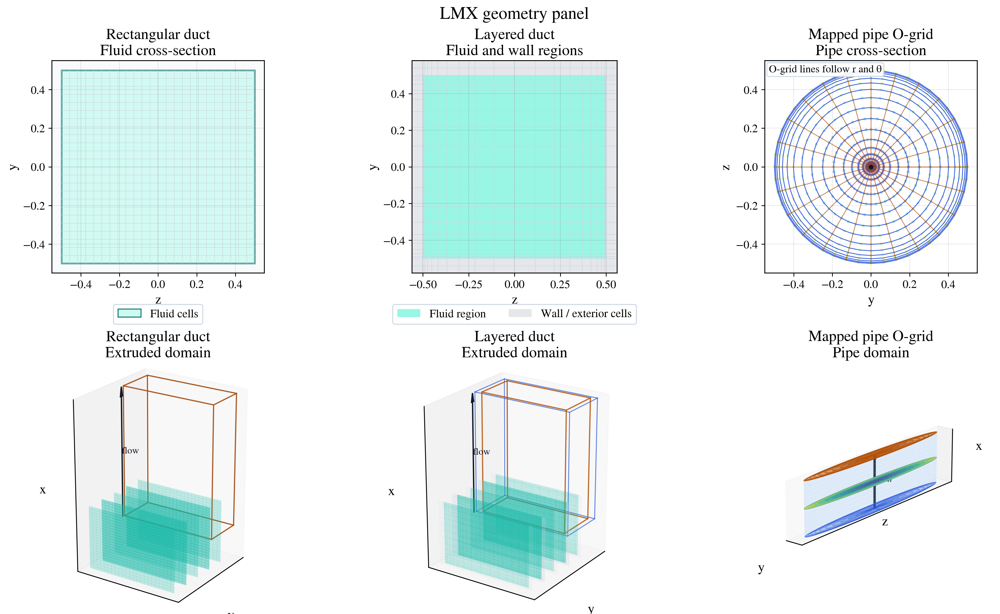

Those geometries are not shown in isolation in the rest of the README:

- the startup GIFs below use the layered Hunt geometry
- the fringing overview below uses the rectangular extruded 3D geometry
- the mapped-pipe workflow is exercised through the fringing CLI/TOML and the
  pipe comparison example in `examples/pipe_reference_comparison_demo.py`
- the bent-pipe workflow is exercised through
  `examples/bent_pipe_inductionless_demo.py`

### Bent-pipe inductionless baseline

LMX now includes a curved-centerline bent-pipe baseline built on the same
inductionless pipe cross-section used by the mapped-pipe fringing lane. The
current benchmark is intentionally the low-De limit: for sufficiently small
Dean number, the local axial profile should remain close to the straight-pipe
reference, while throughput and current closure remain bounded. That is the
right first validation step before adding explicit Dean-vortex or higher-inertia
physics.

This baseline is anchored to the classic Dean small-curvature limit and to the
later curved-duct benchmark literature that treats secondary-flow intensity as
the key observable as Dean number increases:

- [Dean’s curved-pipe limit](https://www.sciencedirect.com/science/article/abs/pii/S0142727X20307669)
- [A new benchmark for the secondary fluid flow through curved ducts](https://doi.org/10.1016/j.ces.2021.117196)
- [MHD formulations for the liquid metal flow in a curved pipe of circular cross section](https://www.sciencedirect.com/science/article/abs/pii/S0045793015001802)

The current LMX bent-pipe lane is the low-De inductionless baseline, not yet a
full Dean-vortex solver. The public example writes the geometry preview, the
mid-bend flow panel, and a machine-readable validation summary.

On the current bounded example (`Ha = 20`, `R = 0.45`, `R_c = 3.6`,
`15 × 18 × 40`), the bent-pipe baseline matches the straight-pipe reference to
machine precision on the local comparison cuts (`cross_section_l2_error = 0`,
`centerline_l2_error = 0`), while keeping
`max_charge_balance_residual ≈ 2.15e-2` and
`volumetric_flow_rate_span ≈ 1.14e-9`.

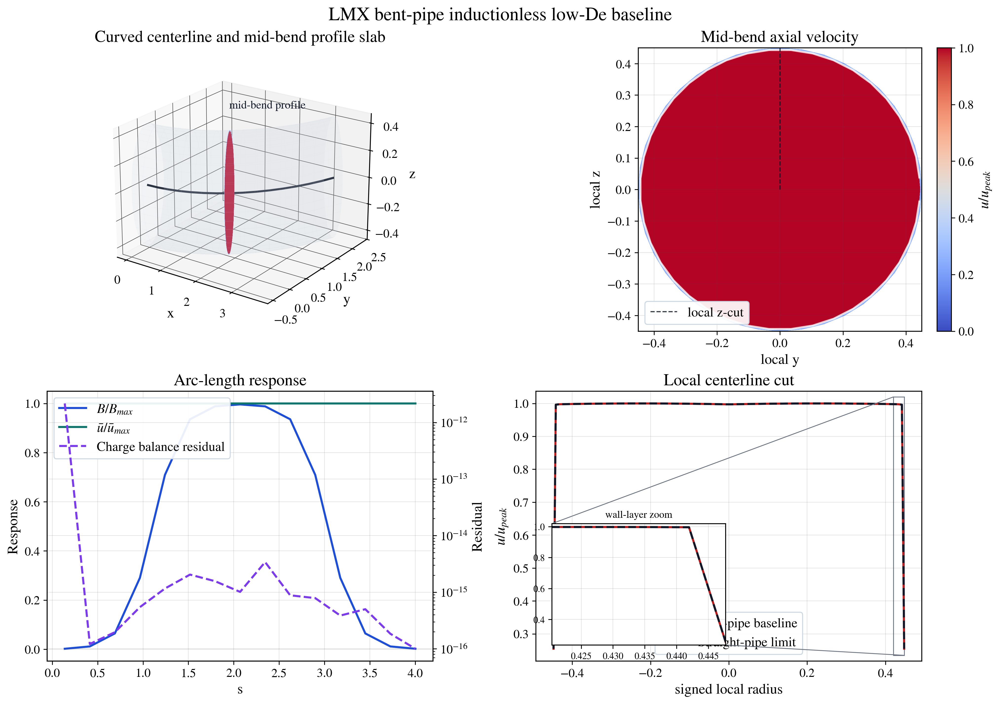

The panel is meant to be read left to right, then top to bottom:

- the 3D slab shows the curved centerline and the local mid-bend profile plane
- the cross-section panel shows the normalized axial velocity at the bend midpoint
- the response panel overlays `B/Bmax`, mean velocity, and charge-balance residual
  along the arc length
- the cut panel compares the bent-pipe and straight-pipe low-De limits and now
  includes a wall-layer zoom rather than only the full-radius view

### Variable-field extruded duct

LMX now also supports executable rectangular `extruded_inductionless` solves
with analytic cross-sectional magnetic fields through the Python API. The
current public lane uses a divergence-free analytic field model, runs the full
extruded duct solve, writes the field preview and extruded response plots, and
checks both field divergence and 3D conservation metrics.

This is the right next step after the uniform-field fringing benchmarks: it
keeps the geometry fixed while broadening the admissible magnetic-field models
that can drive the 3D inductionless response.

The same field API now also drives:

- layered duct variable-field solves
- straight-pipe variable-field solves
- bent-pipe low-De variable-field comparisons against the matching straight-pipe limit
- tabulated-field extruded solves through both Python examples and TOML input files

The tabulated rectangular lane is exercised by
`examples/variable_field_tabulated_demo.py` and
`examples/fringing_tabulated_case.toml`.

### Benchmark C baseline

LMX now includes a first Benchmark C baseline as a quasi-2D Hartmann-friction
decay problem. This is not a turbulent closure yet. It is the first executable
Q2D validation surface: a 2D mode decays under diffusion plus Hartmann-friction
drag and is compared against the corresponding analytic exponential decay.

LMX also now includes the first forced Benchmark C slice: a periodic Q2D mode
driven to a steady state and compared against the corresponding analytic forced
solution.

The next wall-bounded Q2D slice is now also executable: a no-slip duct mode
forced inside a rectangular box and compared against the exact transient
Dirichlet solution. That closes the gap between the periodic baseline and the
first wall-bounded Q2D validation surface.

### Benchmark D first slice

LMX now includes a stronger executable magnetic-obstacle benchmark on the
rectangular extruded solver lane. This is still a low-inertia inductionless
slice, not a turbulent magnetic-obstacle solver, but it now compares the
obstacle case directly against a matched no-field reference and reports
normalized response observables rather than only baseline internal metrics.

The main driver is `examples/magnetic_obstacle_benchmark.py`. On the current
bounded case (`24 × 24 × 17`, localized obstacle field, matched no-field
reference), it reports:

- `peak_velocity_deficit_ratio ≈ 3.23e-2`
- `peak_centerline_deficit_ratio ≈ 3.76e-1`
- `integrated_velocity_deficit_ratio ≈ 2.78e-2`
- `recovery_station ≈ 4.76`
- `peak_pressure_excess ≈ 5.01e-1`
- `pressure_excess_proxy ≈ 1.22e-1`
- `current_proxy_peak ≈ 4.56`
- `peak_crosscut_distortion ≈ 2.31e-1`
- `max_charge_balance_residual ≈ 3.98e-13`

That is the current reviewer-facing Benchmark D slice: a real 3D obstacle
response benchmark with measurable wake deficit, streamwise recovery, pressure
growth, cross-sectional distortion, and clean conservation.

LMX now also reports a literature-facing validation view on the same case:
`peak_station ≈ 3.00`, `normalized_recovery_distance ≈ 6.25e-1`, and
`literature_pass = true` for the current bounded obstacle slice.

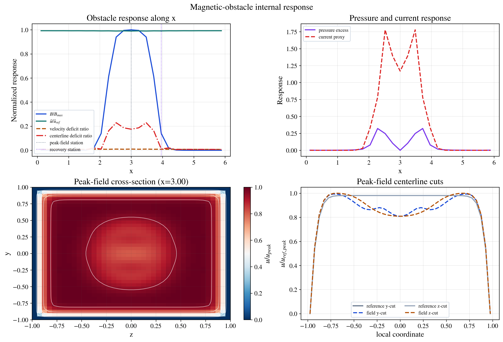

To push beyond that single bounded point, LMX also now includes
`examples/magnetic_obstacle_regime_scan.py`, which sweeps obstacle runs over
field scale and forcing and writes a compact response map. That scan is the
current bridge from the low-inertia baseline toward stronger-inertia Benchmark
D cases, while keeping the routine example and test surface bounded.

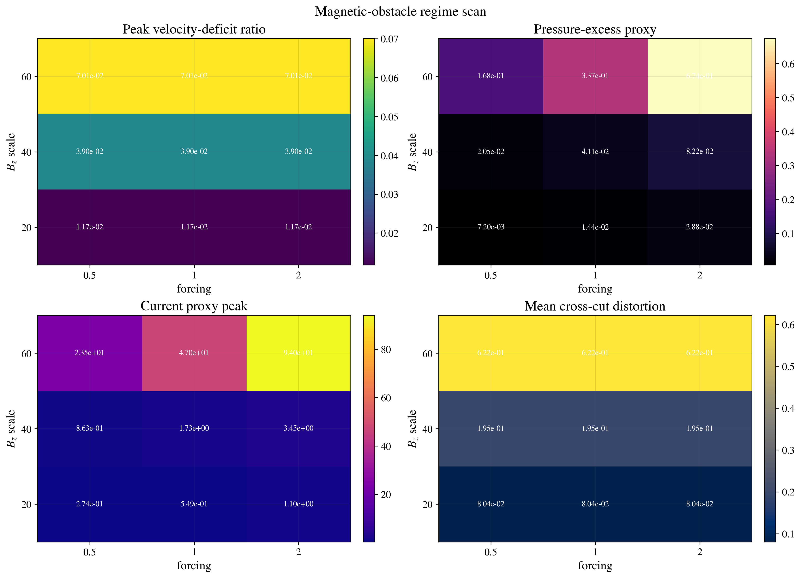

LMX now also includes a tabulated WHAM-like mirror-field pipe lane and a
matching differentiable pressure-drop sensitivity study. The executable driver
is `examples/wham_mirror_pipe_demo.py`: it writes the tabulated 3D field,
solves the pipe crossing that field, and exports the field preview plus a
dedicated WHAM overview showing the mirror coils, centerplane field contours,
the pipe location, and the solved velocity cross-section at peak field. The
paired reduced differentiable study is
`examples/autodiff_wham_pressure_sensitivity.py`, which treats the same WHAM
mirror topology as a stationwise field profile and differentiates a
pressure-drop proxy with respect to coil separation.

The executable WHAM lane is useful today for field loading, geometry context,
and conservation auditing. The new overview figure shows exactly that: the pipe
passes across the mirror field, the centerplane field contours are sampled from
the tabulated 3D field, and the colored disk is the solved axial velocity slice
inside the pipe at the station of peak field.

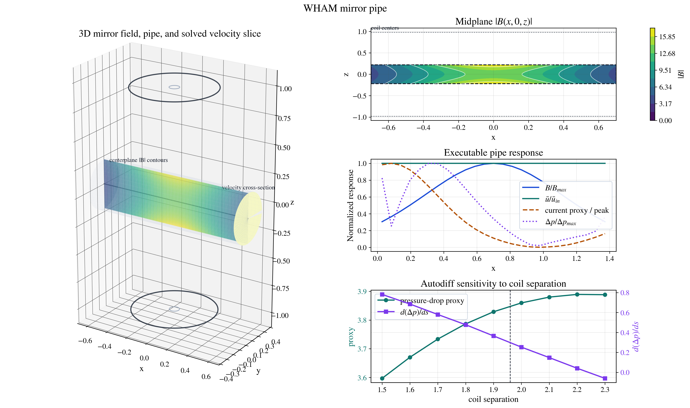

At the current reference separation (`1.96 m`), the reduced differentiable
lane gives `pressure_drop_proxy ≈ 3.85` and `d(Δp)/ds ≈ 2.98e-1`, with a
smooth monotone pressure-drop trend over the tested separation sweep. The full
executable tabulated-pipe solve remains a stable field-loading and conservation
baseline, but its nominal-WHAM low-Re response is still much weaker than the
rectangular magnetic-obstacle benchmark above.

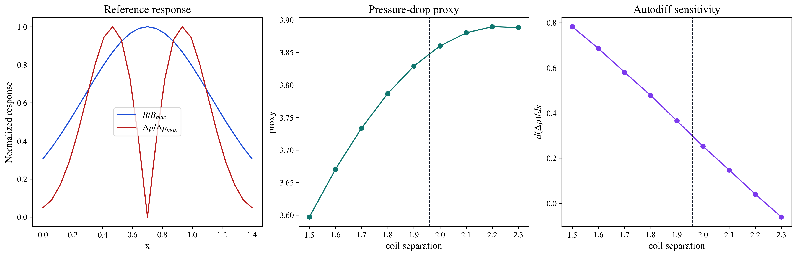

### Straight-duct setup

The standalone straight-duct showcase scripts build the same Shercliff/Hunt
family from explicit geometry, material, and mesh parameters. The first figure
labels the wall-material layout used by the Shercliff and Hunt benchmarks, and
the second shows the clustered structured mesh used to resolve the Hartmann
layers.

<p align="center">
  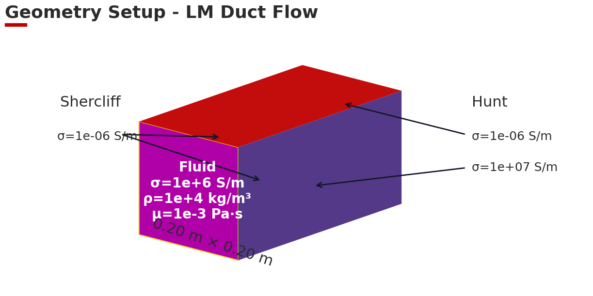
  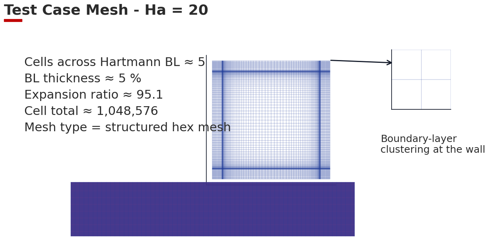
</p>

The straight-duct comparison workflow now bundles the three canonical
fully-developed checks at `Ha = 20`: Hartmann, Shercliff, and Hunt. The panel
shows the Hartmann centerline together with a wall-layer zoom, then the
Shercliff and Hunt `y` and `z` cuts against the same bundled analytical
references used by the validation utilities. The artifact is generated
directly from `examples/straight_duct_profile_comparison.py`, which uses a
bounded `37 × 37` cross-section with no-slip wall reconstruction when matching
cell-centered LMX profiles against analytical wall-to-wall curves. With the
corrected implicit Lorentz reaction split, the retained cuts now meet the
manuscript-facing `L2 <= 1.2e-2` target: Hartmann `1.15e-2`, Shercliff
`7.46e-3 / 7.22e-3`, and Hunt `8.96e-3 / 5.99e-3`.

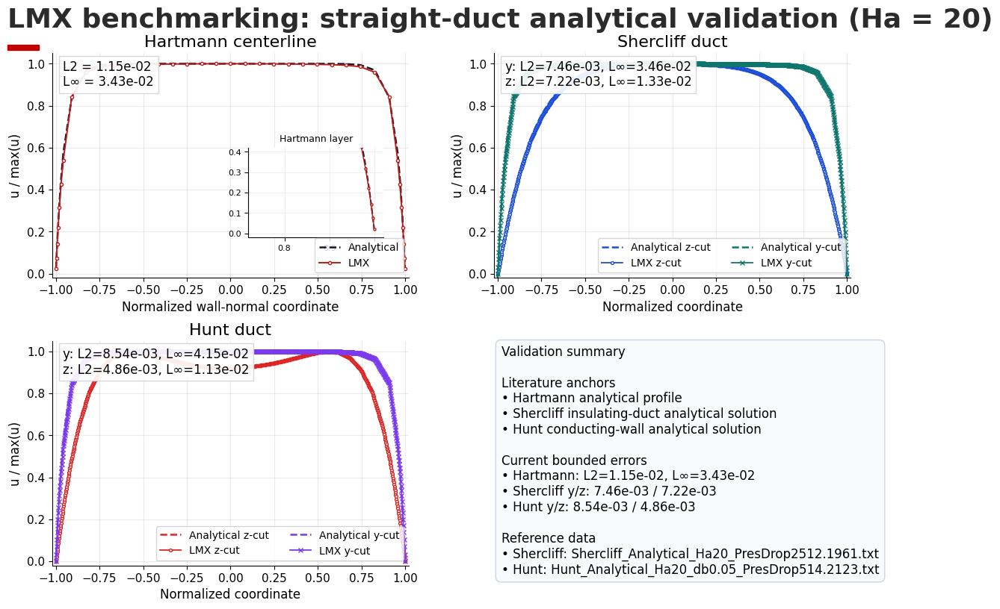

For the literature-style ladder, `examples/straight_duct_validation_ladder.py`
now writes the bounded Shercliff/Hunt multi-`Ha` validation panel used in the
testing docs. The current checked ladder runs `Ha = 20` and `Ha = 100` on the
same normalized `y` and `z` cuts and keeps the reference filenames in the
summary JSON so the later paper figures remain traceable to the bundled
analytical datasets.

`examples/hartmann_validation_ladder.py` now does the same for the Hartmann
centerline, including a wall-layer zoom and a checked summary JSON, so the
straight-duct manuscript lane is no longer relying on a single Hartmann panel
embedded only inside the broader comparison figure.

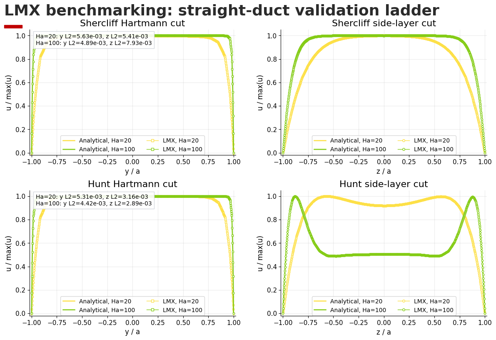

### 2D and 3D startup movies

These README assets are generated from `examples/readme_showcase_demo.py` and
show Hunt startup in 2D and 3D over `t = 0` to `t = 2 ms`. Hunt flow uses a
layered duct with conducting side walls and insulating Hartmann walls, so the
startup sequence develops thin Hartmann layers at the insulating walls and
the characteristic Hunt side jets along the conducting walls. The run starts
from a flat plug-flow profile, time is shown in physical units, and all solved
timesteps are written to the GIF. The 2D panel carries the transient `y`- and
`z`-centerline diagnostics so the layer growth can be read directly from the
movie, while the 3D panel shows a streamwise-velocity profile slab embedded
inside the duct so the evolving Hunt profile can be read in the full geometry.
The README regeneration path uses a bounded `57 × 57` cross-section with
`dt = 1e-5 s`, `t_final = 2e-3 s`, `coupling_iterations = 8`, and
`potential_iterations = 80`, plus `8` wall cells on the Hunt geometry. Heavy example reruns now also populate a local
JAX compilation cache under `artifacts/jax_cache` so repeated runs on the same
host do not pay the full cold-compile cost every time.

<p align="center">
  
  
</p>

### Fringing-field response

The 3D fringing overview shows the imposed magnetic-field ramp, the response of
the streamwise velocity, the pressure span, and the charge/current diagnostics
for a rectangular duct in one place.

Here the magnetic field is weak upstream, ramps up inside the magnet region,
and drops again downstream. That axial field variation is what “fringing” means
in this context. The committed overview is generated on a `24 × 24 × 33`
cross-section/station grid so the axial histories and cross-sectional panels
are not limited by a coarse axial sweep.

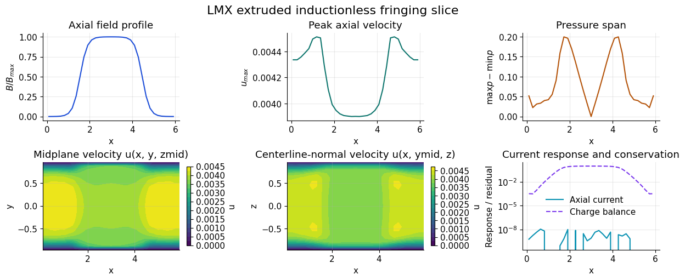

### Scaling and autodiff

The scaling panel below is a fixed-problem strong-scaling benchmark for a dense
structured-grid `extruded3d` inductionless MHD operator. Solid lines are
measured warm runtimes and speedups; the dashed line is ideal linear speedup.
The current figure uses a `2048×64×64` CPU case with `1024` operator
iterations and a `6144×96×96` GPU case with `4096` operator iterations, so the
device curves come from minute-scale kernels instead of short smoke tests. The
CPU panel is limited to `1, 2, 4` devices, which is where the current host
still shows a meaningful reduction in warm runtime.

Measured warm-runtime points:

- CPU: `79.45 s`, `68.68 s`, `64.09 s` at `1, 2, 4`
- GPU: `78.58 s`, `62.52 s` at `1, 2`

On this workstation the CPU curve improves through `4` logical devices, while
the two-GPU path keeps the cleaner strong-scaling trend on the larger fixed
problem.

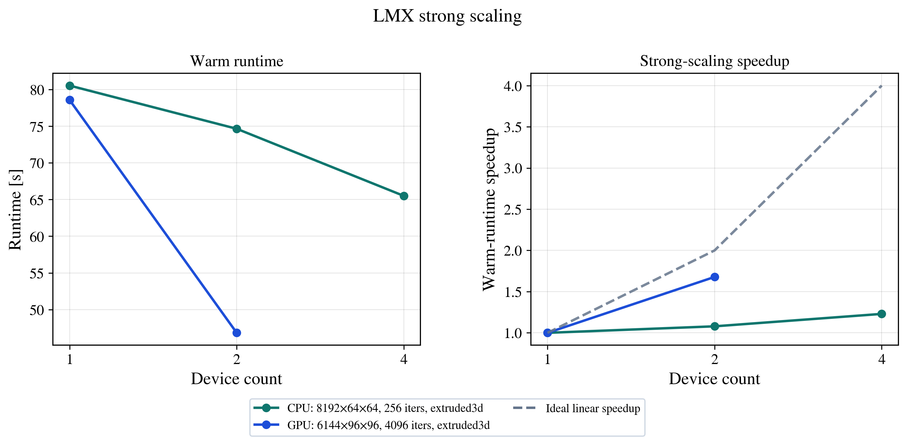

The autodiff panel summarizes two things: the mean velocity and its sensitivity
to Hartmann number on the left, and a simple inverse-design loop recovering the
forcing on the right. The left panel shows the expected decrease in throughput
as Hartmann layers strengthen. The right panel shows the optimizer recovering
the forcing that generated the target profile while the loss falls by several
orders of magnitude.

## Meshing

LMX uses structured meshes. The user controls resolution directly through the
input file or Python case object:

- `ny`, `nz` for rectangular and layered ducts
- `wall_cells`, `wall_thickness`, and `insulator_cells` when wall materials are
  modeled explicitly
- `nx_stations` for the axial resolution of `extruded_inductionless`
- `nr`, `ntheta`, and `radius` for `pipe_ogrid`

The practical rule is to resolve the thin boundary layers before trusting a
benchmark or design study. For Hartmann and Hunt problems, increase `ny` and
`nz` until flow rate, current diagnostics, and interface-current residuals stop
moving materially. For fringing-field studies, refine both the cross-section and
the axial stations until pressure span, charge-balance residuals, and
throughput variation stabilize.

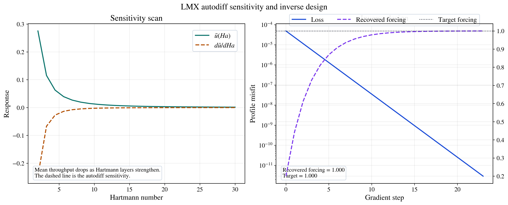

## Validation status

The current validation surface includes:

- fast CI under a five-minute routine budget
- strict docs build
- restartable TOML and CLI workflows
- internal conservation and fringing-physics gates on `rect_duct`, `layered_duct`, and `pipe_ogrid`
- mapped-pipe external comparison now uses one shared velocity normalization
  across all transverse lines, and currently exposes a real high-`Ha`,
  high-`Re` parity gap rather than hiding it behind per-line normalization
- widened bounded manual fringing campaign at `Ha = 10, 20, 30`, `resolution = 8`
- a standalone quantitative Benchmark B summary driver for rectangular, layered,
  and mapped-pipe fringing cases
- dense duct Benchmark B at `24 × 24 × 33` closes `rect_duct` on raw internal
  metrics; `layered_duct` now uses symmetry-aware closure metrics because the
  Hunt fringing response is odd/even about the field midplane rather than
  span-minimizing. On the heavier layered closure run at `Ha = 20`,
  `18 × 18 × 21`, the retained layered metrics are
  `axial_current_mirror_residual ≈ 1.88e-7`,
  `pressure_span_mirror_residual ≈ 2.67e-5`,
  `center_axial_current ≈ -8.10e-8`, and
  `center_pressure_span ≈ 9.56e-6`

The widened bounded manual campaign is intentionally stricter than the release
gate. On the current tree it confirms the 3D fringing set at `Ha = 10, 20, 30`
for `rect_duct`, `layered_duct`, and `pipe_ogrid`, and the repaired fully
developed Hunt low-resolution row now also passes that heavier conservation
check. On the bounded `Ha = 10`, `resolution = 8` manual run, the Hunt
interface-current residual is now `≈ 1.27e-2` instead of the old failing
`≈ 4.20e-1`.

The heavier 3D validation campaign is generated with:

```bash
python scripts/run_full_validation_exercise.py --output artifacts/validation/full_validation_exercise --ha-values 10,20 --resolution 12 --fringing-resolutions 8,12 --skip-paraview --write-plot
python scripts/run_benchmark_b_quantitative.py --output artifacts/validation/benchmark_b_quantitative --ha-peak 20 --duct-ny 20 --duct-nz 20 --pipe-nr 20 --pipe-ntheta 80 --nx-stations 21 --max-steps 24 --coupling-iterations 12 --potential-iterations 80
python examples/extruded_validation_campaign.py --output artifacts/examples/extruded_validation_campaign --ha-values 10,20 --resolutions 10,14 --fringing-nx 5
python scripts/run_manual_solver_family_validation.py --output artifacts/manual_validation/solver_family_summary.json --ha-values 10,20 --resolutions 8,12 --include-fringing --fringing-geometries rect_duct,layered_duct,pipe_ogrid --fringing-nx 5 --max-steps 12 --potential-iterations 48 --coupling-iterations 8 --write-csv --write-plot
```

When run from the source tree, the closed-channel validation commands use the
bundled reference dataset under `external/FreeMHDPaperAllFigures/.../ClosedChannel`
by default, so an explicit `--reference-root` is only needed when comparing
against a different dataset.

## Examples

Useful entry points:

- `examples/readme_showcase_demo.py`: regenerates the README media bundle
- `examples/straight_duct_geometry_and_mesh.py`: geometry/setup and structured mesh figures for Shercliff/Hunt straight ducts
- `examples/shercliff_showcase.py`: Shercliff boundary-layer, annotated cross-section, 3D profile, and startup media
- `examples/hunt_showcase.py`: Hunt boundary-layer, annotated cross-section, 3D profile, and startup media
- `examples/straight_duct_profile_comparison.py`: analytical versus LMX Shercliff/Hunt profile overlay
- `examples/freemhd_closed_channel_parity.py`: fresh LMX versus FreeMHD transient parity and runtime comparison on the same host
- `examples/freemhd_closed_channel_observable_parity.py`: normalized `u`, gauge-shifted `potE`, `J`, and `J×B_x` parity against the bundled FreeMHD paper slices with case-specific validated settings
- `examples/plotting_api_demo.py`: direct import-and-plot post-processing workflow
- `examples/geometry_panel_demo.py`: geometry previews plus paired geometry/simulation panel
- `examples/fringing_benchmark_demo.py`: 3D fringing benchmark plots
- `examples/extruded_summary_figures.py`: extra fringing-figure generator used by the docs asset workflow
- `examples/autodiff_sensitivity_demo.py`: Hartmann sensitivities
- `examples/autodiff_extruded_trajectory_demo.py`: deeper extruded autodiff target matching
- `examples/variable_field_geometry_demo.py`: Python-native geometry and field editing

## Documentation

The detailed documentation lives under [`docs/`](docs/) and covers:

- equations and physics model
- numerics and solver structure
- geometry and mesh handling
- input reference and CLI usage
- testing and validation strategy
- autodiff and performance workflows

Build locally with:

```bash
python -m sphinx -W -b html docs docs/_build/html
```

## Testing

Fast routine gate:

```bash
python -m pytest -m "unit or validation"
```

Focused coverage or solver work should stay bounded; runs over five minutes are
explicitly treated as failures for routine local development.

## License

LMX is released under the [MIT License](LICENSE).
