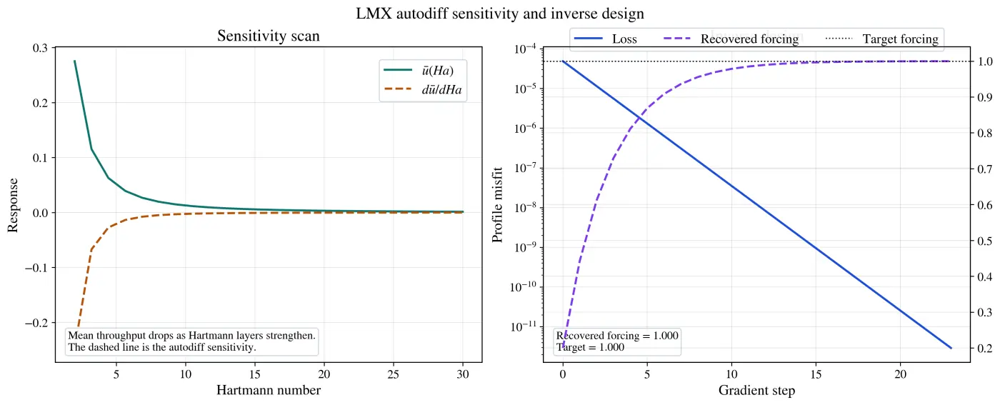

# LMX

[](https://github.com/uwplasma/LMX/blob/main/pyproject.toml)
[](https://docs.jax.dev/)
[](https://lmx.readthedocs.io/)
[](https://github.com/uwplasma/LMX/blob/main/LICENSE)

**LMX is JAX-native inductionless liquid-metal MHD for CPUs and GPUs.**
Verified: Hartmann, Shercliff, and Hunt ducts, conducting walls, and selected
differentiable workflows. Research-stage: imposed 3D/fringe fields, magnetic
obstacles, Q2D turbulence, blanket models, and extruded flows.

[Documentation](https://lmx.readthedocs.io/) ·
[Quickstart](https://lmx.readthedocs.io/en/latest/getting_started.html) ·
[Examples](https://lmx.readthedocs.io/en/latest/case_cookbook.html) ·
[Validation](https://lmx.readthedocs.io/en/latest/benchmark_matrix.html) ·
[Roadmap](https://github.com/uwplasma/LMX/blob/main/plan.md)


## Install and run

```bash
git clone https://github.com/uwplasma/LMX.git
cd LMX && python -m pip install -e '.[visualization]'
lmx examples/hartmann_case.toml
```

```python
from lmx import make_hartmann_case, solve_steady

solution = solve_steady(make_hartmann_case(ha=20, ny=48, nz=48))
print(solution.diagnostics.volumetric_flow_rate_history[-1])
```

TOML/Python cases support restarts, diagnostics, plots, and checksummed artifacts.
For the lean core, use `pip install -e .`; see the
[case cookbook](https://lmx.readthedocs.io/en/latest/case_cookbook.html).

## Capabilities

✅ native/documented · ◐ partial/research · — no named native workflow

| Capability | LMX | [FreeMHD](https://github.com/PlasmaControl/FreeMHD) | [NekRS](https://nekrs.readthedocs.io/en/latest/) |
|---|:---:|:---:|:---:|
| Inductionless electric-potential LM MHD | ✅ | ✅ | — |
| Full-induction / finite-Rm MHD | — | —¹ | ◐ research |
| Verified high-Hartmann duct benchmarks | ✅ | ✅ | — |
| 3D imposed/fringing-field LM workflow | ◐ | ✅ | — |
| Conducting/insulating wall-current closure | ✅ | ✅ | — |
| Fully 3D transient MHD | ◐ extruded | ✅ | ◐ research |
| Free-surface / two-phase MHD | — | ✅ | — |
| Fluid–solid conjugate heat transfer | — | ✅ | ✅ |
| Turbulence models | ◐ Q2D | ◐ OpenFOAM | ✅ LES/RANS |
| Curved / complex 3D meshes | ◐ mapped | ✅ | ✅ |
| Parallel CPU solver | ◐ | ✅ | ✅ |
| Single-GPU execution | ✅ | — | ✅ |
| Multi-GPU execution | ◐ B2 | — | ✅ |
| Selected reverse-mode AD workflows | ✅ | — | — |
| Published liquid-metal experiment comparison | ◐ | ✅ | — |

¹ [FreeMHD2](https://arxiv.org/abs/2606.18745) is a separate finite-Rm extension.
Sources: [FreeMHD paper](https://doi.org/10.1063/5.0230242),
[solver](https://github.com/PlasmaControl/FreeMHD/blob/main/MHD_Solvers/solvers/epotMultiRegionInterFoam/epotMultiRegionInterFoam.C),
[NekRS](https://nekrs.readthedocs.io/en/latest/), [MHD extension](https://doi.org/10.2172/2453867),
[GPU scaling](https://doi.org/10.1016/j.parco.2022.102982).

## Verified duct MHD

Eight frozen high-Hartmann rows pass; audited closed-channel FreeMHD
observables pass the 1% finite-grid gate.


<p align="center">
  
  <br><em>Legacy bounded transient; a steady-gated replacement is pending an idle-host run.</em>
</p>

[Validation evidence →](https://lmx.readthedocs.io/en/latest/validation_report.html)

## Real geometries and nonuniform fields

<p align="center">
  
  
</p>


B2 passes exact restart and schema-6 topology gates (1/2/4 CPU; 1/2 GPU).
Shared-norm acceleration and production parity remain open; multi-minute
Docker CPU-allocation scaling is accepted, while exact-core and idle-host GPU
timing remain open.
[Fringing status →](https://lmx.readthedocs.io/en/latest/fringing.html)

## Follow curved pipes


Mapped pipes have a low-De inductionless baseline; Dean vortices await their
literature gate. [Geometry status →](https://lmx.readthedocs.io/en/latest/geometry.html)

## Model conducting multilayer walls


At `Ha = 220`, research-stage Li/AlN pressure/current change below 10% per mesh
step; experiment/blanket validation remain open. [Wall models →](https://lmx.readthedocs.io/en/latest/wall_models.html)

## Differentiate selected workflows



Promoted objectives pass finite-difference/independent-transpose checks.
[Differentiable workflows →](https://lmx.readthedocs.io/en/latest/autodiff.html)

## Explore research flows

<p align="center">
  
  
</p>

<p align="center">
  
</p>

The blanket loop stops at its accepted 18-update steady window. The Q2D loop
is a weakly forced legacy transient (7.014 s), not a statistically steady
result. Quantitative turbulent Q2D-MHDfoam parity and blanket validation remain
open.
[Geometry and fields →](https://lmx.readthedocs.io/en/latest/geometry.html) ·
[External benchmarks →](https://lmx.readthedocs.io/en/latest/external_benchmarks.html)

## Scale on CPUs and GPUs


The callback-free `256 × 67 × 67` CPU ladder (32 updates, three warm/rung) takes
244.763/173.033/158.354 s, reaching **1.415×/1.546×** on 2/4 JAX devices with
2.318% maximum CV. Observer exclusion, exact restart, and continuous monitoring
pass. A multi-minute 1/2-GPU ladder reaches 1.626× on two A4000s, but foreign
contexts keep that result a shared-host calibration.
[Protocol and results →](https://lmx.readthedocs.io/en/latest/performance.html)

## Quality and citation

Portable gate: **854 tests**, **95.37% line/branch coverage**, **142.6 s** on six
Apple-Silicon workers.
[Testing](https://lmx.readthedocs.io/en/latest/testing.html) ·
[Theory](https://lmx.readthedocs.io/en/latest/theory.html) ·
[Numerics](https://lmx.readthedocs.io/en/latest/numerics.html) ·
[Contributing](https://github.com/uwplasma/LMX/blob/main/CONTRIBUTING.md) ·
[Research assets](https://github.com/uwplasma/LMX/releases/tag/lmx-research-assets-v1)

MIT licensed; cite [CITATION.cff](https://github.com/uwplasma/LMX/blob/main/CITATION.cff).
