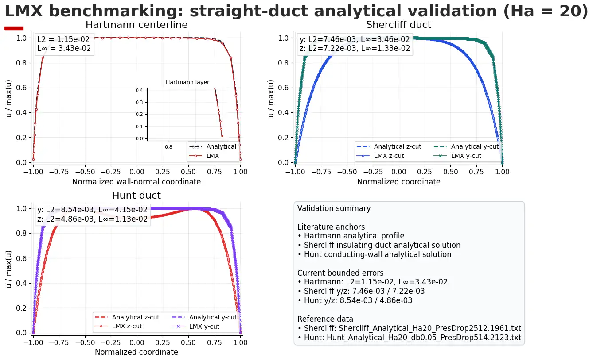
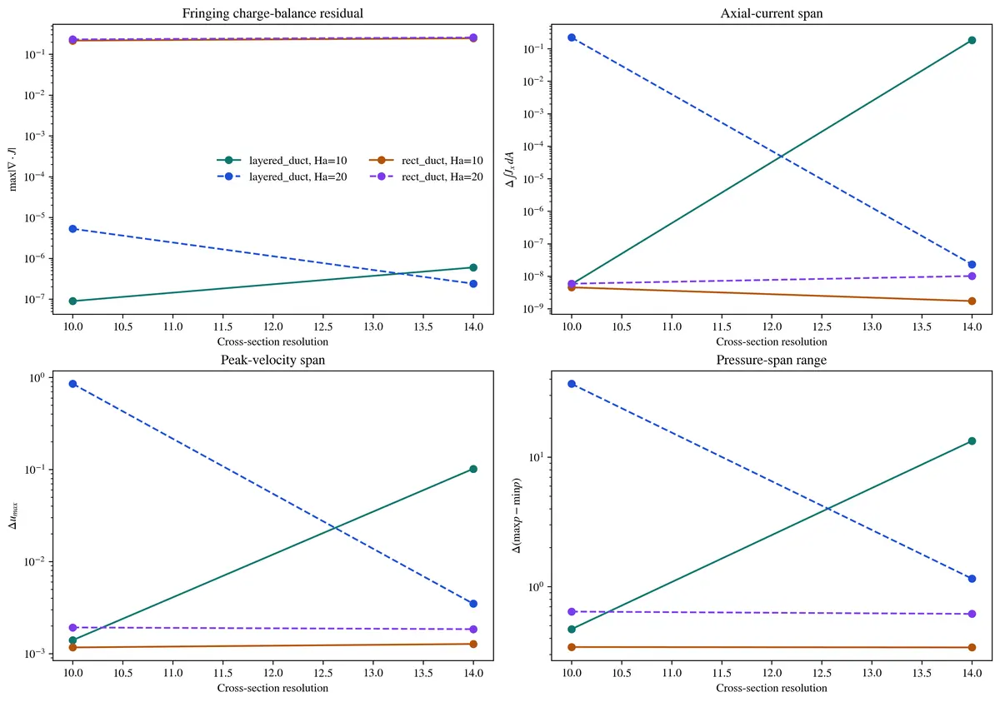
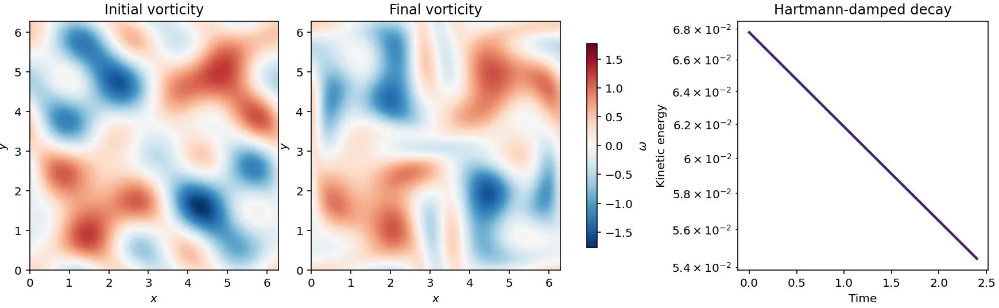

# LMX

[](https://pypi.org/project/lmx/)
[](https://pypi.org/project/lmx/)
[](https://github.com/uwplasma/LMX/actions/workflows/ci.yml)
[](https://lmx.readthedocs.io/)
[](LICENSE)

LMX solves inductionless liquid-metal magnetohydrodynamics in ducts with JAX.
It covers fully developed Hartmann, Shercliff, and Hunt flows, three-dimensional
extruded ducts and pipes in spatially varying magnetic fields, and periodic Q2D
vortex dynamics with Hartmann-layer damping. LMX owns the MHD models, boundary
conditions, coupling, diagnostics, and validation;
[SOLVAX](https://github.com/uwplasma/SOLVAX) supplies reusable linear and
fixed-point algorithms and their memory-efficient derivatives. The Q2D field
core supports gradient-based design with a checkpointed reverse pass instead
of retaining the complete time trajectory.



## Install

```console
python -m pip install lmx
lmx --help
```

LMX supports Python 3.10–3.13. JAX selects the CPU by default; install the
appropriate accelerator wheel using the
[JAX installation guide](https://docs.jax.dev/en/latest/installation.html).
Plots are optional: `python -m pip install "lmx[visualization]"`.

## Solve a duct

```python
import lmx

case = lmx.make_hartmann_case(ha=5.0, ny=8, nz=8)
result = lmx.solve(case)

assert result.converged, result.status
print(result.steps, result.residual)
```

The case object contains the geometry, materials, imposed field, boundary
conditions, time stepping, solver controls, and output policy. The result
contains the final fields, convergence status, iteration counts, and physical
diagnostics. The same workflow is available from TOML:

```console
lmx examples/hartmann_case.toml
```

## Solve a three-dimensional fringe

```python
import lmx
from lmx.fringing import build_square_duct_extruded_problem

problem = build_square_duct_extruded_problem(
    ha_peak=20.0,
    width=2.0,
    height=2.0,
    length=6.0,
    nx_stations=21,
    ny=24,
    nz=24,
)
result = lmx.solve(problem)

print(result.converged, result.validation.max_charge_balance_residual)
```

The 3-D formulation solves electric-potential/current closure, Lorentz force,
momentum transport, and face-flux pressure projection on rectangular,
layered-duct, straight-pipe, and mapped bent-pipe meshes. Analytic and tabulated
vector fields use the same problem interface.



## Evolve a Q2D flow

```python
import lmx

case = lmx.make_q2d_case(
    shape=(64, 64),
    viscosity=2.0e-3,
    hartmann_friction=4.0e-2,
    history_stride=4,
)
result = lmx.solve(case)

print(result.converged, result.diagnostics.energy_budget_residual)
```

The compact Q2D path uses dealiased Fourier vorticity evolution and a released
SOLVAX periodic Poisson inversion. It reports energy, enstrophy, divergence,
Courant number, and energy-budget closure.

For optimization, `evolve_q2d` returns only traced JAX fields. Continuous
state, forcing, length, viscosity, friction, and timestep inputs differentiate
through the same finite evolution; the reverse pass checkpoints the trajectory
with `O(sqrt(steps))` retained state by default.

```python
import jax


def response(friction):
    return lmx.evolve_q2d(
        case.initial_vorticity,
        viscosity=case.viscosity,
        hartmann_friction=friction,
        dt=case.dt,
        steps=case.steps,
    )[0].var()


value, derivative = jax.value_and_grad(response)(case.hartmann_friction)
```



## Capabilities and evidence

| Capability | Interface | Evidence |
|---|---|---|
| Hartmann, Shercliff, and Hunt flow | `lmx.make_*_case`, `solve` | analytical profiles, conservation, power balance, mesh convergence |
| Conducting and insulating wall layers | `WallLayer`, layered mesh builders | interface-current and layer-resolution gates |
| 3-D rectangular fringing fields | `lmx.fringing` | manufactured operators, projection, restart, Benchmark B2 |
| 3-D pipe fringing fields | `lmx.fringing` | mapped operators, current closure, fixed-flow and Benchmark B1 gates |
| Periodic Q2D flow | `Q2DProblem`, `make_q2d_case`, `solve`, `evolve_q2d` | analytical decay/gradients, energy identity, spatial refinement, bounded reverse memory, measured CPU/GPU parity |
| FreeMHD comparison | `validation/freemhd.py`, validation scripts | pinned case contracts, native-output observers, executable Docker workflow |
| Meshes and analytic/tabulated fields | `lmx.mesh` | geometry, divergence, and interpolation tests |

Validation status and tolerances are stated in the
[validation guide](https://lmx.readthedocs.io/en/latest/validation/index.html).
Internal diagnostics are not presented as external validation.

## Documentation

- [Install and run](https://lmx.readthedocs.io/en/latest/getting_started/install.html)
- [First 2-D solve](https://lmx.readthedocs.io/en/latest/getting_started/first_run.html)
- [3-D fringing tutorial](https://lmx.readthedocs.io/en/latest/tutorials/fringing.html)
- [Q2D vortex tutorial](https://lmx.readthedocs.io/en/latest/tutorials/q2d.html)
- [Walls and imposed fields](https://lmx.readthedocs.io/en/latest/tutorials/walls_and_fields.html)
- [Equations and assumptions](https://lmx.readthedocs.io/en/latest/physics/equations.html)
- [Numerical methods and SOLVAX boundary](https://lmx.readthedocs.io/en/latest/physics/numerics.html)
- [Python API](https://lmx.readthedocs.io/en/latest/reference/api.html)
- [CLI and TOML schema](https://lmx.readthedocs.io/en/latest/reference/cli.html)

Runnable scripts in [`examples/`](examples/) are deliberately small and write
their artifacts under an ignored `artifacts/` directory.

## Development

```console
git clone https://github.com/uwplasma/LMX.git
cd LMX
python -m pip install -e ".[dev,docs]"
python scripts/run_full_test_suite.py
python -m sphinx -W -b html docs docs/_build/html
```

Tests require at least 95% combined line/branch coverage. A release also gates
package size, lazy import behavior, distribution contents, analytical physics,
3-D conservation, and the pinned external-validation contract.

## Cite

Use the version or commit that produced the result. Citation metadata is in
[`CITATION.cff`](CITATION.cff).
