# LMX

[](https://github.com/uwplasma/LMX/actions/workflows/ci.yml)
[](https://github.com/uwplasma/LMX/actions/workflows/docs.yml)


LMX is a JAX-native inductionless MHD code for structured meshes. It provides
fully developed duct solvers, a 3D `extruded_inductionless` fringing-field
solver lane, restartable CLI workflows, strong-scaling tooling, and
differentiable workflows for sensitivity analysis and inverse design.

<p align="center">
  
  
  
  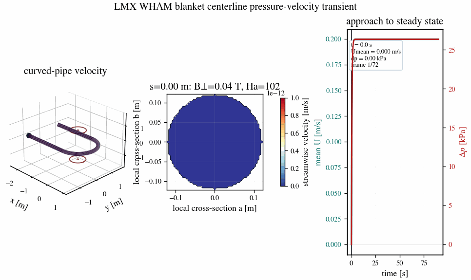
</p>

## Why use LMX

- Fully developed Hartmann, Shercliff, and Hunt workflows
- Rectangular, layered, mapped-pipe, and bent-pipe geometry support
- Executable analytic variable-field duct workflows
- Layered and curved-pipe variable-field research drivers
- Tabulated 3D magnetic-field support through Python and TOML/CLI
- JAX-based CPU and GPU execution
- Explicit conservation diagnostics for charge closure and boundary-current audits
- Input-file and Python-driver workflows
- Built-in plots, movies, and validation reports
- Autodiff examples for inverse design and sensitivity analysis

## Installation

Minimal install:

```bash
git clone https://github.com/uwplasma/LMX
cd LMX
python -m pip install -e .
```

Development install:

```bash
python -m pip install -e '.[dev]'
```

Documentation install:

```bash
python -m pip install -e '.[docs]'
```

LMX supports Python `3.10+`, falls back to `tomli` on Python `3.10`, and works
with the installed JAX/JAXLIB pair rather than pinning a narrow runtime window.

## Quick start

CLI:

```bash
lmx examples/hartmann_case.toml
lmx examples/hunt_case.toml
lmx examples/fringing_rect_case.toml
lmx run fringing_layered --ha 20 --nx-stations 21 --wall-cells 1 --insulator-cells 1 --output out/fringing_layered
```

Python:

```python
from lmx.cases import make_hartmann_case
from lmx.solvers import solve_steady

case = make_hartmann_case(ha=20.0, ny=48, nz=48)
solution = solve_steady(case)
print(solution.diagnostics.residual_history[-1])
```

Live runtime feedback:

- the CLI logger prints `Progress` lines with completed step fraction, average
  wall time per step, estimated remaining time, and estimated total runtime
- the generated run summary JSON now includes `execution_seconds`, so example,
  benchmark, and CLI runs can be compared on the same host without parsing logs

Post-processing from Python:

```python
from lmx import (
    make_hartmann_case,
    solve_steady,
    solve_case_snapshots,
    write_case_overview_plots,
    write_geometry_preview_plots,
    write_transient_movies,
)

case = make_hartmann_case(ha=20.0, ny=32, nz=32)
steady = solve_steady(case)
write_geometry_preview_plots(steady.mesh, "out/geometry", case_title=case.name)
write_case_overview_plots(steady, "out/steady", case_title=case.name)
frames = solve_case_snapshots(case, frame_count=40)
write_transient_movies(frames, "out/movies", case_title=case.name, output_stem="hartmann_startup")
```

Backend selection from the shell:

```bash
JAX_PLATFORMS=cpu OMP_NUM_THREADS=8 lmx examples/hartmann_case.toml
CUDA_VISIBLE_DEVICES=0 JAX_PLATFORMS=cuda lmx examples/hunt_case.toml
XLA_FLAGS=--xla_force_host_platform_device_count=8 JAX_PLATFORMS=cpu OMP_NUM_THREADS=1 lmx examples/hartmann_case.toml
```

For larger scaling studies, use:

```bash
python examples/strong_scaling_demo.py --output artifacts/examples/strong_scaling_cpu
python examples/strong_scaling_demo.py --benchmark-kind extruded_solve --profile --output artifacts/examples/extruded_solve_scaling
python examples/strong_scaling_demo.py --remote-host office --output artifacts/examples/strong_scaling_full
```

## Showcase

### Geometry and flow states

The top panel shows the three geometry families and the actual mesh or
wall layout each solver sees:

- Hartmann flow in a rectangular duct
- Hunt flow in a layered duct with conducting side walls
- a mapped-pipe O-grid for fringing-field studies

LMX solves liquid-metal duct and pipe flows in imposed magnetic fields. No
plasma background is needed to read the figures:

- a `rect_duct` is a plain rectangular channel
- a `layered_duct` adds wall materials around that channel so conducting and
  insulating walls can be represented explicitly
- a `pipe_ogrid` is the same idea in a circular pipe with an O-grid mesh
- a `bent_pipe` is the same mapped-pipe cross-section carried along a curved
  centerline; LMX now exposes this as a low-De inductionless baseline and
  geometry QA path

The two most important benchmark ideas in the README are:

- `Hunt` flow:
  liquid metal in a rectangular duct with conducting walls parallel to the
  imposed field, insulating Hartmann walls, and a transverse magnetic field
- `fringing field`:
  a magnetic field that changes along the flow direction instead of staying
  uniform, which makes the problem fully 3D because the fluid accelerates and
  redistributes as it enters and leaves the magnetized region


Those geometries are not shown in isolation in the rest of the README:

- the startup GIFs below use the layered Hunt geometry
- the fringing overview below uses the rectangular extruded 3D geometry
- the mapped-pipe workflow is exercised through the fringing CLI/TOML and the
  pipe comparison example in `examples/pipe_reference_comparison_demo.py`
- the bent-pipe workflow is exercised through
  `examples/bent_pipe_inductionless_demo.py`

### Bent-pipe inductionless baseline

LMX now includes a curved-centerline bent-pipe baseline built on the same
inductionless pipe cross-section used by the mapped-pipe fringing lane. The
current benchmark is intentionally the low-De limit: for sufficiently small
Dean number, the local axial profile should remain close to the straight-pipe
reference, while throughput and current closure remain bounded. That is the
right first validation step before adding explicit Dean-vortex or higher-inertia
physics.

This baseline is anchored to the classic Dean small-curvature limit and to the
later curved-duct benchmark literature that treats secondary-flow intensity as
the key observable as Dean number increases:

- [Dean’s curved-pipe limit](https://www.sciencedirect.com/science/article/abs/pii/S0142727X20307669)
- [A new benchmark for the secondary fluid flow through curved ducts](https://doi.org/10.1016/j.ces.2021.117196)
- [MHD formulations for the liquid metal flow in a curved pipe of circular cross section](https://www.sciencedirect.com/science/article/abs/pii/S0045793015001802)

The current LMX bent-pipe lane is the low-De inductionless baseline, not yet a
full Dean-vortex solver. The public example writes the geometry preview, the
mid-bend flow panel, and a machine-readable validation summary.

On the current bounded example (`Ha = 20`, `R = 0.45`, `R_c = 3.6`,
`15 × 18 × 40`), the bent-pipe baseline matches the straight-pipe reference to
machine precision on the local comparison cuts (`cross_section_l2_error = 0`,
`centerline_l2_error = 0`), while keeping
`max_charge_balance_residual ≈ 2.16e-12` and
`volumetric_flow_rate_span ≈ 3.30e-11`. The summary also reports the
Dean/curvature observables that will become the higher-inertia gate:
`secondary_flow_rms_ratio ≈ 6.38e-18`,
`normalized_velocity_centroid_shift = 0`, and
`inner_outer_velocity_ratio = 1.0` for this low-De straight-pipe limit.
The reported `max_charge_balance_residual` is a maximum local conservative
`|div J|` diagnostic on the cylindrical mapped grid, not a net current-leakage
measure. The same run has `max_wall_current_leakage = 0` and
`net_boundary_current_residual = 0`; after the conservative pipe-potential sign
fix, the JSON summary records `research_grade_charge_balance_pass = true`. The
remaining curved-pipe gate is now higher-inertia Dean-vortex validation, not
low-De current closure.


LMX also now ships a separate Dean-flow literature gate based on the
Bayat-Rezai semi-empirical correlation for average Dean velocity,
`V_De = 0.031 (nu / s) De^1.63`, validated in that work through the
low-Dean-number range up to about `De = 30`.
This closes the correlation/reference-data side of the curved-pipe lane and
provides a reduced two-cell secondary-flow field for plotting and design QA.
It does not by itself mark the current inductionless bent-pipe solver as a
resolved Dean-vortex validation.
`examples/dean_vortex_bayat_rezai_strict_attempt.py` now makes that gap
quantitative: at the retained moderate-De target, Bayat-Rezai implies
`secondary_flow_rms_ratio ≈ 4.13e-2`, while the current low-De LMX bent-pipe
solve reports `≈ 6.38e-18`. The strict lane therefore remains open until the
curved-pipe solve has a resolved or explicitly reduced higher-inertia
secondary-flow model.


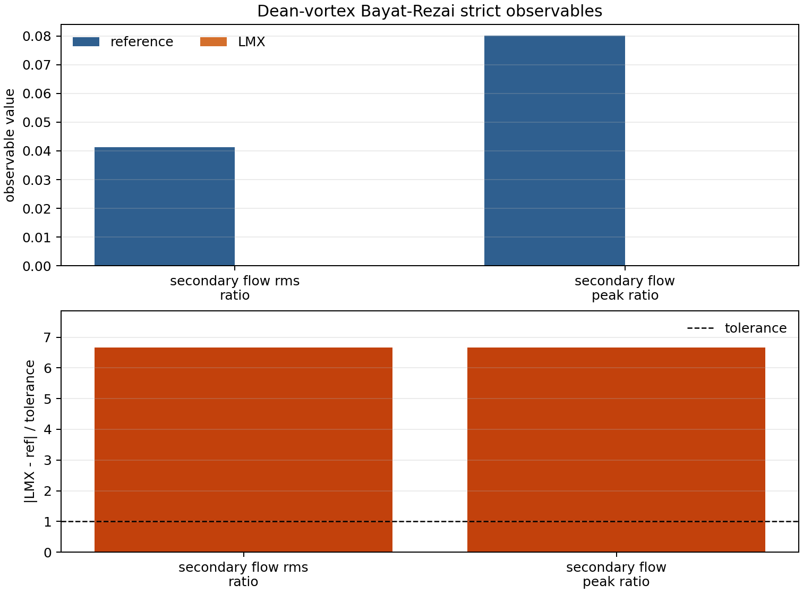

The panel is meant to be read left to right, then top to bottom:

- the 3D slab shows the curved centerline and the local mid-bend profile plane
- the cross-section panel shows the normalized axial velocity at the bend midpoint
- the response panel overlays `B/Bmax`, mean velocity, and charge-balance residual
  along the arc length
- the cut panel compares the bent-pipe and straight-pipe low-De limits and now
  includes a wall-layer zoom rather than only the full-radius view

### Variable-field extruded duct

LMX now also supports executable rectangular `extruded_inductionless` solves
with analytic cross-sectional magnetic fields through the Python API. The
current public lane uses a divergence-free analytic field model, runs the full
extruded duct solve, writes the field preview and extruded response plots, and
checks both field divergence and 3D conservation metrics.

This is the right next step after the uniform-field fringing benchmarks: it
keeps the geometry fixed while broadening the admissible magnetic-field models
that can drive the 3D inductionless response.

The same field API now also drives:

- layered duct variable-field solves
- straight-pipe variable-field solves
- bent-pipe low-De variable-field comparisons against the matching straight-pipe limit
- tabulated-field extruded solves through both Python examples and TOML input files

The tabulated rectangular lane is exercised by
`examples/variable_field_tabulated_demo.py` and
`examples/fringing_tabulated_case.toml`. Its summary now includes a reusable
tabulated-field quality gate: table-node interpolation error, axis
monotonicity, finite-value fraction, normalized field magnitude, and discrete
divergence. The current rectangular table gives zero table-node interpolation
error and `divergence_to_field_ratio ≈ 4.81e-4`. The README artifact now also
checks the field at the actual solver cross-section points against the
manufactured analytic field, giving `relative_l2_error ≈ 1.92e-5` and
`relative_linf_error ≈ 4.18e-5`; this is the relevant gate for judging whether
the tabulated field used by the extruded solve matches the expected values.

<p align="center">
  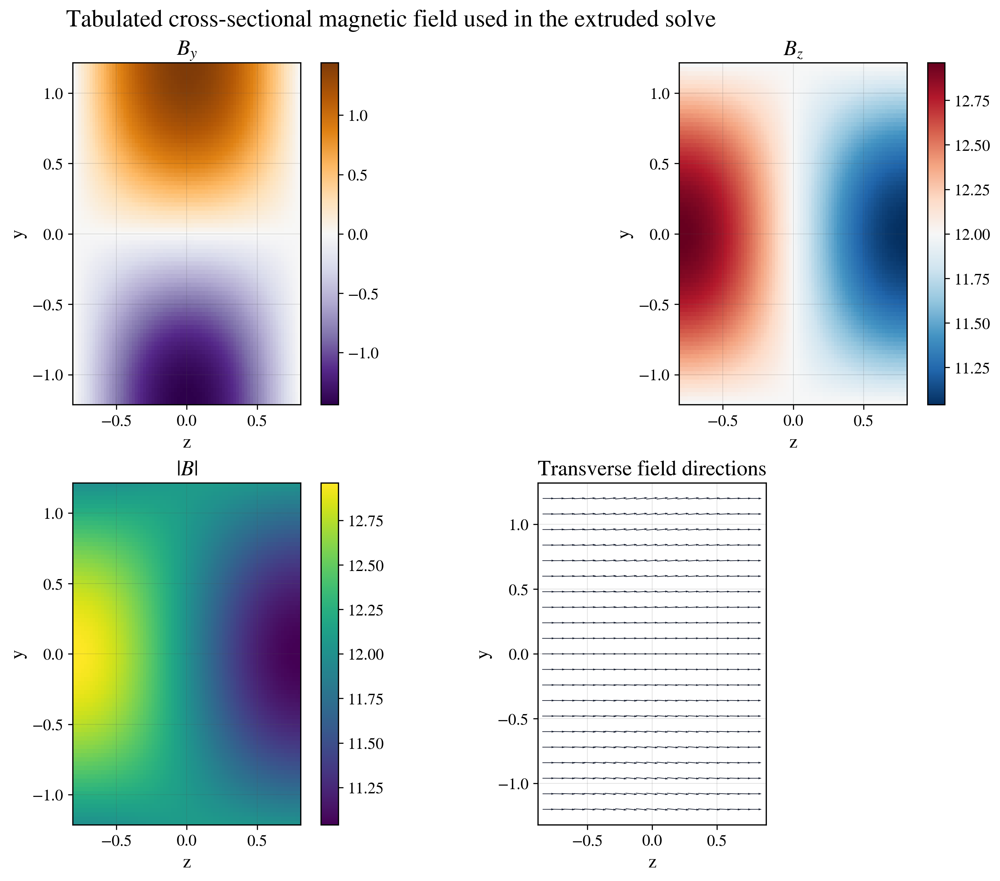
  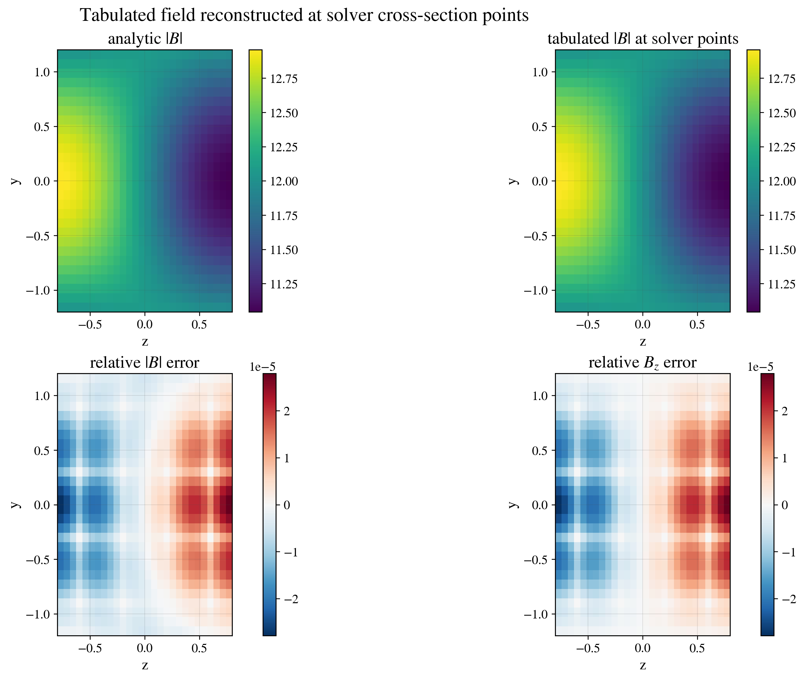
</p>

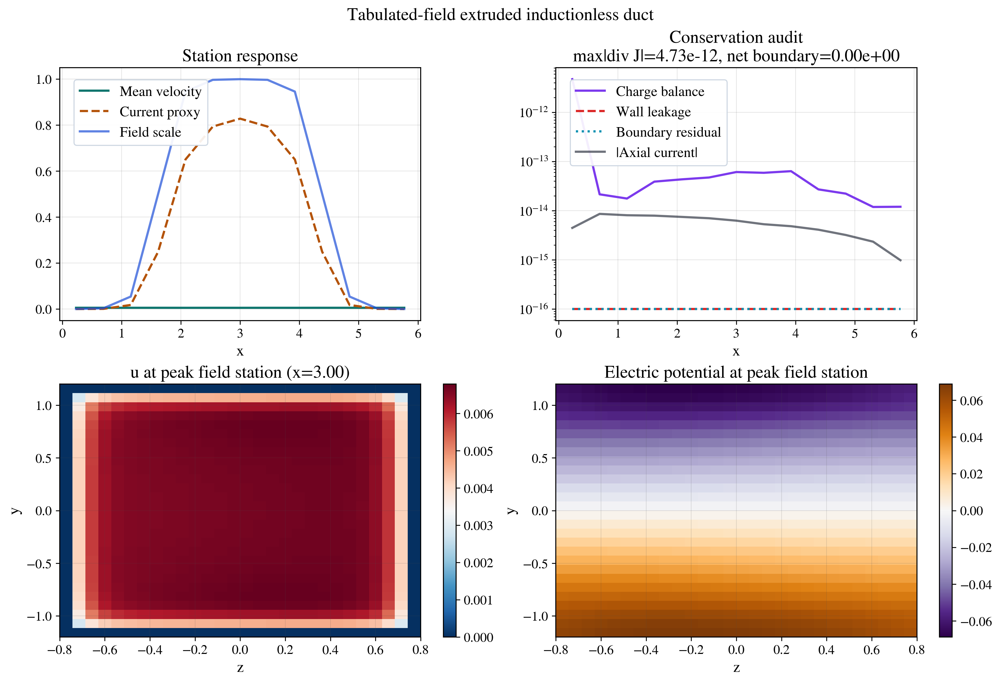

### Quasi-2D Hartmann-friction validation

LMX includes three quasi-2D Hartmann-friction validation slices. These are not
turbulent-duct claims yet. They are deliberately bounded reduced problems that
check the Q2D time integrator against analytical decay and forced-mode
solutions before moving to turbulent observables.
The nonlinear movie lane follows the same SM82 modeling direction used in
modern quasi-2D MHD duct studies, where Hartmann-layer friction damps a
two-dimensional core model rather than resolving every three-dimensional
boundary-layer detail ([Pothérat, 2020](https://arxiv.org/abs/2006.03993)).

- `examples/q2d_decay_validation.py`: a periodic 2D mode decays under
  diffusion plus Hartmann friction and matches the exact exponential amplitude
  history with `L2 ≈ 9.10e-5`; the modal energy budget closes with relative
  residual `≈ 5.18e-4`
- `examples/q2d_forced_validation.py`: a periodic forced mode approaches the
  analytical steady amplitude with `L2 ≈ 4.44e-4`; the production-dissipation
  budget closes with relative residual `≈ 5.60e-4`
- `examples/q2d_wall_bounded_validation.py`: a no-slip rectangular box is
  forced toward the exact transient Dirichlet solution with `L2 ≈ 4.15e-4`
  and energy-budget residual `≈ 5.12e-4`; it writes
  Sommeria-Moreau-facing energy, enstrophy, dissipation, and spectral
  observables for the future turbulent Q2D validation lane. The companion
  `q2d_turbulence_observables` panel plots the wall-bounded field, shell energy
  spectrum, and energy/dissipation proxies without claiming turbulent parity.
- `examples/q2d_turbulence_decay_demo.py`: a deterministic nonlinear periodic
  Q2D vorticity movie with Hartmann-friction damping and weak large-scale
  forcing. It runs to `t = 3.0` with `72` frames, giving visible vortex
  interaction rather than single-mode diffusion. The current movie has
  `turnover_count ≈ 3.31e-1`, `max_courant ≈ 5.23e-2`, spectral centroid
  shift `≈ 8.63e-1`, and divergence `≈ 2.74e-14`. This is a bounded SM82-style
  nonlinear physics gate; external turbulent parity remains open until matched
  to a published turbulent Q2D reference dataset. If a filled
  `q2d_turbulence_reference_observables.csv` is present, the example writes the
  scalar comparison table and PNG/PDF tolerance-gate plots automatically.
- `examples/q2dmhdfoam_external_reference_adapter.py`: ingests local
  Q2DmhdFoam validation outputs from the external checkout, including tepot
  line-profile samples, Vetcha 2009 digitized line cuts, and the lid-driven
  turbulence spectral-summary file. It now also ingests saved Q2DmhdFoam
  cylinder/duct force coefficients and probe histories, so the external data
  artifact contains profile, spectrum, force, and time-history observables.
  This closes the data-ingestion part of the Q2D external lane; matched
  LMX-vs-Q2DmhdFoam turbulent parity remains a separate validation gate.
- `examples/q2d_lmx_q2dmhdfoam_turbulence_comparison.py`: runs the LMX
  nonlinear Q2D movie case and overlays its energy/enstrophy/spectrum
  observables with the available Q2DmhdFoam lid-driven spectral summary. This
  is the current publication-facing Q2D comparison artifact, but it records
  `matched_parity = false` because the archived Q2DmhdFoam lid-driven case is
  not the same physical case as the periodic LMX SM82-style run.
- `examples/q2dmhdfoam_lmx_turbulence_match_audit.py`: reads the available
  Q2DmhdFoam case dictionaries and records whether any case can be promoted to
  the strict nonlinear Q2D turbulence parity CSV. The current local cases are
  executable evidence, but the audit rejects them for strict parity because
  topology, forcing, Hartmann friction, timestep window, or observable
  definitions do not match the LMX SM82-style movie case.
- `docker/q2dmhdfoam` and
  `examples/q2dmhdfoam_docker_reference_validation.py`: build Q2DmhdFoam in a
  foam-extend 4.1 container, run the `Q2DfullyDeveloped` reference case with
  MPI, export VTK fields for ParaView, and write a profile/summary panel. The
  current Docker rerun reaches the steady-state marker at `Ha ≈ 50` with
  flow-rate relative error `≈ 6.29e-8`. This is an executable external-code
  gate; the profile is a mixed-convection fully developed case and is therefore
  not used as a symmetric turbulence-parity claim.
- `examples/q2dmhdfoam_lid_driven_vtk_artifact.py`: ingests the VTK field from
  a generic Docker rerun of `run/lidDriven`, computes velocity and vorticity
  observables, and writes a field-level panel. This verifies non-default
  Q2DmhdFoam case execution and VTK ingestion; it is still not a matched LMX
  turbulence validation.
- `examples/q2d_lmx_q2dmhdfoam_lid_driven_parity.py`: runs the LMX
  side-wall-driven Q2D cavity against an isothermal `run/lidDriven` Q2DmhdFoam
  run generated with `ZERO_THERMAL=1`. The strict table now uses
  cell-centered OpenFOAM fields and graded-cell area weights rather than VTK
  point samples. The retained `201 × 201` LMX run now passes area-weighted mean
  speed, speed RMS, and peak vorticity at the `20%` gate. This closes the
  matched side-wall comparison, while the genuinely turbulent Q2D parity lane
  remains separate.

<p align="center">
  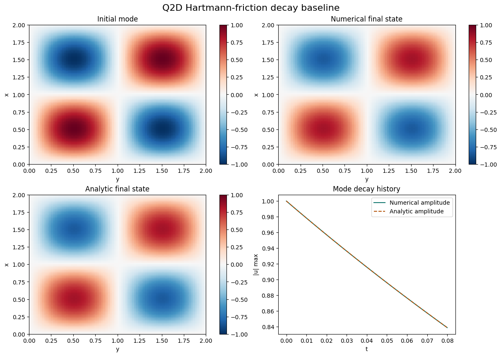
  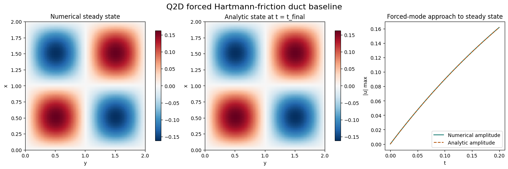
  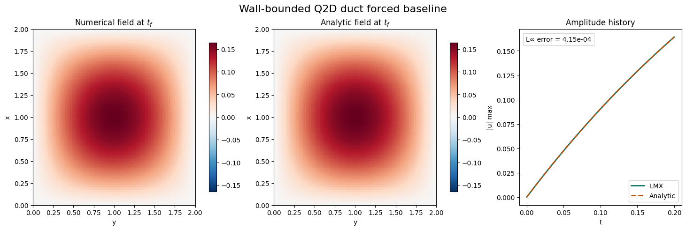
</p>

<p align="center">
  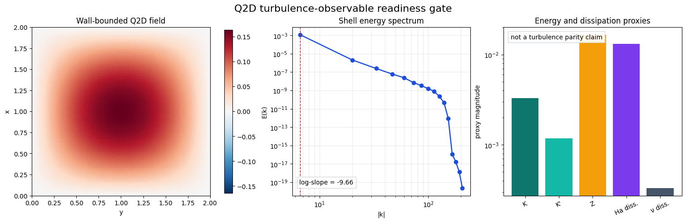
</p>

<p align="center">
  
</p>

<p align="center">
  
</p>

<p align="center">
  
</p>

<p align="center">
  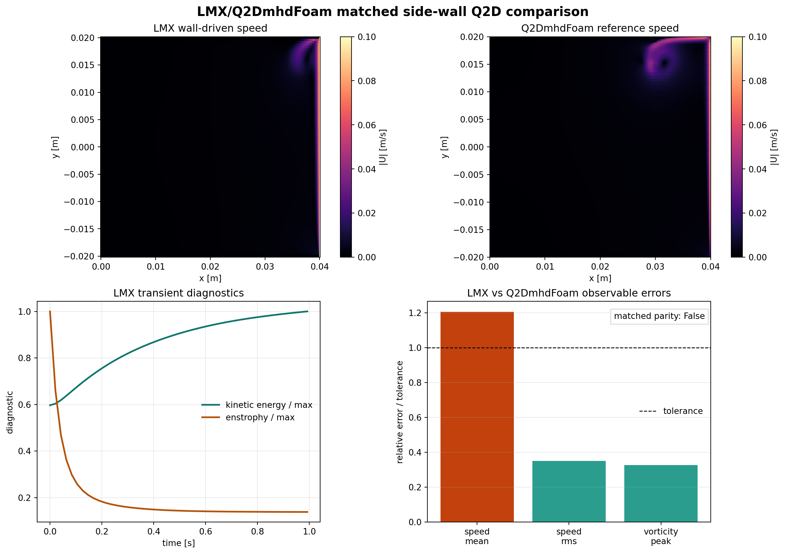
</p>

<p align="center">
  
</p>

<p align="center">
  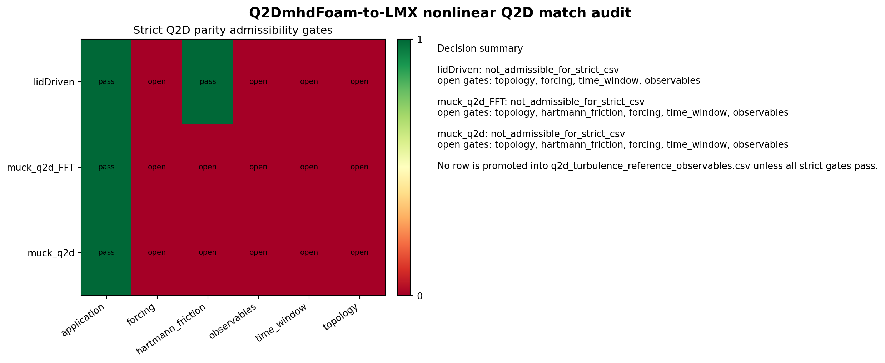
</p>

<p align="center">
  
</p>

<p align="center">
  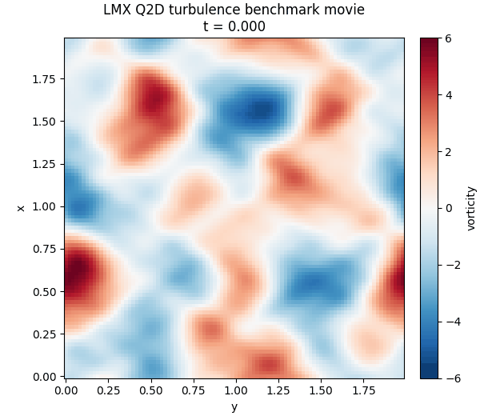
</p>

### Magnetic-obstacle localized-field response

LMX includes an executable localized-field response problem on the rectangular
extruded solver lane. This is currently an internal response and conservation
gate, not an external magnetic-obstacle validation. The reference in the panel
below is the same LMX case with the localized magnetic obstacle removed, so the
comparison checks whether the obstacle produces a measurable velocity deficit,
pressure response, cross-section distortion, and clean current closure. It does
not yet prove parity with the magnetic-obstacle literature.

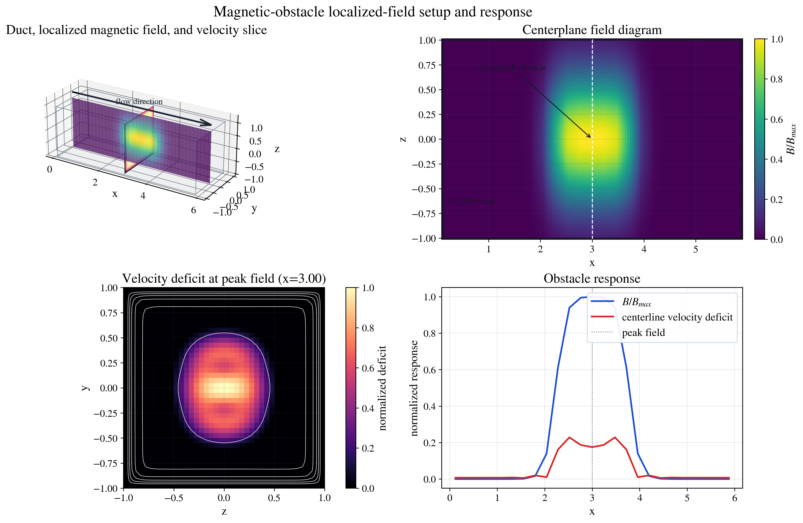

The main driver is `examples/magnetic_obstacle_benchmark.py`. On the current
bounded case (`40 × 40 × 25`, localized obstacle field, matched no-field
reference), it reports:

- `peak_velocity_deficit_ratio ≈ 1.01e-2`
- `peak_centerline_deficit_ratio ≈ 2.29e-1`
- `integrated_velocity_deficit_ratio ≈ 8.40e-3`
- `recovery_station ≈ 3.96`
- `peak_pressure_excess ≈ 3.22e-1`
- `pressure_excess_proxy ≈ 6.52e-2`
- `current_proxy_peak ≈ 1.78`
- `peak_crosscut_distortion ≈ 9.75e-2`
- `y_peak_cut_abs_error ≈ 1.72e-1`
- `z_peak_cut_abs_error ≈ 1.72e-1`
- `max_charge_balance_residual ≈ 3.02e-12`

The peak-field centerline cuts in the figure use one shared reference scale
instead of per-line normalization, so the centerline deficit and transverse
distortion are visible rather than normalized away.

The current status is therefore: internal response gate passes, external
research-grade validation remains open. The next validation step is to match a
published localized-field case on geometry, wall model, `Re`, `Ha`, interaction
parameter, field profile, and observables, then compare centerline deficit,
wake recovery, pressure drop, current closure, and cross-sectional distortion
without using a matched no-field LMX solution as the only reference.

The current summary makes that distinction explicit:
`reference_kind = matched_no_field_lmx`, `external_reference_available = false`,
and `research_grade_validation_pass = false`.

The benchmark summary also now records a literature-readiness block keyed to
the Cuevas-Smolentsev-Abdou quasi-2D magnetic-obstacle study, the
[Votyakov-Zienicke-Kolesnikov constrained-flow study](https://arxiv.org/abs/0704.3700),
and the Andreev-Kolesnikov-Thess nonuniform-field experiment. LMX currently
reports the matching observable vocabulary, but the external
digitized/reference data needed for a true parity claim is still an open lane.

The external-reference contract is now executable rather than implicit:
`examples/magnetic_obstacle_external_reference_template.py` writes the CSV
schema for digitized observables, and
`compare_magnetic_obstacle_reference_observables(...)` compares those rows
against the LMX readiness observables with explicit absolute or relative
tolerances. `examples/magnetic_obstacle_benchmark.py` also checks for a filled
`magnetic_obstacle_reference_observables.csv` in its output directory; when it
is present, the run writes a publication-ready comparison CSV plus PNG/PDF
observable parity plots. When it is absent, the run writes the template and
keeps the validation status explicitly open. This keeps the magnetic-obstacle
lane ready for literature data without reclassifying the current
matched-no-field comparison as external validation.
`examples/magnetic_obstacle_votyakov_strict_attempt.py` now post-processes the
current benchmark against the digitized Votyakov centerline target. That target
requires reverse centerline velocity in the magnetic-obstacle recirculation
regime; the present reduced LMX case stays positive, so the strict lane has
moved from template-only to an explicit external-observable mismatch.
`examples/magnetic_obstacle_votyakov_curve_validation.py` extends that check
from one scalar to the full digitized Votyakov Fig. 7(a)-style curve. It
extracts reverse-flow onset and high-`N` plateau observables, then shows that
the current LMX localized-field response stays near positive through-flow
instead of entering the recirculating obstacle regime.


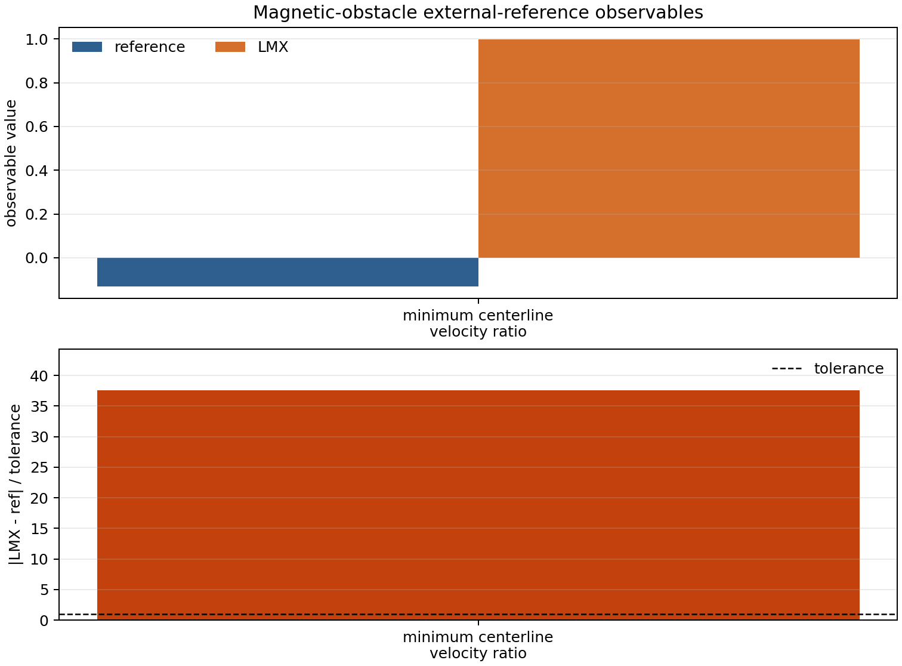

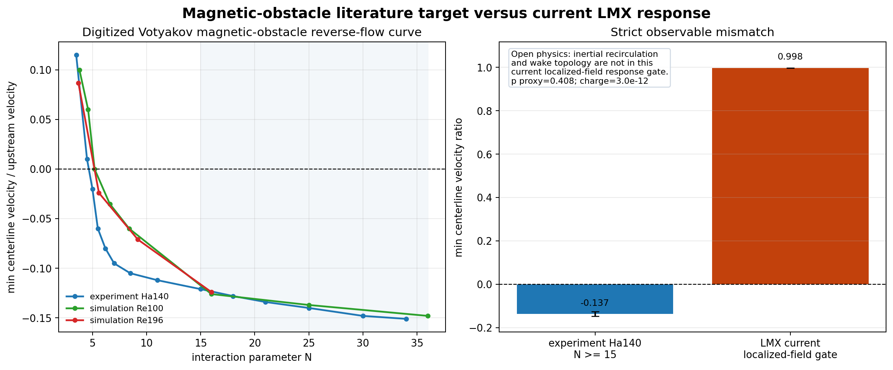

To push beyond that single bounded point, LMX also now includes
`examples/magnetic_obstacle_regime_scan.py`, which sweeps obstacle runs over
field scale and forcing and writes a compact response map. That scan is the
current bridge from the low-inertia internal response gate toward the
published magnetic-obstacle validation cases, while keeping the routine example
and test surface bounded.


LMX now also includes a tabulated WHAM-like mirror-field pipe lane and a
matching differentiable pressure-drop sensitivity study. The coil-model adapter
is `examples/wham_coil_model_field_adapter.py`: it parses the attached WHAM
coil script, preserves its total ampere-turns under a reduced loop count, and
writes a reproducible tabulated-field artifact plus a field-contour panel. The
executable pipe driver is `examples/wham_mirror_pipe_demo.py`: it writes the
tabulated 3D field,
solves the pipe crossing that field, and exports the field preview plus a
dedicated WHAM overview showing the mirror coils, centerplane field contours,
the pipe location, and the solved velocity cross-section at peak field. The
paired reduced differentiable study is
`examples/autodiff_wham_pressure_sensitivity.py`, which treats the same WHAM
mirror topology as a stationwise field profile and differentiates a
pressure-drop proxy with respect to coil separation.

The next blanket-design preprocessing step is
`examples/wham_blanket_geometry_preview.py`. It builds a circular pipe route
for a liquid-metal blanket loop around the WHAM central cell: the pipe enters
from one side, wraps around the central-cell clearance envelope in the mirror
midplane, and returns on the opposite side. This artifact is geometry-only, so
it is meant for route and clearance review before the mapped-pipe mesh and MHD
solve are committed.

The first blanket-flow artifact is
`examples/wham_blanket_flow_demo.py`. It keeps the approved route, samples the
WHAM mirror field along the curved centerline, uses PbLi-like properties, and
computes a fixed-flow-rate pressure budget with pipe friction, local
`σ U B_\perp^2` MHD drag, and a distributed bend-loss term. The current
reference point uses `U = 0.20 m/s`, `R = 0.12 m`, and an explicit high-field
design multiplier on the parsed WHAM coil field; it gives
`Δp ≈ 26.5 kPa`, `Re ≈ 2.48e5`, and peak `Ha ≈ 904`. This is a realistic
engineering preview. The same example now also runs a centerline transient
pressure-velocity solve with turbulent pipe-friction closure, local MHD drag,
and bend losses to `t = 15 s`; the retained run settles to
`U_mean ≈ 0.200 m/s` and `Δp ≈ 26.4 kPa`. This moves the WHAM blanket lane
beyond a static startup visualization, but it is still not a resolved 3D
secondary-flow or turbulence validation. The movie and transient panel now also
track a bend-probe Dean-skew diagnostic; at `s ≈ 4.11 m`, the retained reduced
model gives `U_outboard / U_inboard ≈ 1.078`, consistent with the expected
outward axial-velocity shift in a curved pipe. The same script also writes a
field-scale sweep at fixed flow rate; the retained cases give terminal pressure
drops of `≈ 6.7`, `15.0`, `26.5`, and `41.4 kPa` for field multipliers
`4`, `6`, `8`, and `10`, with the MHD contribution following the expected
`B_\perp^2` scaling.

The solver-facing geometry handoff is `examples/wham_blanket_mesh_demo.py`.
It converts the approved route into a mapped circular-pipe O-grid and writes a
ParaView-ready `VTU` mesh plus a QA panel. The current preview mesh has `65`
stations, `18 × 48` cross-section cells, `55,296` cells total, nearly uniform
`Δs ≈ 0.114 m`, and radius/periodic-closure errors at roundoff.

The next solver-facing handoff is
`examples/wham_blanket_field_on_mesh_demo.py`. It samples the parsed
WHAM-like mirror field on every point of that mapped pipe mesh, projects the
global vector field into local streamwise and transverse components, and writes
centerline/cross-section QA artifacts. In the current retained configuration,
the mesh-field handoff passes finite-value checks, gives peak centerline
`B_\perp ≈ 3.60e-1 T`, has negligible streamwise component
(`max |B_s|/|B| ≈ 3.4e-15`), and records the largest cross-section field span
for the future conservative `φ/J` curved-pipe solve.

`examples/wham_blanket_current_closure_demo.py` then exercises that next
`φ/J` gate without claiming a full momentum solve. It prescribes a streamwise
pipe profile, solves the conservative inductionless potential equation on the
mapped local pipe coordinates, and reconstructs `J`. Because this is a
dimensional PbLi-scale current solve, the relevant gate is the residual
relative to the EMF-divergence source: the current retained run has
`max |div J| ≈ 1.08e-2`, `relative |div J| ≈ 3.21e-9`, zero wall-current
leakage, zero net boundary-current residual, and a conservative `J×B`
pressure-drop proxy of `≈ 6.97 kPa`.

`examples/wham_blanket_autodiff_research_demo.py` uses the same route and
pressure model as the movie, but keeps the pressure budget differentiable. The
current run answers two design questions directly: at the reference separation
`s = 1.96 m`, the reduced fixed-flow pressure drop is `≈ 26.5 kPa` and
`d(Δp)/ds ≈ 13.1 kPa/m`; at fixed flow rate, reducing the field multiplier
from `8.0` to `≈ 6.94` hits a `20 kPa` pressure-drop target in the reduced
model. This is a differentiable design/sensitivity gate, not yet the full
curved-pipe pressure-velocity solver.

The WHAM table is generated in the same streamwise coordinate frame used by
the extruded solver, `x ∈ [0, L]`, with an explicit `coil_frame_x_offset` that
centers the mirror coils in physical coordinates. This avoids silent tabulated
field extrapolation at the downstream half of the pipe and is recorded in the
example summary JSON.

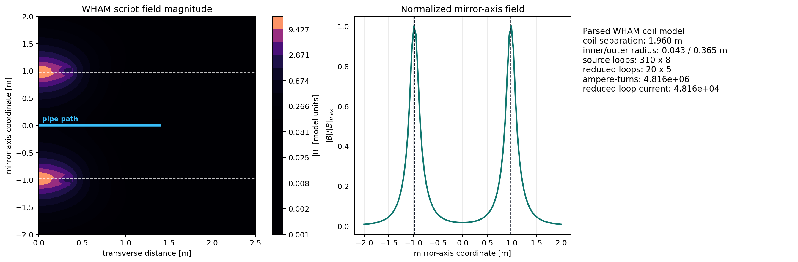

The executable WHAM lane is useful today for field loading, geometry context,
and conservation auditing. The new overview figure shows exactly that: the pipe
passes across the mirror field, the centerplane field contours are sampled from
the tabulated 3D field, and the colored disk is the solved axial velocity slice
inside the pipe at the station of peak field.


At the current reference separation (`1.96 m`), the reduced differentiable
lane gives `pressure_drop_proxy ≈ 3.85` and `d(Δp)/ds ≈ 2.98e-1`, with a
smooth monotone pressure-drop trend over the tested separation sweep. The full
executable tabulated-pipe solve remains a stable field-loading and conservation
baseline, but its nominal-WHAM low-Re response is still much weaker than the
rectangular magnetic-obstacle benchmark above. The WHAM table quality gate
passes on the structured 3D field with zero table-node interpolation error and
`divergence_to_field_ratio ≈ 3.01e-2`; the flow-response validation remains
open because the full solve still has no measurable centerline velocity
deficit at the nominal low-Re settings.


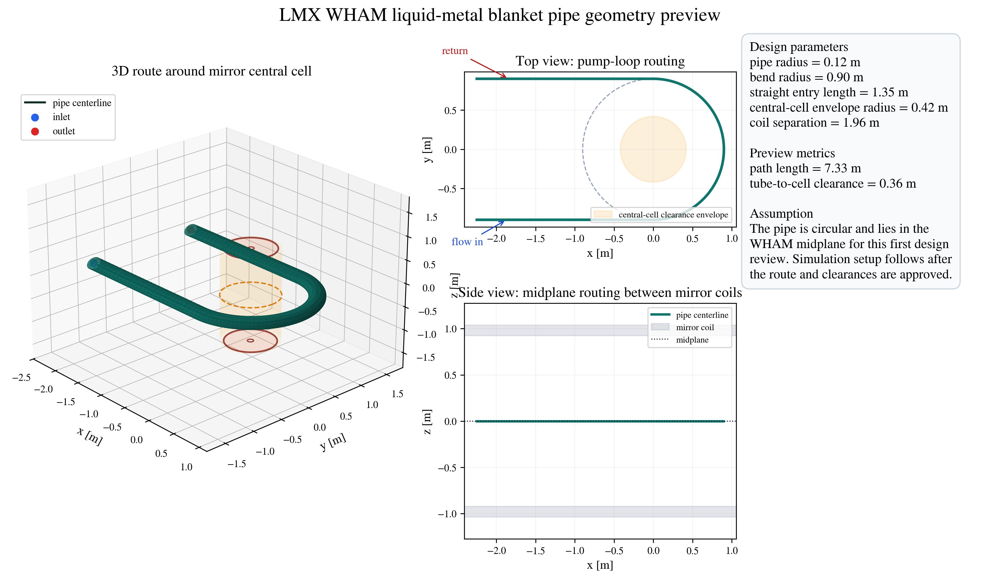

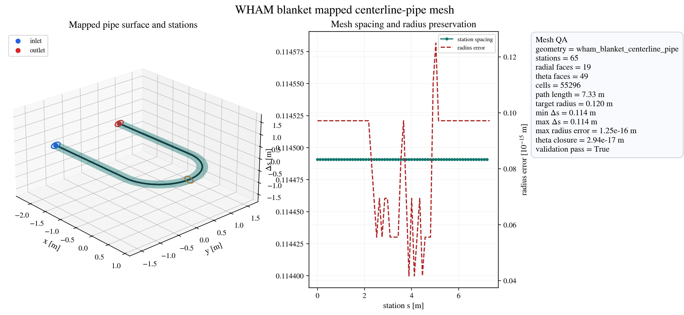

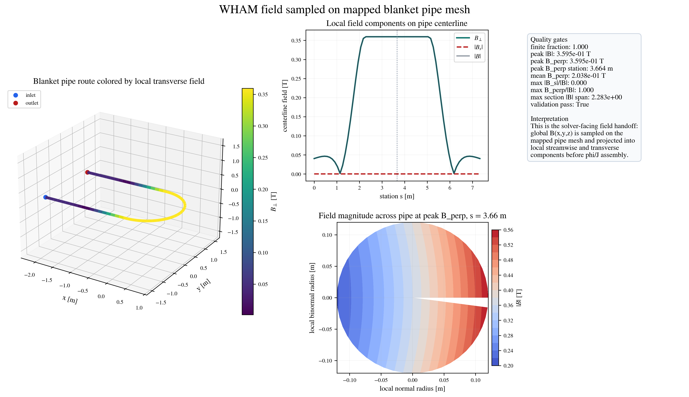

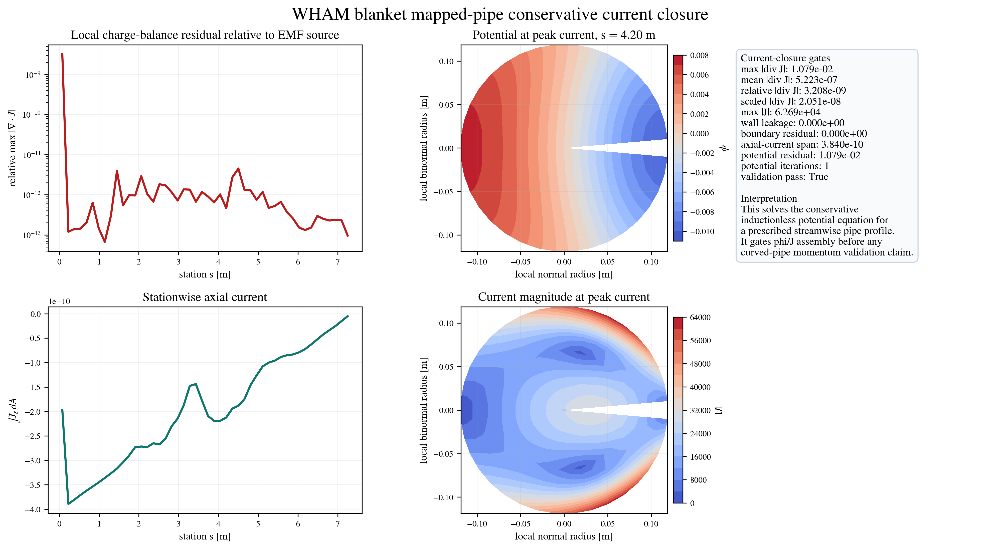

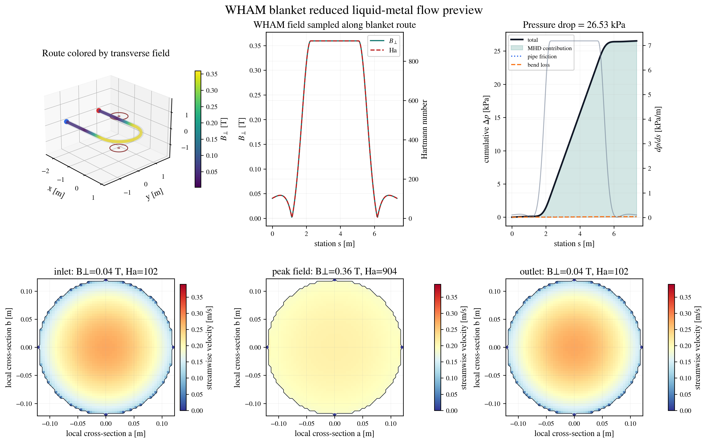

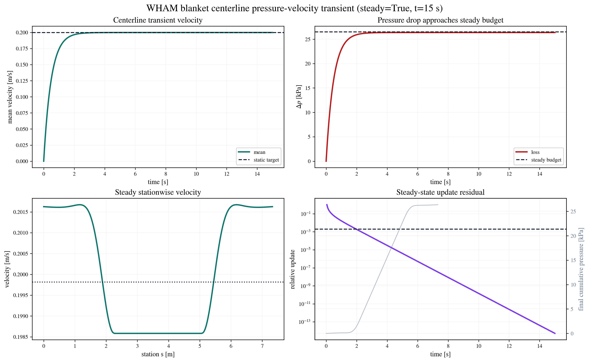

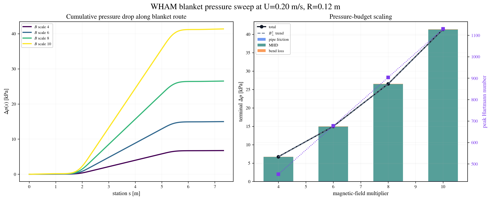

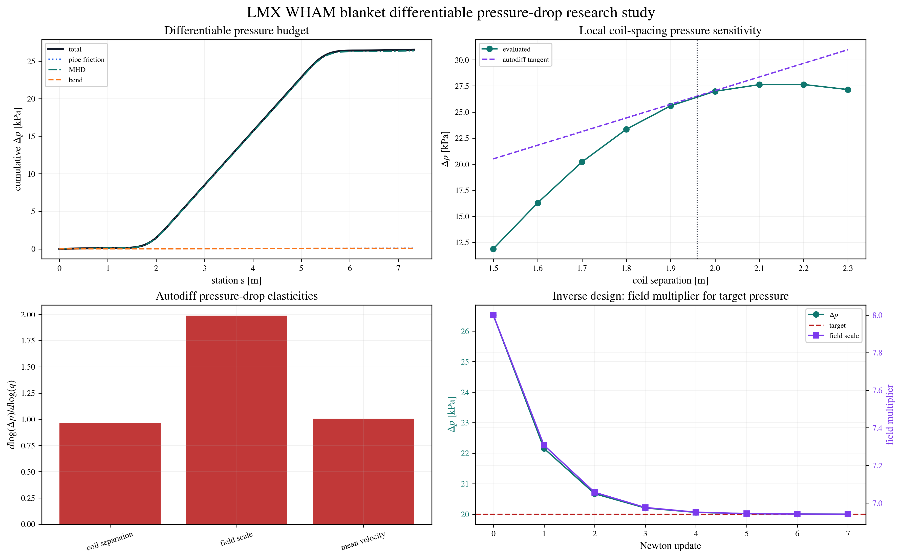

<p align="center">
  
</p>

### Straight-duct setup

The standalone straight-duct showcase scripts build the same Shercliff/Hunt
family from explicit geometry, material, and mesh parameters. The first figure
labels the wall-material layout used by the Shercliff and Hunt benchmarks, and
the second shows the clustered structured mesh used to resolve the Hartmann
layers.

<p align="center">
  
  
</p>

The straight-duct comparison workflow now bundles the three canonical
fully-developed checks at `Ha = 20`: Hartmann, Shercliff, and Hunt. The panel
shows the Hartmann centerline together with a wall-layer zoom, then the
Shercliff and Hunt `y` and `z` cuts against the same bundled analytical
references used by the validation utilities. The artifact is generated
directly from `examples/straight_duct_profile_comparison.py`, which uses a
bounded `49 × 49` cross-section with zero initial velocity, no-slip wall
reconstruction, and the Hunt thin-wall conductance model
(`wall_thickness = 0.001`, `sigma_w / sigma = 5`, `c = 0.05`) used by the
bundled analytical files. The retained cuts meet the manuscript-facing
`L2 <= 1.2e-2` target: Hartmann `1.15e-2`, Shercliff
`7.46e-3 / 7.22e-3`, and Hunt `8.54e-3 / 4.86e-3`.


For the literature-style ladder, `examples/straight_duct_validation_ladder.py`
now writes the bounded Shercliff/Hunt multi-`Ha` validation panel used in the
testing docs. The current checked ladder runs `Ha = 20` and `Ha = 100` on the
same normalized `y` and `z` cuts and keeps the reference filenames in the
summary JSON so the later paper figures remain traceable to the bundled
analytical datasets. It starts from zero velocity and uses `45 × 45` fluid
cells for Shercliff and `49 × 49` for the thin-wall Hunt case.

The ladder now closes the retained Shercliff and Hunt `Ha = 20, 100` profile
cuts under the `1.2e-2` target when the explicit Hunt wall matches the thin-wall
reference model. The `Ha = 100` row reports Shercliff
`y/z L2 = 4.89e-3 / 7.93e-3` and Hunt
`y/z L2 = 4.42e-3 / 2.89e-3`. The high-`Ha` Hunt side-layer remains the most
sensitive diagnostic: blind mesh-only increases to `65 × 65` and `81 × 81` did
not improve monotonically even when nominal layer-cell counts increased. The
documented acceptance criterion is therefore the literature-matched wall model
and measured profile error, not nominal layer-cell count alone.

`examples/hartmann_validation_ladder.py` now does the same for the Hartmann
centerline, including a wall-layer zoom and a checked summary JSON, so the
straight-duct manuscript lane is no longer relying on a single Hartmann panel
embedded only inside the broader comparison figure.


### 2D and 3D startup movies

These README assets are generated from `examples/readme_showcase_demo.py` and
show Hunt startup in 2D and 3D over `t = 0` to `t = 3 ms`. Hunt flow uses a
layered duct with conducting side walls and insulating Hartmann walls, so the
startup sequence develops thin Hartmann layers at the insulating walls and
the characteristic Hunt side jets along the conducting walls. The run starts
from a flat plug-flow profile, time is shown in physical units, and all solved
timesteps are written to the GIF. The 2D panel carries the transient `y`- and
`z`-centerline diagnostics so the layer growth can be read directly from the
movie, while the 3D panel shows a streamwise-velocity profile slab embedded
inside the duct so the evolving Hunt profile can be read in the full geometry.
The README regeneration path uses a bounded `57 × 57` cross-section with
`dt = 1e-5 s`, `t_final = 3e-3 s`, `coupling_iterations = 8`, and
`potential_iterations = 80`, plus `8` wall cells on the Hunt geometry. Heavy example reruns now also populate a local
JAX compilation cache under `artifacts/jax_cache` so repeated runs on the same
host do not pay the full cold-compile cost every time.

<p align="center">
  
  
</p>

### Fringing-field response

The 3D fringing overview shows the imposed magnetic-field ramp, the response of
the streamwise velocity, the pressure span, and the charge/current diagnostics
for a rectangular duct in one place.

Here the magnetic field is weak upstream, ramps up inside the magnet region,
and drops again downstream. That axial field variation is what “fringing” means
in this context. The committed overview is generated on a `24 × 24 × 33`
cross-section/station grid so the axial histories and cross-sectional panels
are not limited by a coarse axial sweep.


### Scaling and autodiff

The scaling panel below is a fixed-problem strong-scaling benchmark for a dense
structured-grid `extruded3d` inductionless MHD operator. Solid lines are
measured warm runtimes and speedups; the dashed line is ideal linear speedup.
The current figure uses an `8192×64×64` CPU case with `256` operator
iterations and a `6144×96×96` GPU case with `4096` operator iterations, so the
device curves come from minute-scale kernels instead of short smoke tests. The
CPU panel is limited to `1, 2, 4` devices, which is where the current host
still shows a meaningful reduction in warm runtime.

Measured warm-runtime points:

- CPU: `80.55 s`, `74.66 s`, `65.50 s` at `1, 2, 4`
- GPU: `78.58 s`, `46.82 s` at `1, 2`

On this workstation the CPU curve improves through `4` logical devices, while
the two-GPU path keeps the cleaner strong-scaling trend on the larger fixed
problem.


For solver-faithful profiling, run the same example with
`--benchmark-kind extruded_solve --profile`. That path invokes the actual
rectangular `solve_extruded_inductionless(...)` projection loop and writes
grid size, memory estimates, warm cell-updates per second, optional JAX trace
directories, `strong_scaling_table.csv`, and
`strong_scaling_diagnostics.json`. The table records speedup, parallel
efficiency, memory, profiler coverage, and whether each row is solver-faithful.
The current committed figure remains the sharded
`extruded3d` operator panel because the production projection loop does not
yet have explicit multi-device domain decomposition.

The autodiff panel summarizes two things: the mean velocity and its sensitivity
to Hartmann number on the left, and a simple inverse-design loop recovering the
forcing on the right. The left panel shows the expected decrease in throughput
as Hartmann layers strengthen. The right panel shows the optimizer recovering
the forcing that generated the target profile while the loss falls by several
orders of magnitude.

## Meshing

LMX uses structured meshes. The user controls resolution directly through the
input file or Python case object:

- `ny`, `nz` for rectangular and layered ducts
- `wall_cells`, `wall_thickness`, and `insulator_cells` when wall materials are
  modeled explicitly
- `nx_stations` for the axial resolution of `extruded_inductionless`
- `nr`, `ntheta`, and `radius` for `pipe_ogrid`

The practical rule is to resolve the thin boundary layers before trusting a
benchmark or design study. For Hartmann and Hunt problems, increase `ny` and
`nz` until flow rate, current diagnostics, and interface-current residuals stop
moving materially. For fringing-field studies, refine both the cross-section and
the axial stations until pressure span, charge-balance residuals, and
throughput variation stabilize.


## Li/AlN Wall-Stack Study

The first Li/AlN wall-stack lane is a reduced MHD electrical-performance study,
not a material-compatibility claim. It audits liquid-lithium units, converts
dynamic viscosity to kinematic viscosity at the input boundary, reports `Ha`,
`Re`, `N`, and `Rm`, checks the inductionless assumption, and sweeps reduced
AlN conductance and pinhole/shunt fraction. The model separates tangential
thin-wall conductance from normal leakage through a coating so the user can
screen whether an AlN-like electrical barrier behaves close to the ideal
insulator limit before attempting a full multilayer solve.

Run the Phase 0-2 artifact with:

```bash
python examples/li_aln_wall_stack_phase0_2.py
```

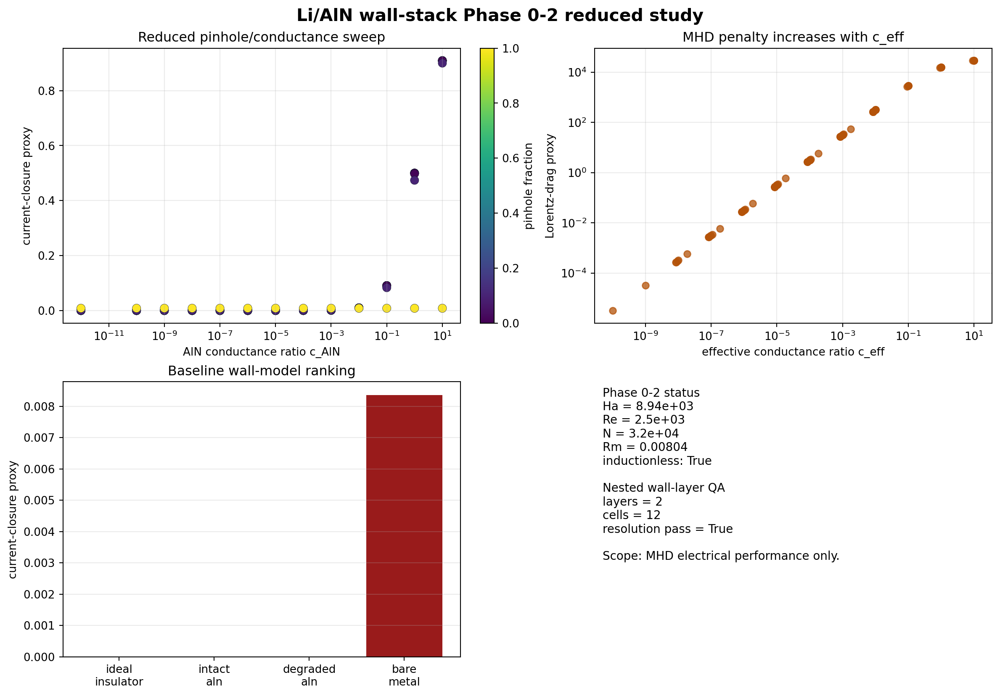

The Phase 3-6 reduced campaign extends that executable study to a `B`/velocity
operating matrix, substrate-conductivity comparisons, AlN degradation sweeps,
and pinhole thresholds for bounded current-closure deviation. It reports
tangential conductance and normal leakage separately; these are electrical
performance gates for MHD design, not statements about compatibility or coating
survival.

```bash
python examples/li_aln_wall_stack_phase3_6.py
```

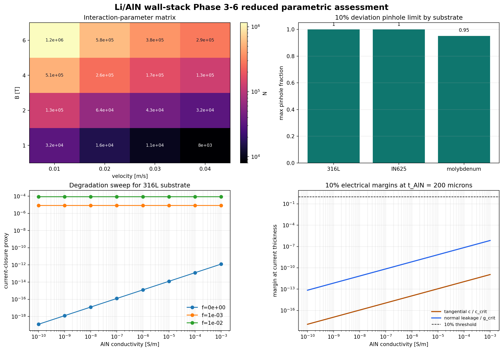

The explicit multilayer mesh gate constructs `fluid | AlN | metal` cells with
faces aligned at every material interface and exports the conductivity field,
region IDs, layer tables, and interface table. This is the geometry prerequisite
for conservative current diagnostics and future external-code limiting-case
comparisons.

```bash
python examples/li_aln_multilayer_mesh_qa.py
```

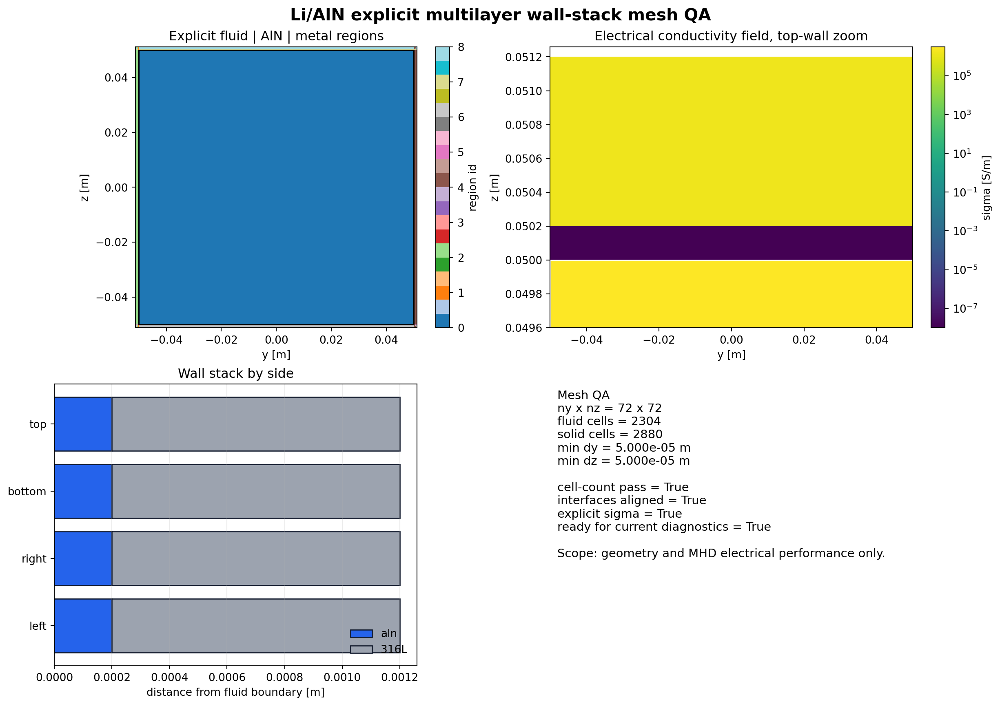

## Validation status

The current validation surface includes:

- fast CI under a five-minute routine budget
- strict docs build
- restartable TOML and CLI workflows
- internal conservation and fringing-physics gates on `rect_duct`, `layered_duct`, and `pipe_ogrid`
- mapped-pipe external comparison now uses one shared velocity normalization
  across all transverse lines, and currently exposes a real high-`Ha`,
  high-`Re` parity gap rather than hiding it behind per-line normalization
- widened bounded manual fringing campaign at `Ha = 10, 20, 30`, `resolution = 8`
- a standalone quantitative 3D fringing-field summary driver for rectangular,
  layered, and mapped-pipe cases
- dense rectangular fringing at `24 × 24 × 33` closes `rect_duct` on raw
  internal metrics; `layered_duct` now uses symmetry-aware closure metrics because the
  Hunt fringing response is odd/even about the field midplane rather than
  span-minimizing. On the heavier layered closure run at `Ha = 20`,
  `18 × 18 × 21`, the retained layered metrics are
  `axial_current_mirror_residual ≈ 1.88e-7`,
  `pressure_span_mirror_residual ≈ 2.67e-5`,
  `center_axial_current ≈ -8.10e-8`, and
  `center_pressure_span ≈ 9.56e-6`

The remaining research-grade blockers are tracked explicitly rather than
hidden in the figures:


The current target panel records the strongest available external evidence for
the open lanes without counting it as closure. The candidate CSVs are useful for
manuscript planning and follow-on runs, but release readiness still requires the
matched strict files `magnetic_obstacle_reference_observables.csv`,
`q2d_turbulence_reference_observables.csv`, and
`dean_vortex_reference_observables.csv`.


The closure dashboard is the compact reviewer-facing ledger for those lanes. It
keeps the closed Q2D side-wall support gate, the failed Votyakov
magnetic-obstacle reverse-flow comparison, the failed Bayat-Rezai Dean-vortex
comparison, and the strict closure status in one panel.

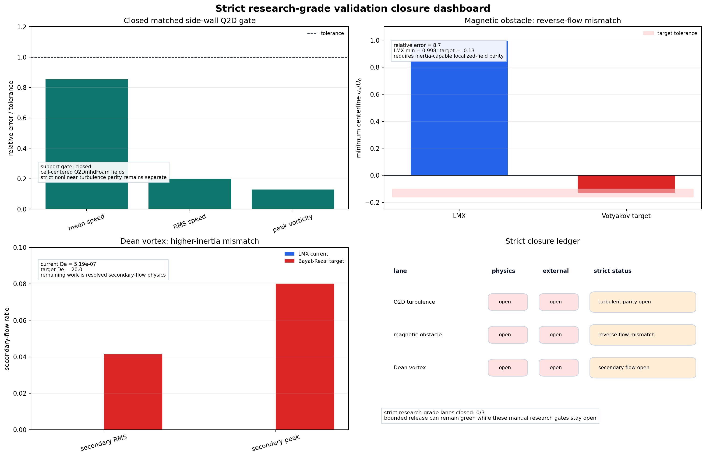

The final disposition artifact is the last-push audit. It records the measured
offender and required next physics for each strict lane and keeps the release
bounded instead of marking failed external-validation lanes as research-grade.

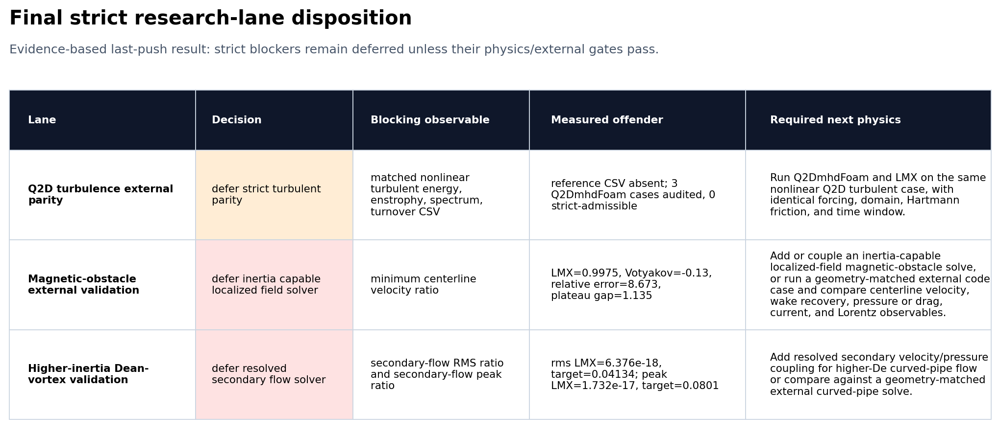

The final strict-blocker probe is kept in the README because it is the release
guard against over-claiming. It records that a low-resolution magnetic-obstacle
reverse-flow candidate did not survive the current-resolution rerun, that the
Q2DmhdFoam match audit rejects the available external Q2D cases for strict
nonlinear turbulence parity, and that the current bent-pipe result is still a
low-De current-closure baseline rather than a Dean-vortex validation.


- high-`Ha` Hunt side-layer parity is closed for the public analytical
  overlay after matching the thin-wall reference model used by the FreeMHD/Ni
  files (`wall_thickness = 0.001`, `sigma_w / sigma = 5`,
  conductance ratio `c = 0.05`). The retained `49 × 49` case gives Hunt
  `Ha = 100` errors below the `1.2e-2` target. Blind mesh-only increases with
  the older thick-wall approximation and with the same high-Ha segmented mesh
  were not reliable; `81 × 81` and `97 × 97` runs met or approached nominal
  layer-cell counts but worsened the side cut. The documented gate is therefore
  the literature-matched wall model plus measured profile error, not nominal
  layer-cell count alone
- the magnetic-obstacle section is an internal response/conservation gate until
  a digitized or executable external reference is filled into
  `magnetic_obstacle_reference_observables.csv`
- the Q2D lane has modal decay, forced-mode, wall-bounded, energy-budget, and
  spectrum diagnostics plus a longer nonlinear vorticity movie; turbulent
  parity remains open until those observables are compared with published
  nonlinear Q2D turbulent data. The external-reference CSV contract now exists
  in `examples/q2d_turbulence_external_reference_template.py`, and
  `examples/q2dmhdfoam_external_reference_adapter.py` now wires local
  Q2DmhdFoam/Vetcha outputs into profile, turbulence, force-coefficient, and
  probe-history observable artifacts without calling them matched LMX parity.
  `examples/q2d_lmx_q2dmhdfoam_turbulence_comparison.py` adds the current
  side-by-side observable plot and README movie, but still marks the strict
  parity gate open until a matched Q2DmhdFoam case is run. The first
  geometry/forcing-matched isothermal side-wall Q2DmhdFoam comparison now
  exists in `examples/q2d_lmx_q2dmhdfoam_lid_driven_parity.py`; it uses
  cell-centered OpenFOAM fields and graded-cell area weights. Area-weighted
  mean speed, speed RMS, and peak vorticity now pass at the `20%` tolerance.
  `examples/q2dmhdfoam_lmx_turbulence_match_audit.py` records this distinction
  case-by-case and prevents unmatched Q2DmhdFoam outputs from silently filling
  the strict reference CSV
  after the LMX cross-grid was increased to `201 × 201`; this closes the
  side-wall comparison but not the separate turbulent parity claim
- the bent-pipe low-De current-closure blocker is closed
  (`max_charge_balance_residual ≈ 2.16e-12`,
  `max_wall_current_leakage = 0`, `net_boundary_current_residual = 0`). The
  remaining bent-pipe research lane is higher-inertia Dean-vortex parity with
  a curved-duct reference dataset. The external-reference CSV contract now
  exists in `examples/dean_vortex_external_reference_template.py`, and the
  Dean literature-gate artifact documents the Bayat-Rezai correlation and
  reduced secondary-flow field used for the next solved-physics step
- the tabulated-field rectangular lane now passes both table-node and
  solver-point manufactured-field reconstruction; WHAM-like 3D field response
  remains a separate open validation lane because the current pipe solve is
  stable but still weak-response

The widened bounded manual campaign is intentionally stricter than the release
gate. On the current tree it confirms the 3D fringing set at `Ha = 10, 20, 30`
for `rect_duct`, `layered_duct`, and `pipe_ogrid`, and the repaired fully
developed Hunt low-resolution row now also passes that heavier conservation
check. On the bounded `Ha = 10`, `resolution = 8` manual run, the Hunt
interface-current residual is now `≈ 1.27e-2` instead of the old failing
`≈ 4.20e-1`.

The heavier 3D validation campaign is generated with:

```bash
python scripts/run_full_validation_exercise.py --output artifacts/validation/full_validation_exercise --ha-values 10,20 --resolution 12 --fringing-resolutions 8,12 --skip-paraview --write-plot
python scripts/run_benchmark_b_quantitative.py --output artifacts/validation/benchmark_b_quantitative --ha-peak 20 --duct-ny 20 --duct-nz 20 --pipe-nr 20 --pipe-ntheta 80 --nx-stations 21 --max-steps 24 --coupling-iterations 12 --potential-iterations 80
python examples/extruded_validation_campaign.py --output artifacts/examples/extruded_validation_campaign --ha-values 10,20 --resolutions 10,14 --fringing-nx 5
python scripts/run_manual_solver_family_validation.py --output artifacts/manual_validation/solver_family_summary.json --ha-values 10,20 --resolutions 8,12 --include-fringing --fringing-geometries rect_duct,layered_duct,pipe_ogrid --fringing-nx 5 --max-steps 12 --potential-iterations 48 --coupling-iterations 8 --write-csv --write-plot
```

When run from the source tree, the closed-channel validation commands use the
bundled reference dataset under `external/FreeMHDPaperAllFigures/.../ClosedChannel`
by default, so an explicit `--reference-root` is only needed when comparing
against a different dataset.

## Examples

Useful entry points:

- `examples/readme_showcase_demo.py`: regenerates the README media bundle
- `examples/straight_duct_geometry_and_mesh.py`: geometry/setup and structured mesh figures for Shercliff/Hunt straight ducts
- `examples/shercliff_showcase.py`: Shercliff boundary-layer, annotated cross-section, 3D profile, and startup media
- `examples/hunt_showcase.py`: Hunt boundary-layer, annotated cross-section, 3D profile, and startup media
- `examples/straight_duct_profile_comparison.py`: analytical versus LMX Shercliff/Hunt profile overlay
- `examples/freemhd_closed_channel_parity.py`: fresh LMX versus FreeMHD transient parity and runtime comparison on the same host
- `examples/freemhd_closed_channel_observable_parity.py`: pressure-gradient-driven `u`, gauge-shifted `potE`, `J`, and `J×B_x` parity against the bundled FreeMHD paper slices with case-specific validated settings
- `examples/freemhd_closed_channel_flow_rate_parity.py`: constrained-flow-rate parity against the same processed FreeMHD slices, including case-specific target mean velocities
- `examples/freemhd_observable_mesh_ladder.py`: manual mesh/settings ladder for the remaining FreeMHD observable offenders
- `examples/external_validation_readiness_panel.py`: executable external-code validation map for the remaining open lanes
- `examples/q2dmhdfoam_external_reference_adapter.py`: Q2DmhdFoam/Vetcha external Q2D reference-data adapter
- `examples/q2dmhdfoam_docker_reference_validation.py`: Docker-rerun Q2DmhdFoam VTK/profile validation artifact
- `examples/q2d_lmx_q2dmhdfoam_lid_driven_parity.py`: matched side-wall LMX/Q2DmhdFoam field-observable comparison
- `examples/q2d_lmx_q2dmhdfoam_turbulence_comparison.py`: LMX Q2D movie plus Q2DmhdFoam spectral-summary comparison artifact
- `examples/q2dmhdfoam_lmx_turbulence_match_audit.py`: strict admissibility audit for local Q2DmhdFoam cases before promoting them to nonlinear Q2D parity data
- `examples/plotting_api_demo.py`: direct import-and-plot post-processing workflow
- `examples/geometry_panel_demo.py`: geometry previews plus paired geometry/simulation panel
- `examples/fringing_benchmark_demo.py`: 3D fringing benchmark plots
- `examples/extruded_summary_figures.py`: extra fringing-figure generator used by the docs asset workflow
- `examples/autodiff_sensitivity_demo.py`: Hartmann sensitivities
- `examples/autodiff_extruded_trajectory_demo.py`: deeper extruded autodiff target matching
- `examples/variable_field_geometry_demo.py`: Python-native geometry and field editing
- `examples/wham_coil_model_field_adapter.py`: WHAM coil-script to tabulated-field adapter
- `examples/wham_blanket_geometry_preview.py`: circular blanket pipe route around the WHAM central cell before simulation
- `examples/wham_blanket_mesh_demo.py`: mapped circular-pipe O-grid and ParaView mesh for the approved WHAM blanket route
- `examples/wham_blanket_field_on_mesh_demo.py`: WHAM field sampling and local streamwise/transverse projections on the mapped blanket mesh
- `examples/wham_blanket_current_closure_demo.py`: conservative local `φ/J` current-closure gate on the mapped blanket mesh
- `examples/wham_blanket_flow_demo.py`: reduced liquid-metal blanket flow, pressure-drop estimate, pressure sweep, steady sections, and 15 s transient movie
- `examples/wham_blanket_autodiff_research_demo.py`: differentiable WHAM blanket pressure-drop sensitivity and field-scale inverse-design study
- `examples/li_aln_wall_stack_phase0_2.py`: reduced Li/AlN unit audit, nested-wall QA, conductance sweep, and pinhole-sensitivity artifact
- `examples/publication_figure_campaign.py`: bounded manuscript-figure manifest with artifact status, references, metrics, and remaining gaps
- `examples/research_grade_closure_status.py`: strict Q2D turbulence, magnetic-obstacle, and Dean-vortex closure-status manifest
- `examples/research_grade_external_data_audit.py`: local external-code/data audit for the remaining strict blockers
- `examples/research_grade_closure_dashboard.py`: publication-facing dashboard for closed support gates and remaining strict blockers

## Documentation

The detailed documentation lives under [`docs/`](docs/) and covers:

- equations and physics model
- numerics and solver structure
- geometry and mesh handling
- input reference and CLI usage
- testing and validation strategy
- autodiff and performance workflows

Build locally with:

```bash
python -m sphinx -W -b html docs docs/_build/html
```

## Testing

Fast routine gate:

```bash
python -m pytest -m "unit or validation"
```

Focused coverage or solver work should stay bounded; runs over five minutes are
explicitly treated as failures for routine local development.

## License

LMX is released under the [MIT License](LICENSE).
