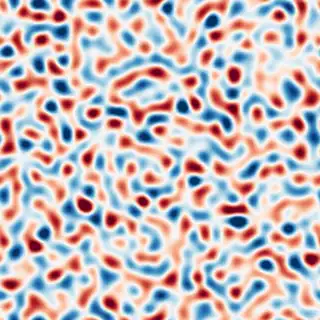
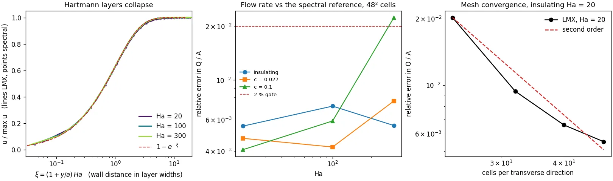
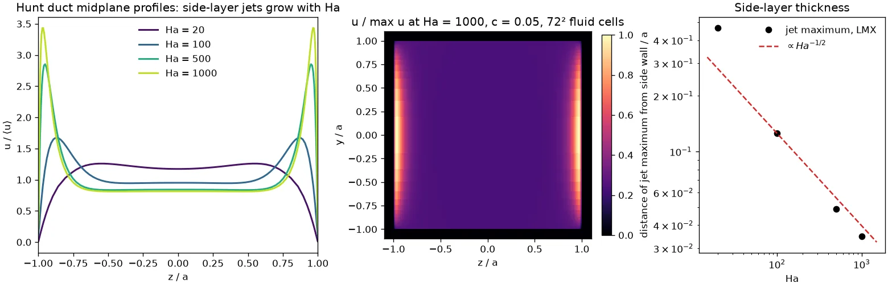
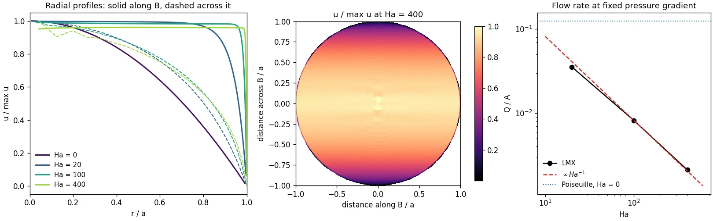
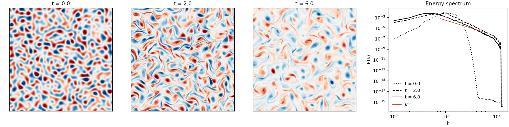

# LMX

**Differentiable inductionless liquid-metal MHD in JAX.**

[](https://github.com/uwplasma/LMX/actions/workflows/ci.yml)
[](https://lmx.readthedocs.io/)
[](https://www.python.org/)
[](LICENSE)

LMX solves the flow of liquid metals in strong magnetic fields — the physics of
fusion blanket channels. Ducts and pipes with insulating or thin conducting
walls, three-dimensional channels entering a fringing field, and
quasi-two-dimensional vortex dynamics, all differentiable end to end.
Reusable solvers and implicit derivatives come from
[SOLVAX](https://github.com/uwplasma/SOLVAX).

- **Resolve the layers:** meshes chosen from `a/Ha` and `a/√Ha`, not from a cell count.
- **Skip the transient:** the steady state as a differentiable root, not a march.
- **Differentiate anything continuous:** drive, field strength, wall conductance, geometry.
- **Check against something else:** an independent spectral solve that shares no code.
- **Run where you like:** CPU or GPU, one compiled trajectory per run.



*Decaying quasi-2D MHD turbulence with Hartmann-layer friction — 256², 3,000 steps, 20 s on a laptop CPU.*

## Install

```console
git clone https://github.com/uwplasma/LMX.git
cd LMX
pip install ".[visualization]"
lmx examples/hartmann_case.toml
```

JAX runs on the CPU by default; install the GPU wheel from the
[JAX guide](https://docs.jax.dev/en/latest/installation.html) and LMX uses it.

## Solve a duct in three lines

```python
import lmx

problem = lmx.duct_problem(hartmann=100.0, cells=48, wall_conductance=0.027)
solution = lmx.solve(problem)
```

`duct_problem` picks both transverse meshes from the layers the Hartmann number
implies — `a/Ha` against the walls normal to the field, `a/√Ha` against the
others — so the answer is converged rather than merely computed. `solve` finds
the steady state by matrix-free Newton–Krylov.

## Duct flows against an independent reference



```console
python scripts/make_showcase_figures.py --only ladder
```

- Hartmann profiles at Ha 20, 100 and 300 **collapse onto `1 − e^{−ξ}`** when
  plotted against the wall distance in layer widths; the points are a spectral
  solve, the lines are LMX.
- Flow rate within **0.4 – 2.3 %** on a fixed 48² mesh, across insulating walls
  and wall conductance 0.027 and 0.1.
- Second order in the mesh, so the error at a fixed mesh growing with the field
  is a resolution statement rather than a model one.
- The reference, [`validation/shercliff.py`](validation/shercliff.py), is
  Chebyshev collocation of the governing system converged to eight digits. It
  shares no operator, mesh or solver with the package, and at zero field it
  returns the analytic Poiseuille maximum `0.29468541`.

## Side layers at blanket-scale Hartmann numbers



```console
python examples/hunt_example.py
```

- Conducting Hartmann walls drive **jets in the side layers** that carry a
  growing share of the flow as the field rises.
- The jet maximum tracks `Ha^{−1/2}`, the side-layer thickness, over Ha 20 → 1000.
- The same steady solver reaches **Ha 1000** in the insulating duct, 0.5 % from
  the spectral reference on a wall-resolving 64² mesh.

## Pipes



```console
python scripts/make_showcase_figures.py --only pipe
```

- A polar grid with the metric in `lmx.grid`, so the same flux-form operators
  solve a circular pipe. The axis needs no condition: the face at `r = 0` has
  zero area.
- The potential Poisson still factorizes exactly — a Fourier transform in the
  azimuth leaves each mode separable in `(r, z)`.
- `Q/A = 1/8` at zero field, the exact Hagen–Poiseuille value, at second order;
  `Q/A ∝ Ha^{−1}` once the field takes over.

## Design with gradients


```console
python examples/variable_field_extruded_demo.py
```

```python
import jax, jax.numpy as jnp, lmx

problem = lmx.duct_problem(hartmann=20.0, cells=24)

def throughput(drive, field_scale):
    solution = lmx.solve_steady_state(problem, forcing=(drive, 0.0, 0.0), field_scale=field_scale)
    return jnp.mean(solution.velocity[0].data)

print(jax.grad(throughput, argnums=(0, 1))(1.0, 1.0))
```

- One adjoint solve at the root, through the implicit function theorem — not a
  tape of the iteration.
- Agrees with central differences to **7e-12** in the drive and **1.2e-10** in
  the field scale.
- A solve that stops short raises, rather than returning a plausible field and a
  gradient taken away from a root.

## Quasi-two-dimensional turbulence



```console
python examples/q2d_turbulence_demo.py
```

- Vortex merging under Hartmann friction, with a `k^{−3}` enstrophy range.
- Energy and enstrophy budget identities checked on every run.
- 256² for 3,000 steps in about 20 s on a laptop CPU.

## Comparison with other codes

| Comparison | What it establishes | Status |
|---|---|---|
| [`validation/shercliff.py`](validation/shercliff.py) spectral solve | Duct flow rates, insulating and Hunt walls, Ha 0 → 1000 | independent of the package; 0.4 – 2.3 % on the meshes above |
| Analytic Hartmann, Shercliff, Hunt and Poiseuille | Profiles and flow rates in every limit that has a closed form | `python examples/hartmann_example.py` |
| FreeMHD (OpenFOAM `epotFoam`), pinned [`freemhd_install`](https://github.com/rogeriojorge/freemhd_install) image, B2 case | Same observed contract, executed by both codes | passes: transverse pressure difference RMS 0.0045, max 0.0109, against frozen bounds 0.16 and 0.32 — an integration check on a harness mesh, **not** a production result |
| ALEX B1 pipe and B2 square duct experiments | Fringing-field pressure drop | production acceptance **open**; specs and digitised references are frozen in [`src/lmx/data/benchmarks`](src/lmx/data/benchmarks) |

The [validation record](https://lmx.readthedocs.io/en/latest/validation/index.html)
states each gate and what it does not cover.

## Examples

| Command | Physics |
|---|---|
| `lmx examples/hartmann_case.toml` | Hartmann duct from a TOML file, terminal diagnostics |
| `python examples/hartmann_example.py` | analytical error, conservation, mesh convergence |
| `python examples/hunt_example.py` | conducting Hartmann walls, side-layer jets |
| `python examples/li_aln_wall_stack_example.py` | explicit wall material layers and interface currents |
| `python examples/fringing_benchmark_demo.py` | 3-D duct entering a magnetic field |
| `python examples/variable_field_extruded_demo.py` | gradient-based field, wall and geometry design |
| `python examples/q2d_turbulence_demo.py` | Q2D vorticity evolution, energy decay, movie |

Each example is one editable file that writes to `artifacts/examples/`;
parameters and evidence status are in [`examples/catalog.toml`](examples/catalog.toml).
`python scripts/make_showcase_figures.py` regenerates every figure above.

## What is validated, what is research

- **Validated:** Hartmann, Shercliff and Hunt ducts against an independent
  spectral solve and against analytical profiles; the pipe against
  Hagen–Poiseuille at zero field; implicit adjoints against finite differences;
  the mechanical power balance to 1e-13; Q2D decay identities.
- **Research stage:** the pipe at finite Hartmann number has no outside
  reference yet, three-dimensional ducts carry no convective transport, the ALEX
  B1/B2 fringing benchmarks have production acceptance open, and multi-device
  execution is correct but not yet faster. The
  [validation matrix](https://lmx.readthedocs.io/en/latest/validation/index.html)
  and the [plan](plan.md) state each gate.

## Documentation

[Install](https://lmx.readthedocs.io/en/latest/getting_started/install.html) ·
[Tutorials](https://lmx.readthedocs.io/en/latest/tutorials/fully_developed.html) ·
[Equations](https://lmx.readthedocs.io/en/latest/physics/equations.html) ·
[Validation](https://lmx.readthedocs.io/en/latest/validation/index.html) ·
[API](https://lmx.readthedocs.io/en/latest/reference/api.html) ·
[Roadmap](plan.md)

## Cite and contribute

Cite the commit or release you used; metadata is in [CITATION.cff](CITATION.cff).
Development: `pip install -e ".[dev,docs]"`, then
`python scripts/run_full_test_suite.py --changed-from HEAD`. See
[CONTRIBUTING.md](CONTRIBUTING.md).
