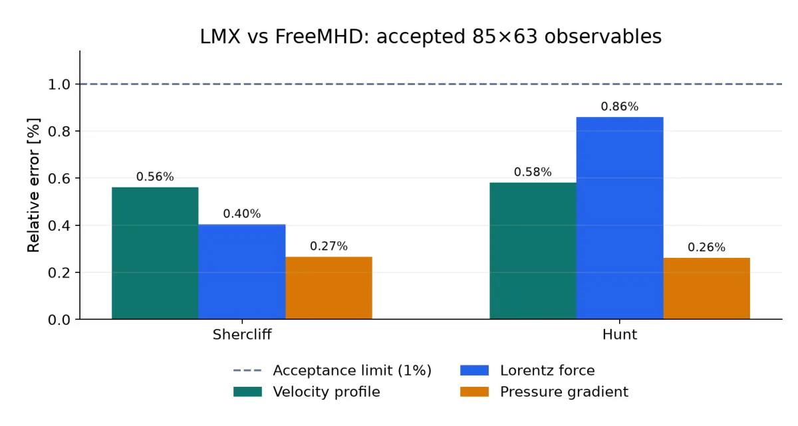
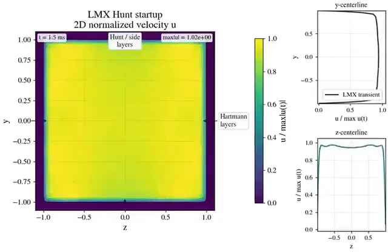
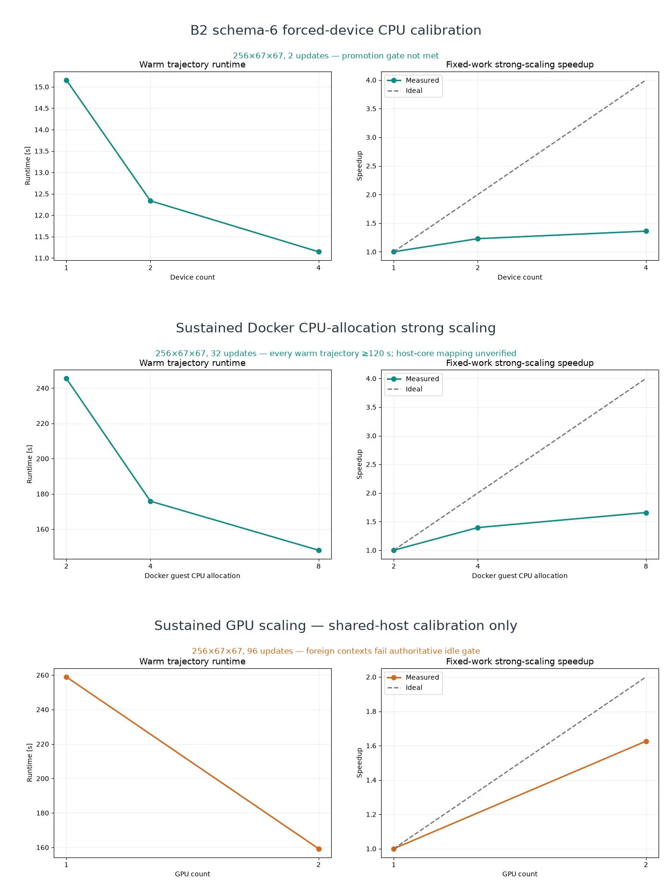

# LMX

[](pyproject.toml)
[](https://docs.jax.dev/)
[](https://lmx.readthedocs.io/)
[](LICENSE)

**LMX is a JAX-native code for inductionless liquid-metal MHD on CPUs and
GPUs.** It combines verified duct solvers, conducting walls, imposed 3D fields,
selected differentiable workflows, and research-stage extruded flows.

> Hartmann, Shercliff, and Hunt ducts are verified. Fringe fields, magnetic
> obstacles, Q2D turbulence, and blanket models remain research-stage.

[Documentation](https://lmx.readthedocs.io/) ·
[Quickstart](docs/getting_started.md) ·
[Examples](docs/case_cookbook.md) ·
[Validation](docs/benchmark_matrix.md) ·
[Roadmap](plan.md)


## Install and run

```bash
git clone https://github.com/uwplasma/LMX.git
cd LMX && python -m pip install -e .
lmx examples/hartmann_case.toml
```

```python
from lmx import make_hartmann_case, solve_steady

solution = solve_steady(make_hartmann_case(ha=20, ny=48, nz=48))
print(solution.diagnostics.volumetric_flow_rate_history[-1])
```

TOML and Python inputs support restarts, diagnostics, plotting, and checksummed
artifacts. See the [case cookbook](docs/case_cookbook.md).

## Capabilities

✅ native and documented · ◐ partial/research-stage · — not exposed as the named native workflow

| Capability | LMX | [FreeMHD](https://github.com/PlasmaControl/FreeMHD) | [NekRS](https://nekrs.readthedocs.io/en/latest/) |
|---|:---:|:---:|:---:|
| Inductionless electric-potential LM MHD | ✅ | ✅ | — |
| Full-induction / finite-Rm MHD | — | —¹ | ◐ research |
| Verified high-Hartmann duct benchmarks | ✅ | ✅ | — |
| 3D imposed/fringing-field LM workflow | ◐ | ✅ | — |
| Conducting/insulating wall-current closure | ✅ | ✅ | — |
| Fully 3D transient MHD | ◐ extruded | ✅ | ◐ research |
| Free-surface / two-phase MHD | — | ✅ | — |
| Fluid–solid conjugate heat transfer | — | ✅ | ✅ |
| Turbulence models | ◐ Q2D | ◐ OpenFOAM | ✅ LES/RANS |
| Curved / complex 3D meshes | ◐ mapped | ✅ | ✅ |
| Parallel CPU solver | ◐ | ✅ | ✅ |
| Single-GPU execution | ✅ | — | ✅ |
| Multi-GPU execution | ◐ B2 | — | ✅ |
| Selected reverse-mode AD workflows | ✅ | — | — |
| Published liquid-metal experiment comparison | ◐ | ✅ | — |

¹ [FreeMHD2](https://arxiv.org/abs/2606.18745) is a separate finite-Rm
extension. Sources: [FreeMHD paper](https://doi.org/10.1063/5.0230242) and
[solver](https://github.com/PlasmaControl/FreeMHD/blob/main/MHD_Solvers/solvers/epotMultiRegionInterFoam/epotMultiRegionInterFoam.C),
[NekRS native capabilities](https://nekrs.readthedocs.io/en/latest/),
[research MHD extension](https://doi.org/10.2172/2453867), and
[GPU scaling](https://doi.org/10.1016/j.parco.2022.102982).

## Verified duct MHD

Eight frozen high-Hartmann rows pass, and audited closed-channel FreeMHD
observables pass the 1% finite-grid gate.

<p align="center">
  
  <a href="docs/_static/readme_hunt_startup_2d.mp4"></a>
</p>

▶ [Watch the 7-second Hunt startup](docs/_static/readme_hunt_startup_2d.mp4)

[Validation evidence →](docs/validation_report.md)

## Real geometries and nonuniform fields

<p align="center">
  
  
</p>


B2 passes exact restart and 1/2/4-CPU plus 1/2-GPU equivalence. Its stopping
threshold, production parity, and scaling promotion remain open.
[Fringing status →](docs/fringing.md)

## Model conducting multilayer walls


Research-stage Li/AlN wall results retain pressure and current mesh-step changes
below 10% at `Ha = 220`; experimental and blanket-level validation remain open.
[Wall models →](docs/wall_models.md)

## Differentiate selected workflows


Promoted objectives pass finite-difference or independent-transpose checks.
[Differentiable workflows →](docs/autodiff.md)

## Explore research flows

<p align="center">
  
  <a href="https://github.com/uwplasma/LMX/releases/download/lmx-research-assets-v1/readme-blanket-flow.mp4"></a>
</p>

<p align="center">
  <a href="https://github.com/uwplasma/LMX/releases/download/lmx-research-assets-v1/readme-q2d-turbulence.mp4"></a>
</p>

▶ [Watch blanket flow](https://github.com/uwplasma/LMX/releases/download/lmx-research-assets-v1/readme-blanket-flow.mp4) ·
[Q2D turbulence · 7 s](https://github.com/uwplasma/LMX/releases/download/lmx-research-assets-v1/readme-q2d-turbulence.mp4)

These visuals demonstrate implemented workflows. Quantitative turbulent
Q2D-MHDfoam parity and blanket validation remain open.
[Geometry and fields →](docs/geometry.md) ·
[External benchmarks →](docs/external_benchmarks.md)

## Scale on CPUs and GPUs



The current B2 smoke agrees on 1/2/4 CPU and 1/2 GPU devices. At
`128 × 67 × 67`, two GPUs reduce 2.780 s to 2.400 s (1.159×); this misses the
1.2× promotion gate, so no production-scaling speedup is claimed.
[Protocol and results →](docs/performance.md)

## Quality and citation

The portable gate records **818 passing tests**, **95.03% combined line/branch
coverage**, and **157.4 s** on six Apple-Silicon workers. [Testing](docs/testing.md) ·
[Theory](docs/theory.md) · [Numerics](docs/numerics.md) ·
[Contributing](CONTRIBUTING.md) · [Research assets](https://github.com/uwplasma/LMX/releases/tag/lmx-research-assets-v1)

LMX is MIT licensed. Cite it with [CITATION.cff](CITATION.cff).
