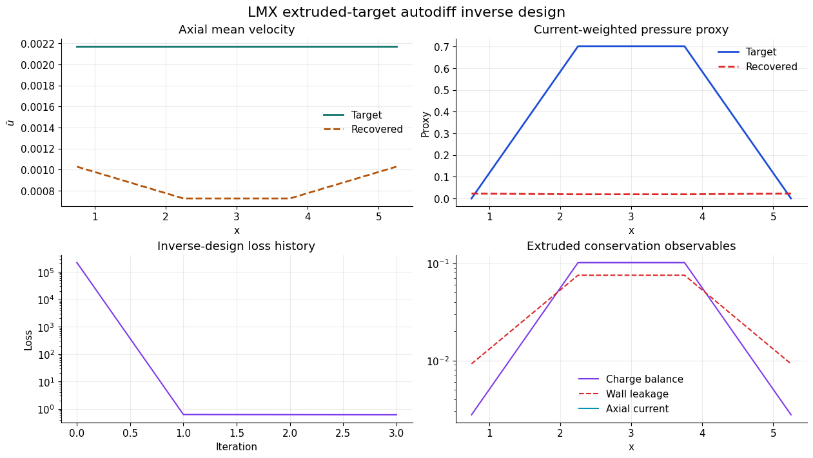
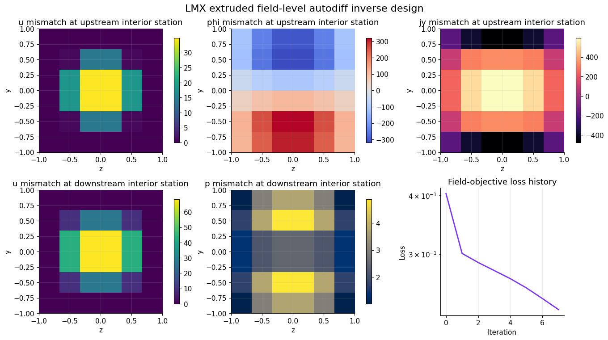
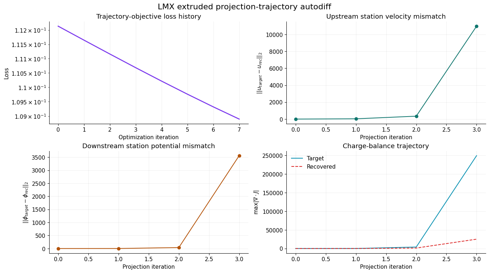

# Autodiff and Inverse Design

LMX includes an explicit differentiable duct lane for
parameter-sensitivity and inverse-design studies. The default example focuses on
Hartmann flow because it is fast, well understood, and a clean starting point
for differentiable benchmark figures.

## What is included

- a differentiable fixed-iteration fully developed Hartmann solve
- sensitivity analysis with `jax.grad`
- inverse forcing identification from synthetic target profiles
- full-profile inverse design that recovers both forcing and Hartmann number
- fringing-history inverse design over axial field-profile parameters
- fringing multi-observable inverse design over axial mean-velocity and
  current-response histories
- inverse design against response targets produced directly by the
  `extruded_inductionless` 3D slice
- a first direct differentiable rectangular `extruded_inductionless` response
  model used for inverse design against 3D-solver-generated targets
- a field-level inverse-design workflow over selected extruded `u`, `\phi`,
  `J_y`, and `p` slices
- summary plots and JSON outputs

The differentiable lane is intentionally explicit:

- it uses fixed-iteration Jacobi relaxations to preserve reverse-mode
  differentiation
- it is scoped to benchmark and inverse-study workflows
- the production CLI/reporting path remains free to use pragmatic
  non-differentiable tooling where that improves robustness

## Run the example

```bash
python examples/autodiff_design_demo.py \
  --output artifacts/examples/autodiff_design
```

The example writes:

- `autodiff_summary.json`
- `autodiff_summary.png`
- `autodiff_summary.pdf`

The repository also ships a second autodiff example focused on derivative
verification:

```bash
python examples/autodiff_sensitivity_demo.py \
  --output artifacts/examples/autodiff_sensitivity
```

That companion example writes:

- `autodiff_sensitivity_summary.json`
- `autodiff_sensitivity_validation.png`
- `autodiff_sensitivity_validation.pdf`

The repository now also ships a third autodiff example focused on joint
profile-matching recovery:

```bash
python examples/autodiff_profile_design_demo.py \
  --output artifacts/examples/autodiff_profile_design
```

That workflow writes:

- `autodiff_profile_design_summary.json`
- `autodiff_profile_design.png`
- `autodiff_profile_design.pdf`

The repository now also ships a fourth autodiff example focused on fringing
history matching:

```bash
python examples/autodiff_fringing_design_demo.py \
  --output artifacts/examples/autodiff_fringing_design

python examples/autodiff_fringing_response_demo.py \
  --output artifacts/examples/autodiff_fringing_response

python examples/autodiff_extruded_target_demo.py \
  --output artifacts/examples/autodiff_extruded_target

python examples/autodiff_extruded_field_design_demo.py \
  --output artifacts/examples/autodiff_extruded_field_design

python examples/autodiff_extruded_trajectory_demo.py \
  --output artifacts/examples/autodiff_extruded_trajectory
```

That workflow writes:

- `autodiff_fringing_design_summary.json`
- `autodiff_fringing_design.png`
- `autodiff_fringing_design.pdf`

## Current artifact

The current committed autodiff summary is stored under
`docs/_static/generated/autodiff_summary.png`.


The run demonstrates:

- a Hartmann-number sensitivity scan of mean velocity and `d(mean velocity)/dHa`
- inverse recovery of a synthetic forcing parameter at fixed Hartmann number
- convergence from forcing `0.2` to `0.999863` for a target forcing of `1.0`
- final profile misfit `2.9e-12`

The left panel should be read physically, not only numerically: mean
throughput drops as the Hartmann number rises because the transverse magnetic
field strengthens the Hartmann layers at the walls normal to `B`, and the
dashed line is the autodiff sensitivity quantifying that trend. The right panel
shows the inverse-design path itself: the profile-misfit decays by many orders
of magnitude while the recovered forcing approaches the synthetic target.

## Source map

- `lmx/autodiff.py`
  - differentiable Hartmann problem construction, fixed-iteration solve, and
    inverse-design utilities
- `examples/autodiff_design_demo.py`
  - sensitivity scan and inverse-design loop
- `examples/autodiff_profile_design_demo.py`
  - full-profile inverse design over forcing and Hartmann number
- `examples/autodiff_fringing_design_demo.py`
  - inverse design over fringing-profile parameters and axial response history
- `examples/autodiff_extruded_field_design_demo.py`
  - field-level inverse design over selected extruded 3D slices
- `lmx/plotting.py`
  - polished sensitivity/inverse summary figure

## Typical summary figures

The default example produces two common autodiff figures:

1. a sensitivity scan of mean velocity and `d(mean velocity)/dHa`
2. an inverse-design history showing loss decay and the recovered forcing
   approaching a synthetic target

These are the standard ingredients for a first differentiable-solver section in
an MHD code paper: local sensitivities, explicit gradient verification, and a
small inverse problem.

## Additional workflows

The sensitivity-validation example compares autodiff gradients against central
finite differences for:

- `d(mean velocity)/dHa`
- `d(mean velocity)/dF`

This is the fast gradient-verification figure that should
accompany broader inverse-design claims.

The profile-design example broadens the differentiable lane from scalar
objective matching to field-level inverse design. It optimizes two parameters
simultaneously:

- forcing
- Hartmann number

against a full target centerline profile, which is the right next step before
moving the differentiable lane into Hunt or fringing research studies.

The fringing-design example takes that next step. It optimizes:

- peak Hartmann number
- fringing entry location
- fringing exit location
- fringing transition width

against a target axial mean-velocity history, which is the current bridge from
Hartmann-only autodiff to fringing-oriented inverse design.

The fringing-response example broadens that objective from one observable to
two. It optimizes the same axial field-shape parameters against:

- a target axial mean-velocity history
- a target axial current-proxy history

This is the current best lightweight stand-in for multi-observable inverse
design before the full 3D fringing solver family is made differentiable.

The extruded-target example is the first direct bridge into the 3D solver lane.
It:

- runs `solve_extruded_inductionless(...)` on a small fringing problem
- extracts axial mean-velocity, current-weighted pressure proxy,
  charge-balance residual, boundary-current residual, wall-current leakage, and
  axial-current histories
- uses those histories as targets in a direct differentiable rectangular
  `extruded_inductionless` response model
- recovers the axial field-shape parameters against a target generated by the
  3D solver family itself

That is not yet full reverse-mode differentiation through the complete 3D
projection loop. It is the intended intermediate step: the inverse-design
objective is tied directly to `extruded_inductionless`-style 3D response
histories, while the optimization remains cheap enough for routine tests and
figures. The rectangular differentiable model also uses the same conservative
electric source assembly and face-current boundary audit as the executable
rectangular 3D fringing slice, so its charge/current loss terms are closer to
the solver family than the earlier
cell-gradient-only version.

Extruded-target artifact:



The field-level extruded example pushes the objective deeper into the
projection loop. It matches selected-station fields instead of only
station histories:

- `u(x_i, y, z)`
- `\phi(x_i, y, z)`
- `J_y(x_i, y, z)`
- `p(x_i, y, z)`

Run it with:

```bash
python examples/autodiff_extruded_field_design_demo.py \
  --output artifacts/examples/autodiff_extruded_field_design
```

Field-level artifact:



The projection-trajectory example goes one step deeper still. It matches
selected-station fields and conservation diagnostics across the
projection iterations themselves:

- `u_k(x_i, y, z)`
- `\phi_k(x_i, y, z)`
- `J_{y,k}(x_i, y, z)`
- `p_k(x_i, y, z)`
- `\max |\nabla \cdot J|_k(x_i)`
- boundary-current residual history at the sampled stations

Trajectory-level artifact:



`examples/autodiff_extruded_trajectory_demo.py` is the deepest bounded
example in the differentiable fringing lane because it matches fields
and conservation trajectories across the projection iterations, not
just final-state outputs.

These three extruded autodiff figures should be read as field- and
trajectory-matching examples built around the current 3D projection loop. The
Hartmann sensitivity and inverse-design summary above remains the cleanest
analytical reference, while the extruded-target, field-level, and
trajectory-level examples extend the same workflow into 3D fringing problems.

## References

- [JAX advanced autodiff](https://docs.jax.dev/en/latest/advanced-autodiff.html)
- [JAX gradient checkpointing](https://docs.jax.dev/en/latest/gradient-checkpointing.html)
- [Lineax solvers](https://docs.kidger.site/lineax/api/solvers/)
- [Φ-Flow differentiable PDE workflows](https://proceedings.mlr.press/v235/holl24a.html)
