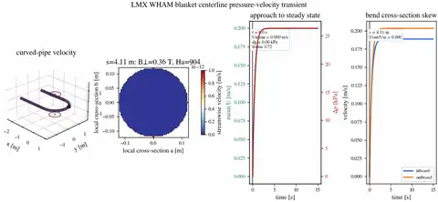
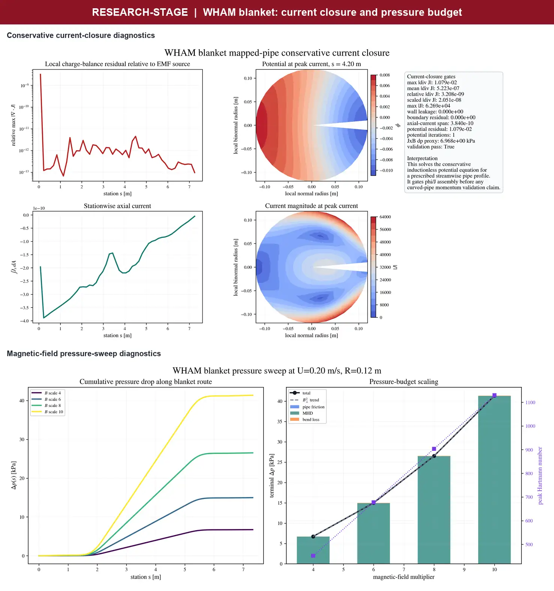
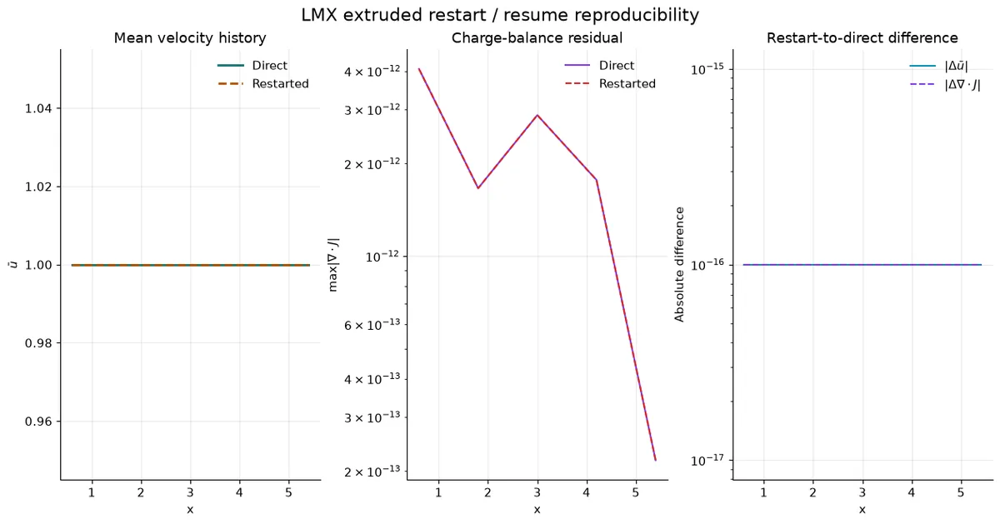

# Case cookbook

The curated examples cover the supported user journeys without a large tree of
one-off campaign drivers. Run commands from the repository root.

## Fully developed ducts

```bash
lmx examples/hartmann_case.toml
lmx examples/cases/ducts/shercliff_case.toml
lmx examples/cases/ducts/hunt_case.toml
```

Python constructors expose the same stable cases:

```python
from lmx.cases import make_hunt_case
from lmx.solvers import solve_steady

case = make_hunt_case(ha=20.0, ny=48, nz=48, wall_cells=2)
solution = solve_steady(case)
```

Increase `ny` and `nz` for convergence studies; change wall resolution or
conductance through the constructor rather than private arrays.

## Validate a case

```bash
lmx validate hartmann --ha 20 --output artifacts/validation/hartmann
lmx validate shercliff --ha 20 --output artifacts/validation/shercliff
lmx validate hunt --ha 20 --output artifacts/validation/hunt
python scripts/run_convergence_suite.py --help
python scripts/run_convergence_suite.py --mode time --help
```

The validation commands record profiles, solver metrics, and available
analytical comparisons. The convergence driver adds mesh/time change and
fingerprints. Long or external comparisons are not hidden inside the portable
test run.

## Fringing fields

```bash
lmx examples/cases/fringing/fringing_rect_case.toml
lmx examples/cases/fringing/fringing_layered_case.toml
lmx examples/cases/fringing/fringing_pipe_case.toml
python examples/fringing_benchmark_demo.py --help
```

These workflows are research-stage. Begin with the rectangular case, then add
layers, mapped geometry, or tabulated fields one change at a time.

## Blanket research workflow

<p align="center">
  
</p>

<p align="center">
  
</p>

The reduced blanket workflow includes a conservative current-closure gate and
a magnetic-field pressure-budget sweep. These are research-stage diagnostics,
not a validated blanket design prediction.

## Restart

```bash
lmx examples/hartmann_case.toml
lmx examples/cases/ducts/hartmann_restart_case.toml
python examples/extruded_restart_demo.py --help
```

<p align="center">
  
</p>

The portable 3+3-step demo reproduces the direct six-step solution bit-for-bit
across `u`, `v`, `w`, `p`, and `phi` (5.15 s on the reference Mac run).
Restart metadata protects against incompatible source, mesh, or input state.
Use atomic partial checkpoints for long extruded runs.

## Custom imposed field

```bash
python examples/variable_field_extruded_demo.py --help
lmx examples/cases/fringing/fringing_tabulated_case.toml
```

The included `examples/tabulated_rect_field.npz` is a small tested fixture.
Production field volumes belong in release or user storage, not Git.

## Differentiable design

```bash
python examples/autodiff_design_demo.py
```

Always compare the automatic derivative against a finite difference or
independent transpose reference at the final mesh and solver tolerance.

## Plotting

Install `lmx[visualization]` to enable plots and movies. Numerical solves and
non-plot outputs do not require Matplotlib or Pillow.

`lmx.plotting` writes bounded plots from solution and validation objects. The
Python examples demonstrate the supported plotting API. Showcase media in the
README and docs is compressed and served from releases; new runs write under
ignored `artifacts/` directories.

## Parallel performance

```bash
JAX_PLATFORMS=cpu python examples/strong_scaling_demo.py --help
JAX_PLATFORMS=cuda CUDA_VISIBLE_DEVICES=0,1 python scripts/run_strong_scaling_worker.py --help
```

Scaling results must use fixed global physics, include a one-device baseline,
separate compilation from warm execution, prove shard placement, and pass
solution-equivalence gates. Defaults are debug/CI smoke checks; `--sustained`
enables the multi-minute acceptance protocol. See [Performance](performance.md).

## Choose the right example

The complete supported list and maturity labels are in `examples/catalog.toml`.
Large parameter sweeps, raw external-solver cases, and manuscript campaigns are
release assets rather than permanent source-tree entry points.
