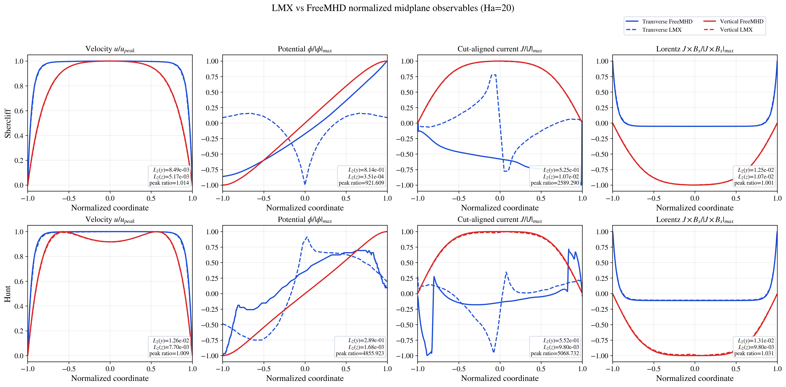

# External Benchmark Comparisons

LMX keeps external solver comparisons as benchmark evidence, not as the source
of truth for the governing equations.

## Current external references

- [FreeMHD validation paper](https://doi.org/10.1063/5.0230242)
- [OpenFOAM pressure-velocity algorithm documentation](https://www.openfoam.com/documentation/guides/latest/doc/guide-applications-solvers-pressure-velocity-intro.html)
- [Fusion Engineering and Design paper on multi-region MHD solvers built on OpenFOAM](https://doi.org/10.1016/j.fusengdes.2024.114216)

## What should be compared

For the fully developed duct solver, the meaningful comparison targets are:

- velocity slices and line cuts
- electric-potential slices and line cuts
- current-density observables
- Lorentz-force observables
- integral flow-rate and pressure-drop surrogates
- matched runtime on the same host when the comparison is used for
  performance context rather than only for physics parity

## What should not be primary acceptance criteria

- backend-specific pressure-correction loop traces
- implementation-specific residual histories
- source-code-level solver choices in external codes

## Rationale

LMX is a clean-room inductionless MHD implementation. External executables are
useful because they provide an independent finite-volume baseline, but the LMX
solver should be accepted or rejected based on physically matched observables.

## Fresh FreeMHD closed-channel parity

LMX now includes a fresh host-local FreeMHD cross-check for the supported
straight-duct transient lane:

```bash
python examples/freemhd_closed_channel_parity.py
```

That example reuses fresh Shercliff and Hunt reruns from
`/Users/rogerio/local/tests/freemhd_install/freemhd_output`, reconstructs the
matching LMX transient cases from the copied OpenFOAM fields and control files,
and writes a parity panel plus checked summary JSON. The panel now includes:

- final transverse and vertical velocity cuts
- transient `u_max(t)` histories from FreeMHD `fieldMinMax.dat` and LMX
  diagnostics
- same-host runtime comparison

Current bounded result from the fresh reruns on this host:

- Shercliff:
  - FreeMHD wall time: `35.32 s`
  - LMX wall time: `21.75 s`
  - `u_max` mismatch: `≈ 4.51e-2`
  - profile errors: `L2(y) ≈ 6.70e-2`, `L2(z) ≈ 1.04e-1`
- Hunt:
  - FreeMHD wall time: `35.28 s`
  - LMX wall time: `40.08 s`
  - `u_max` mismatch: `≈ 5.08e-2`
  - profile errors: `L2(y) ≈ 7.21e-2`, `L2(z) ≈ 8.14e-2`

This is useful as an implementation cross-check and host-runtime comparison,
but it is not currently the manuscript acceptance gate for the straight-duct
lane. The literature-backed analytical ladder remains the primary acceptance
surface because it is tighter and better conditioned. The FreeMHD transient
parity figure is still worth keeping in the docs and future paper as an
independent executable baseline.


## FreeMHD paper-slice observable parity

LMX also includes a richer observable comparison workflow against the bundled
FreeMHD paper slices for the closed-channel family:

```bash
python examples/freemhd_closed_channel_observable_parity.py
```

That example compares normalized midplane profiles of:

- axial velocity `u`
- gauge-shifted electric potential `potE - potE(center)`
- cut-aligned current components `J_y` and `J_z`
- streamwise Lorentz force `J×B_x`

for Shercliff and Hunt against the processed slice CSV files in
`/Users/rogerio/local/tests/freemhd_test_cases/FreeMHDPaperAllFigures/ClosedChannel`.
It now runs on case-specific settings rather than a single showcase default:

- Shercliff:
  - `17 × 17`, `48` steady steps, `face_averaged` current reconstruction
- Hunt:
  - `13 × 13`, `48` steady steps, `cell_centered` current reconstruction

Current retained result on that richer parity lane:

- Shercliff:
  - velocity: `L2(y) ≈ 4.75e-2`, `L2(z) ≈ 4.90e-3`
  - potential: `L2(y) ≈ 7.50e-1`, `L2(z) ≈ 3.87e-3`
  - current: `L2(y) ≈ 9.45e-1`, `L2(z) ≈ 4.06e-2`
  - Lorentz: `L2(y) ≈ 4.20e-2`, `L2(z) ≈ 4.06e-2`
- Hunt:
  - velocity: `L2(y) ≈ 9.28e-2`, `L2(z) ≈ 6.24e-2`
  - potential: `L2(y) ≈ 1.12e0`, `L2(z) ≈ 3.27e-2`
  - current: `L2(y) ≈ 1.02e0`, `L2(z) ≈ 5.92e-1`
  - Lorentz: `L2(y) ≈ 1.18e-1`, `L2(z) ≈ 5.92e-1`

This is now a useful manuscript-grade external comparison figure because it
shows much more than one velocity cut, but it also makes the remaining parity
gap explicit: the fully developed constant-`Q`/flow-rate lane is still the
main blocker, and field-level parity is not yet closed on `potE`, `J`, and
`J×B`.


