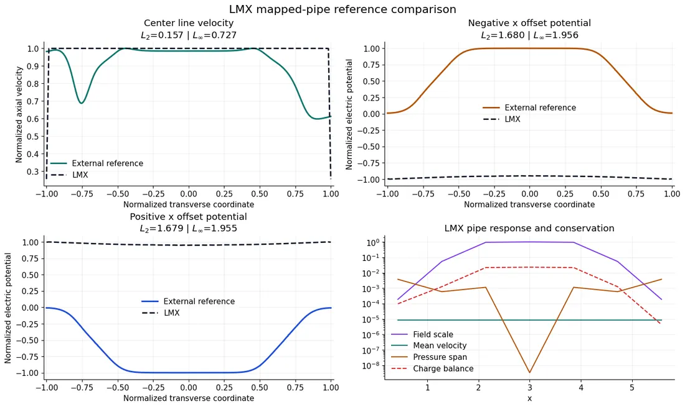
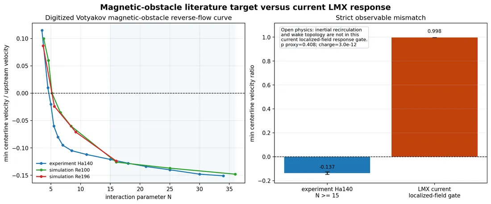
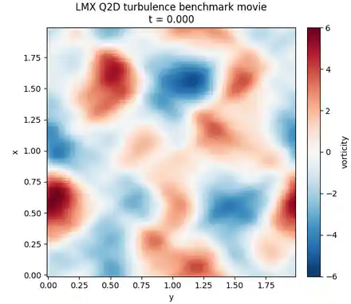
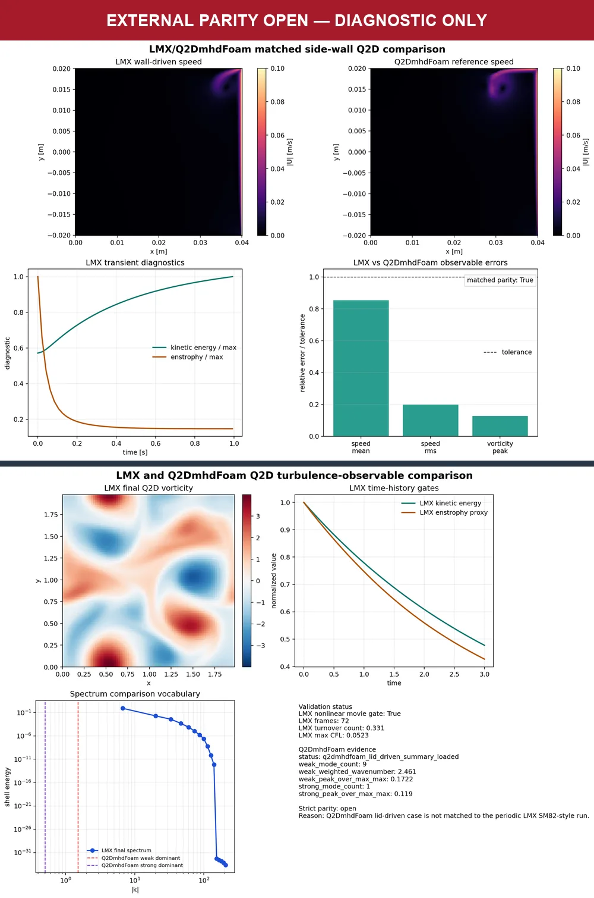

# External benchmark comparisons

External solvers and experiments provide independent evidence; they are not
dependencies of an ordinary LMX installation. LMX keeps input observers,
frozen specifications, and compact observables in Git while raw solver trees
and field dumps remain local or in versioned releases.

## FreeMHD

The closed-channel parity lane audits materialized FreeMHD dictionaries against
the canonical LMX specification before comparing observables. It checks
geometry, material properties, magnetic field, Hartmann number, inlet drive,
wall conductivities, mesh, and normalization.

Run against a local installation or container:

```bash
.venv/bin/python scripts/run_freemhd_parity_suite.py --help
```

The same command materializes an audited Benchmark-A smoke case without
starting FreeMHD. Keep the case under the external FreeMHD workspace, not in
the LMX checkout:

```bash
.venv/bin/python scripts/run_freemhd_parity_suite.py \
  --materialize shercliff \
  --freemhd-install-dir /Users/rogerio/local/tests/freemhd_install \
  --output /Users/rogerio/local/tests/freemhd_install/external_cases/shercliff-ha20
```

Run that exact materialized case through the external Docker installation:

```bash
cd /Users/rogerio/local/tests/freemhd_install
./run_case.sh /workspace/external_cases/shercliff-ha20 4
```

The `/workspace/...` path is the container-visible form of the mounted host
path. Do not use `run_shercliff.sh` or `run_hunt.sh` for a materialized case:
those convenience wrappers recopy the original demos. The case manifest,
OpenFOAM logs, VTK, reconstructed fields, and raw time histories remain in the
external workspace. Only compact, checksummed acceptance records belong in
LMX; large reusable artifacts belong in a versioned release.

To compare processed profiles (see `--help` for required CSVs):

```bash
.venv/bin/python -m examples.freemhd_closed_channel_observable_parity \
  --reference-root /path/to/ClosedChannel \
  --output artifacts/examples/freemhd_closed_channel_observable_parity
```

The frozen Benchmark A aggregate is
`benchmarks/results/benchmark-a-acceptance.json`. At its finest audited mesh,
velocity, Lorentz-force, and pressure-gradient observables for Shercliff and
Hunt are below the 1% finite-grid target. Current closure and power identities
pass independently.


The original Docker examples were found to describe physical `Ha = 1000`, not
the nominal `Ha = 20` comparison. Those outputs are historical workflow data,
not accepted parity evidence. The audited case specification is authoritative.

### Native fringing-pipe archive admission

Verify a user-supplied `S3_Buhler_Ha616.zip` without extracting its 8.77 GB
payload:

```bash
.venv/bin/python scripts/run_freemhd_parity_suite.py \
  --freemhd-s3-preflight /external/S3_Buhler_Ha616.zip \
  --output /external/s3-preflight
```

The gate streams the frozen 1.93 GB hash and verifies seven small members. A
pass means only `native-freemhd-pipe-regression`: the archive has no source SHA
or explicit reuse license, its supplied observer contains nonfinite data, and
its runtime `Ha ≈ 573` differs from both its design label and ALEX B1. The gate
therefore never authorizes extraction, archived-output acceptance, or B1 parity.

After a successful identity check, an explicit local invocation may extract only
the fresh-input allowlist and run a private 3,072-cell, two-rank, two-update
smoke:

```bash
.venv/bin/python scripts/run_freemhd_parity_suite.py \
  --freemhd-s3-smoke /external/S3_Buhler_Ha616.zip \
  --freemhd-source-repo /external/FreeMHD \
  --freemhd-image freemhd-install:latest \
  --output /external/s3-reduced-smoke
```

The runner resolves the image to an immutable digest, verifies that its embedded
FreeMHD repository is at `14b54a3`, disables networking and Linux capabilities,
runs as the host user with bounded resources and a ten-minute ceiling, and
writes only compact logs and hashes. Its observer requires the exact liquid/wall cell and
rank counts, two time levels, finite residuals and Courant numbers, and `End`.
It always denies full-S3 parity, ALEX-B1 equivalence, steady acceptance, archive
observer acceptance, and redistribution. Extracted inputs, meshes, and outputs
stay outside Git and release assets.

## Matched Benchmark B contract

Benchmark-B acceptance no longer trusts a record-supplied
`exact_case_match` boolean. Production records must equal the canonical
specification—not merely each other—across equations, nondimensional groups,
geometry, field mapping, wall model, boundaries and drive, mesh coordinates,
stopping rules, observable, and normalization. Eight immutable physics sections
are shared; only mesh coordinates and stopping rules vary by evidence role.

Schema-2 records keep seven source, input, evaluator, and output artifacts
beneath a caller-selected bundle root. Validation streams and recomputes every
file or deterministic directory-tree hash, rejecting path escapes, symlinks,
hard-link aliases, overlapping trees, special files, and changed content. The
record cannot choose its own root. The pinned FreeMHD source materializer now
verifies the exact source commit and seven file hashes before producing an
eight-file evidence tree. Deterministic LMX and compact FreeMHD B2 inputs now
have independent observers; a shared evaluator defines the pressure taps and
normalization. Their `harness-smoke` contracts agree without either observer
reading the expected contract or the other input. Copying the canonical
dictionary twice remains insufficient evidence.

The canonical FreeMHD source uses conservative `div(rhoPhi,U)` inertia with
Euler time integration and `Gauss limitedLinear 1.0` advection. Its axial drive
is one inlet flow-rate condition plus an outlet pressure gauge, not a flow
multiplier at every station. A matched reduction must also hold phase fraction
and temperature constant, disable the stock velocity limiter, and enforce zero
normal electric current at both axial ends. These requirements are frozen in
the B1 and B2 TOML specifications.

This machinery is a gate, not a parity result. LMX now has the canonical B2
conservative inertia, mixed axial boundaries, viscous stress, corrected-flux
carry, CFL/stopping diagnostics, exact restart, and shard-boundary gates.
The tiny harness has eight axial cells, a `5x5` fluid cross-section plus one
wall cell per side, the sampled ALEX field, `dt=1/540000`, and two updates
ending at `step_limit`. OpenFOAM 2206 builds its 392-cell mesh, splits the 200
fluid and 192 wall cells, applies both region dictionaries, and initializes the
same field samples. Ten one-sided mutations attribute mesh, field, material,
boundary, scheme, stopping, and source drift while leaving the LMX observation
unchanged. This solver-free gate is not a parity result: `harness-smoke` can
never grant production acceptance. The exact two-update execution now passes
that bounded role with pressure differences of 0.00452 RMS and 0.01092 maximum.
No medium or production campaign starts until its own predeclared mesh,
convergence, and acceptance gates are ready.

## ALEX experiments

Digitized pipe and square-duct pressure references live in
`lmx/data/benchmarks/references/`; frozen case definitions live in
`lmx/data/benchmarks/specs/`.
Use:

```bash
.venv/bin/python examples/pipe_reference_comparison_demo.py --help
.venv/bin/python examples/fringing_benchmark_demo.py
```

The pipe workflow uses optional external data. The rectangular fringing script
is only an internal diagnostic; neither grants experimental acceptance. These
cases remain research-stage until experimental observable, mesh/time,
conservation, and steady-convergence gates pass together.

### Mapped-pipe FreeMHD-profile diagnostic



This research diagnostic compares transverse profiles digitized from the
FreeMHD paper workflow, not the frozen ALEX-B1 excess-pressure observable. The
large off-center potential errors and centerline velocity mismatch fail the
comparison; ALEX-B1 acceptance remains open.

### Magnetic-obstacle literature target



The Votyakov target has reverse centerline flow near `-0.137`; the current
localized-field result remains positive near `0.998`. This visible failure
keeps inertial wake/recirculation physics research-stage.

## Q2D-MHDfoam and other OpenFOAM data





The released lid-driven observable check (top) and turbulence audit (bottom)
exercise the external-data path without establishing end-to-end parity. The
banner is the governing status: geometry, forcing, and observables are not yet
matched across the two workflows. This compressed composite reuses released
PNGs; no solver was rerun.

Frame sampling is passive in the LMX lid-driven integrator: the 100-step,
48-frame case uses 101 rather than 148 Poisson solves, and two versus 48 frames
produce identical final streamfunction, vorticity, and velocity.

`lmx.external_validation` parses line profiles, force histories, probes, VTK
fields, and case dictionaries from an external Q2D-MHDfoam tree. The former
in-repository Docker build context was removed because it duplicated a large,
version-specific external code installation. Point the adapters at a separately
managed reference tree instead.

No turbulent Q2D parity claim is currently made. A valid comparison must match
domain, topology, forcing, Hartmann friction, Reynolds number, averaging window,
and observable definition before numerical errors are evaluated.

## Comparison contract

For every external record, retain:

1. citation and source checksum;
2. dimensional inputs and nondimensional groups;
3. geometry, mesh, boundaries, initial state, and drive mode;
4. exact observable definition and normalization;
5. convergence and averaging protocol;
6. source and dependency fingerprints;
7. source, input, evaluator, and output checksums;
8. acceptance role, quantitative tolerance, and a machine-recomputed result.

Primary acceptance uses observables the reference actually resolves. Images,
streamline resemblance, or a single centerline value may support diagnosis but
cannot replace current, power, convergence, and uncertainty gates.

## Data policy

Small independently sourced tables may live in `lmx/data/benchmarks/references/` with
provenance. Large meshes, complete OpenFOAM/FreeMHD cases, raw transient fields,
restarts, logs, VTK, and generated movies stay in an external workspace or a
release with checksums. This keeps cloning and installation lightweight without
discarding reproducibility.
