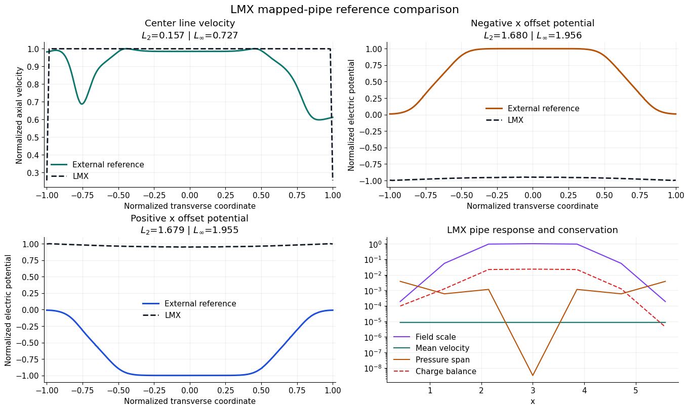
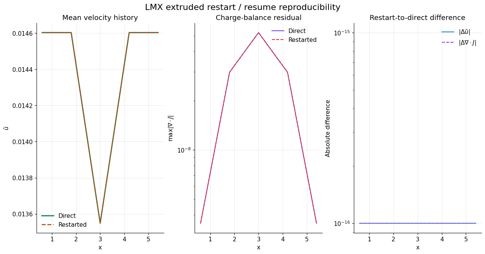
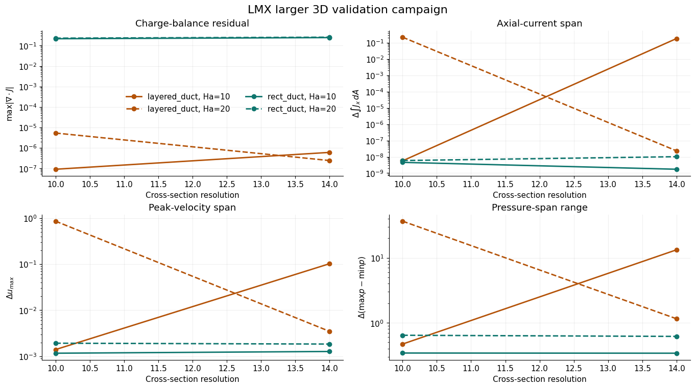
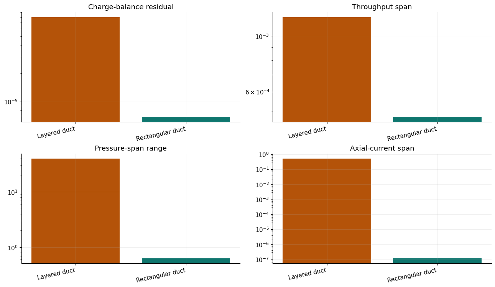

# Fringing-Field Workflows

LMX includes an executable `extruded_inductionless` solver-family front-end for
3D fringing-field workflows.

In plain terms, a fringing-field problem is a duct or pipe flow where the
magnetic field does not stay uniform from inlet to outlet. Instead, the fluid
enters a magnetized region, passes through the strongest field, and then exits
again. That spatial field variation drives pressure redistribution, current
closure, and velocity-profile changes that do not appear in a strictly fully
developed 2D benchmark.

The intended model distinction is:

- `fully_developed_inductionless`
  - 2D cross-sectional solves for `u(y,z)` and `\phi(y,z)` with streamwise
    forcing and conservative transverse currents
- `extruded_inductionless`
  - 3D low-Re slices in `x-y-z` with `u(x,y,z)`, `v(x,y,z)`, `w(x,y,z)`,
    `p(x,y,z)`, and `\phi(x,y,z)` under a prescribed axial magnetic-field
    profile

That distinction matters physically. The 2D family is the right model for
fully developed benchmark ducts, while the 3D family is the right model once
axial field variation, inlet/outlet current closure, or fringing-region
pressure redistribution become important.

The three fringing geometries are:

- `rect_duct`
  a plain rectangular liquid-metal channel
- `layered_duct`
  the same channel with explicit conducting and insulating wall regions
- `pipe_ogrid`
  a circular pipe represented on an O-grid so radial and azimuthal resolution
  can be controlled separately

The current 3D solver lane includes:

- a smooth axial fringing-field profile generator in `lmx/fringing.py`
- a stationwise sweep driver that reuses the fully developed solver as a cheap
  research scaffold
- an `ExtrudedInductionlessProblem -> ExtrudedInductionlessSolution` workflow
  that now runs a true low-Re rectangular-duct, layered-duct, or mapped-pipe
  `u, v, w, p, phi` projection slice
- a stacked axial field-bundle builder that exposes `u(x, y, z)`,
  `v(x, y, z)`, `w(x, y, z)`, `p(x, y, z)`, `phi(x, y, z)`, current,
  Lorentz, axial-current, wall-current leakage, and charge-balance histories
- an explicit validation summary for that extruded slice
- a detailed example in `examples/fringing_benchmark_demo.py`

This is explicit by design. The current lane is a real 3D
pressure-velocity-potential iteration and is now available through both Python
and TOML/CLI workflows, including direct `lmx run fringing_*` entry points for
quick rectangular, layered, and mapped-pipe launches.

## Run the scaffold

```bash
lmx examples/fringing_rect_case.toml
lmx examples/fringing_layered_case.toml
lmx examples/fringing_pipe_case.toml
lmx run fringing_rect --ha 20 --nx-stations 21 --output out/fringing_rect
lmx run fringing_layered --ha 20 --nx-stations 21 --wall-cells 1 --insulator-cells 1 --output out/fringing_layered
lmx run fringing_pipe --ha 20 --radius 0.5 --nr 24 --ntheta 48 --output out/fringing_pipe
python examples/fringing_benchmark_demo.py \
  --geometry-kind rect_duct \
  --ha-peak 20 \
  --ny 12 \
  --nz 12 \
  --nx-stations 11 \
  --max-steps 18 \
  --coupling-iterations 10 \
  --potential-iterations 60 \
  --output artifacts/examples/fringing_benchmark
python examples/fringing_benchmark_demo.py \
  --geometry-kind layered_duct \
  --output artifacts/examples/fringing_benchmark_layered
python examples/fringing_benchmark_demo.py \
  --geometry-kind pipe_ogrid \
  --output artifacts/examples/fringing_benchmark_pipe
python examples/extruded_summary_figures.py \
  --output artifacts/examples/extruded_summary_figures
```

The example writes:

- `fringing_benchmark_summary.json`
- `fringing_benchmark.png`
- `fringing_benchmark.pdf`
- an `extruded_bundle` section in the JSON summary with axial field-bundle shape
  and charge-balance histories
- a `validation` section with residual and field/response consistency metrics
- for TOML/CLI runs, `*_station_history.csv`, `*_extruded_results.npz`,
  `overview.png`, `overview.pdf`, a station-archive manifest, per-station
  `station_XXXX.npz` field bundles, and a JSON summary with conservation metrics

The input files `examples/fringing_rect_case.toml`,
`examples/fringing_layered_case.toml`, and
`examples/fringing_pipe_case.toml` are now the recommended starting points for
3D fringing studies. They enable figure writing directly
through `[output].write_plots = true` and keep the full solver setup in the
input file rather than hiding it in Python glue.

The paired restart template is `examples/fringing_layered_restart_case.toml`.
Use it after a base layered run has written its extruded restart bundle under
`artifacts/examples/toml_fringing_layered/restart/`.

Fringing overview artifact:


Mapped-pipe comparison artifact:



Restart / resume reproducibility artifact:



Larger 3D validation campaign artifact:



The larger campaign is intentionally a resolution study, not a claim
that every coarse layered case is already fully converged. In particular, the
coarsest layered high-field point remains visibly underresolved, so the figure
is used to show convergence behavior and screening logic rather than as a final
reference table.

## Governing equations for the 3D solver lane

The current 3D slice is still incompressible and inductionless. It solves

$$
\nabla \cdot \mathbf{u} = 0
$$

$$
\rho \frac{\partial \mathbf{u}}{\partial t}
= -\nabla p + \mu \nabla^2 \mathbf{u} + \mathbf{J}\times\mathbf{B}
$$

$$
\mathbf{J} = \sigma\left(-\nabla \phi + \mathbf{u}\times\mathbf{B}\right)
$$

$$
\nabla\cdot\mathbf{J} = 0
$$

using a simple low-Re projection loop for the momentum-pressure part and a
Poisson-like solve for `\phi`. The current field is then audited through both
local and integral constraints.

For the mapped-pipe slice, the same equations are evaluated in the local
`(x,r,\theta)` frame, with the prescribed transverse magnetic field projected
onto local `r` and `\theta` directions before the electric and Lorentz terms
are assembled.

## Conservation gates

The fringing lane treats charge conservation as a hard validation target. Each
extruded bundle now reports:

- `charge_balance_residual(x)`
  - a stationwise compatibility and `\nabla\cdot J` residual
- `axial_current(x)`
  - the integrated streamwise current crossing each `x = const` plane
- `wall_current_leakage(x)`
  - the integrated external-wall leakage current on the non-periodic radial or
    `y/z` boundaries
- `net_boundary_current_residual`
  - the full control-volume boundary-flux imbalance

These are the physically relevant hardening metrics for inlet/outlet treatment.
In a closed inductionless control volume, the integrated current must satisfy

$$
\int_{\partial \Omega} \mathbf{J}\cdot\mathbf{n}\, dS = 0,
$$

and the extruded validation lane now checks that condition directly instead of
relying only on local `\nabla\cdot J` norms.

For rectangular and layered extruded cases, the audit assembles
that boundary-flux check from conservative face currents with closed-current
axial boundary treatment. This aligns the reported `div J` and boundary-current
metrics with the actual discrete operator used in the electric solve instead of
mixing a face-based solve with a cell-gradient diagnostic at conductivity
jumps.

The heavier validation driver
`scripts/run_manual_solver_family_validation.py` can now turn these metrics
into pass/fail gates with:

- `--max-charge-balance`
- `--max-interface-current`
- `--max-fringing-wall-current-leakage`
- `--max-fringing-boundary-current`
- `--fail-on-threshold`

The repository now also ships a bounded larger-dataset wrapper:

```bash
python examples/extruded_validation_campaign.py \
  --output artifacts/examples/extruded_validation_campaign
```

That example runs the hard-gate fringing campaign on a larger
resolution set, writes JSON/CSV summaries, and produces a compact comparison
figure.

Its default larger conservation dataset is now
`rect_duct,layered_duct,pipe_ogrid`. The mapped-pipe slice is inside that hard
gate on the bounded larger dataset, but its external profile comparison is still best
treated as qualitative because the reference dataset is a high-`Ha`,
high-`Re` benchmark while the current LMX pipe slice is still a low-`Re`
model.

Current hard-gate dataset:

- fully developed Hartmann / Shercliff / Hunt at `Ha = 10, 20`, resolution `10`
- fringing `rect_duct`, `layered_duct`, and `pipe_ogrid` at the same `Ha`
  values with
  `nx_stations = 5`
- hard thresholds:
  - `max_charge_balance <= 8e-1`
  - `max_interface_current <= 2.5e-1`
  - `max_fringing_wall_current_leakage <= 1e-1`
  - `max_fringing_boundary_current <= 1e-5`
  - `volumetric_flow_rate_span <= 5e-3`
  - `field_mean_velocity_correlation <= -5e-1`

That gate now passes for `rect_duct`, `layered_duct`, and
`pipe_ogrid`. The layered case joined the gate after the multi-region
electric subproblem was switched to a sparse direct solve of the conservative
variable-coefficient potential operator, and the mapped-pipe slice joined after
the cylindrical electric/current operator was rewritten around the conservative
face-flux form and a stable O-grid time-step estimate.

The last two gates are explicitly physics-facing rather than solver-facing:

- `volumetric_flow_rate_span`
  enforces near-constant axial throughput across the fringing region for these
  incompressible low-`Re` benchmark slices
- `field_mean_velocity_correlation`
  enforces the expected anti-correlation between local field strength and mean
  streamwise velocity under constant forcing

On the current bounded larger dataset, those added physics gates now pass for
all three fringing geometries:

- `rect_duct` passes
- `layered_duct` passes after adding a partial stationwise throughput-closure
  step inside the 3D projection loop
- `pipe_ogrid` passes

Current layered hardening signals on that dataset:

- `volumetric_flow_rate_span ≈ 1.00e-3` at `Ha=10`
- `volumetric_flow_rate_span ≈ 2.75e-3` at `Ha=20`
- `field_mean_velocity_correlation ≈ -8.02e-1`
- `max_charge_balance_residual <= 1.37e-5`

So the current bounded-validation statement is:

- the conservation gate covers `rect_duct`, `layered_duct`, and
  `pipe_ogrid`
- the stricter fringing physics gate also covers `rect_duct`,
  `layered_duct`, and `pipe_ogrid`
- mapped-pipe external profile comparison is still treated as qualitative

The widened bounded manual campaign at `Ha = 10, 20, 30`, `resolution = 8`
keeps those three fringing geometries inside the combined conservation and
fringing-physics gate on the current tree. The same bounded probe now also
keeps the previously failing fully developed Hunt row inside the heavier
conservation gate after the interface audit was moved onto the conservative
face-averaged current reconstruction. On the repaired `Ha = 10`,
`resolution = 8` Hunt run, `interface_current_residual ≈ 1.27e-2`.

Current mapped-pipe hardening signals on the heavier bounded
dataset:

- `max_charge_balance_residual ≈ 5.63e-2` at `Ha=10`, `resolution=8`
- `max_charge_balance_residual ≈ 1.20e-2` at `Ha=10`, `resolution=12`
- `max_charge_balance_residual ≈ 1.10e-1` at `Ha=20`, `resolution=8`
- `max_charge_balance_residual ≈ 2.40e-2` at `Ha=20`, `resolution=12`
- `max_wall_current_leakage = 0`
- `net_boundary_current_residual = 0`

The current qualitative comparison against the external high-`Ha`, high-`Re`
fringing-pipe profile data gives:

- center line normalized axial-velocity shape error: `≈ 1.66e-1`
- negative-offset absolute line error: `≈ 9.89e-1`
- positive-offset absolute line error: `≈ 9.89e-1`

So the current conclusion is still deliberately conservative: mapped
pipe is part of the conservation/solver-validation set, but the
current external pipe-profile comparison remains qualitative rather than a
strict parity gate.

The denser `Ha=20`, `20×20×21` Benchmark B summary from
`scripts/run_benchmark_b_quantitative.py` currently reports:

- `layered_duct`
  - `max_charge_balance_residual ≈ 2.76e-5`
  - `volumetric_flow_rate_span ≈ 2.18e-3`
  - `axial_current_span ≈ 6.66e-1`
  - `pressure_span_range ≈ 3.40e1`
- `pipe_ogrid`
  - `max_charge_balance_residual ≈ 7.72e-3`
  - `volumetric_flow_rate_span ≈ 1.83e-9`
  - `axial_current_span ≈ 9.09e-10`
  - `pressure_span_range ≈ 5.51e-4`
- `rect_duct`
  - `max_charge_balance_residual ≈ 7.38e-1`
  - `volumetric_flow_rate_span ≈ 8.75e-4`
  - `axial_current_span ≈ 1.35e-8`
  - `pressure_span_range ≈ 1.95e-1`

That summary separates the current dense-slice status clearly:

- layered and mapped-pipe slices are quantitatively well-behaved on the current
  Benchmark B settings
- the rectangular fringing slice still needs electric/current hardening before
  it can be treated as a quantitative Benchmark B reference case



## What the example shows

- a smooth entrance/exit fringing profile along the duct axis
- the stationwise peak axial velocity response, which is a better proxy for the
  M-shaped redistribution described in the fringing-field literature than the
  nearly conserved cross-sectional mean flow rate
- the stationwise pressure span `max(p)-min(p)`, which is a more stable
  observable than the earlier current-weighted proxy when reviewing 3D fringing
  behavior
- contour views of the stacked velocity bundle in `x-y` and `x-z`
- the stationwise axial current together with charge-balance residuals, which
  are the key current-closure diagnostics for inlet/outlet hardening
- a first true 3D pressure field `p(x, y, z)`
- layered conducting/insulating wall fringing responses through the same API
- the first mapped-pipe fringing slice through the same public API

## Literature context

The duct benchmark ladder and fringing-region validation targets documented
here are aligned with the standard low-magnetic-Reynolds-number literature and
with fusion liquid-metal V&V practice:

- [Samper et al., verification and validation benchmark ladder for MHD codes](https://www.scipedia.com/wd/images/b/b8/Draft_Samper_360028846_6045_art042.pdf)
- [Hunt, *Magnetohydrodynamic flow in rectangular ducts*](https://doi.org/10.1017/S0022112065000344)
- [Recent low-Rm structured-grid duct validation study](https://doi.org/10.1016/j.fusengdes.2013.01.092)
- [Fringing-field rectangular-duct benchmark study](https://www.sciencedirect.com/science/article/abs/pii/S0920379611003188)

## Source map

- `lmx/fringing.py`
  - fringing-profile construction, stationwise sweep utilities, the extruded
    slice solver entry point, validation helpers, and stacked axial field bundles
- `examples/fringing_benchmark_demo.py`
  - user-facing fringing benchmark slice with detailed plots
- `docs/benchmark_matrix.md`
  - benchmark targets that this scaffold is preparing
