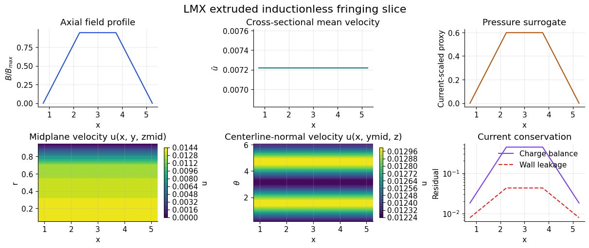

# Fringing-Field Research Slice

LMX now ships the first executable `extruded_inductionless` solver-family
front-end together with the retained 3D research slice that the next paper
phase can build on.

The intended model distinction is:

- `fully_developed_inductionless`
  - 2D cross-sectional solves for `u(y,z)` and `\phi(y,z)` with streamwise
    forcing and conservative transverse currents
- `extruded_inductionless`
  - 3D low-Re slices in `x-y-z` with `u(x,y,z)`, `v(x,y,z)`, `w(x,y,z)`,
    `p(x,y,z)`, and `\phi(x,y,z)` under a prescribed axial magnetic-field
    profile

That distinction matters physically. The 2D family is the right model for
fully developed benchmark ducts, while the 3D family is the right model once
axial field variation, inlet/outlet current closure, or fringing-region
pressure redistribution become important.

The current retained 3D slice includes:

- a smooth axial fringing-field profile generator in `lmx/fringing.py`
- a stationwise sweep driver that reuses the fully developed solver as a cheap
  research scaffold
- an `ExtrudedInductionlessProblem -> ExtrudedInductionlessSolution` workflow
  that now runs a true low-Re rectangular-duct, layered-duct, or mapped-pipe
  `u, v, w, p, phi` projection slice
- a stacked axial field-bundle builder that exposes `u(x, y, z)`,
  `v(x, y, z)`, `w(x, y, z)`, `p(x, y, z)`, `phi(x, y, z)`, current,
  Lorentz, axial-current, wall-current leakage, and charge-balance histories
- an explicit validation summary for that extruded slice
- a publication-style example in `examples/fringing_benchmark_demo.py`

This is explicit by design. The current slice is a real 3D
pressure-velocity-potential iteration and is now available through both Python
and TOML/CLI workflows, including direct `lmx run fringing_*` entry points for
quick rectangular, layered, and mapped-pipe launches. It is still a research
slice rather than the final
production family, but it is now a real executable part of LMX rather than a
Python-only staging path.

## Run the scaffold

```bash
lmx examples/fringing_rect_case.toml
lmx examples/fringing_layered_case.toml
lmx examples/fringing_pipe_case.toml
lmx run fringing_rect --ha 20 --nx-stations 21 --output out/fringing_rect
lmx run fringing_layered --ha 20 --nx-stations 21 --wall-cells 1 --insulator-cells 1 --output out/fringing_layered
lmx run fringing_pipe --ha 20 --radius 0.5 --nr 24 --ntheta 48 --output out/fringing_pipe
python examples/fringing_benchmark_demo.py \
  --output artifacts/examples/fringing_benchmark
python examples/fringing_benchmark_demo.py \
  --geometry-kind layered_duct \
  --output artifacts/examples/fringing_benchmark_layered
python examples/fringing_benchmark_demo.py \
  --geometry-kind pipe_ogrid \
  --output artifacts/examples/fringing_benchmark_pipe
```

The example writes:

- `fringing_benchmark_summary.json`
- `fringing_benchmark.png`
- `fringing_benchmark.pdf`
- an `extruded_bundle` section in the JSON summary with axial field-bundle shape
  and charge-balance histories
- a `validation` section with residual and field/response consistency metrics
- for TOML/CLI runs, `*_station_history.csv`, `*_extruded_results.npz`,
  `overview.png`, `overview.pdf`, and a JSON summary with conservation metrics

The shipped input files `examples/fringing_rect_case.toml`,
`examples/fringing_layered_case.toml`, and
`examples/fringing_pipe_case.toml` are now the recommended publication-scale
starting points for 3D fringing studies. They enable figure writing directly
through `[output].write_plots = true` and keep the full solver setup in the
input file rather than hiding it in Python glue.

Current publication-style artifact:



## Governing equations for the retained 3D slice

The current 3D slice is still incompressible and inductionless. It solves

$$
\nabla \cdot \mathbf{u} = 0
$$

$$
\rho \frac{\partial \mathbf{u}}{\partial t}
= -\nabla p + \mu \nabla^2 \mathbf{u} + \mathbf{J}\times\mathbf{B}
$$

$$
\mathbf{J} = \sigma\left(-\nabla \phi + \mathbf{u}\times\mathbf{B}\right)
$$

$$
\nabla\cdot\mathbf{J} = 0
$$

using a simple low-Re projection loop for the momentum-pressure part and a
Poisson-like solve for `\phi`. The current field is then audited through both
local and integral constraints.

For the mapped-pipe slice, the same equations are evaluated in the local
`(x,r,\theta)` frame, with the prescribed transverse magnetic field projected
onto local `r` and `\theta` directions before the electric and Lorentz terms
are assembled.

## Conservation gates

The fringing lane now treats charge conservation as a hard validation target,
not just a descriptive metric. Each retained extruded bundle now reports:

- `charge_balance_residual(x)`
  - a stationwise compatibility and `\nabla\cdot J` residual
- `axial_current(x)`
  - the integrated streamwise current crossing each `x = const` plane
- `wall_current_leakage(x)`
  - the integrated external-wall leakage current on the non-periodic radial or
    `y/z` boundaries
- `net_boundary_current_residual`
  - the full control-volume boundary-flux imbalance

These are the physically relevant hardening metrics for inlet/outlet treatment.
In a closed inductionless control volume, the integrated current must satisfy

$$
\int_{\partial \Omega} \mathbf{J}\cdot\mathbf{n}\, dS = 0,
$$

and the extruded validation lane now checks that condition directly instead of
relying only on local `\nabla\cdot J` norms.

For rectangular and layered extruded cases, the retained audit now assembles
that boundary-flux check from conservative face currents with closed-current
axial boundary treatment. This aligns the reported `div J` and boundary-current
metrics with the actual discrete operator used in the electric solve instead of
mixing a face-based solve with a cell-gradient diagnostic at conductivity
jumps.

The heavier validation driver
`scripts/run_manual_solver_family_validation.py` can now turn these metrics
into pass/fail gates with:

- `--max-charge-balance`
- `--max-interface-current`
- `--max-fringing-wall-current-leakage`
- `--max-fringing-boundary-current`
- `--fail-on-threshold`

Current retained hard-gate dataset:

- fully developed Hartmann / Shercliff / Hunt at `Ha = 10, 20`, resolution `10`
- fringing `rect_duct`, `layered_duct`, and `pipe_ogrid` at the same `Ha` values with
  `nx_stations = 5`
- hard thresholds:
  - `max_charge_balance <= 8e-1`
  - `max_interface_current <= 2.5e-1`
  - `max_fringing_wall_current_leakage <= 1e-1`
  - `max_fringing_boundary_current <= 1e-5`

That retained gate now passes for `rect_duct`, `layered_duct`, and
`pipe_ogrid`. The layered case joined the retained gate after the multi-region
electric subproblem was switched to a sparse direct solve of the conservative
variable-coefficient potential operator.

## What the example shows

- a smooth entrance/exit fringing profile along the duct axis
- the stationwise cross-sectional mean velocity response
- the stationwise current-scaled pressure surrogate
- contour views of the stacked velocity bundle in `x-y` and `x-z`
- the stationwise charge-balance residual along the fringing region
- the stationwise axial current and wall-current leakage, which are the key
  conservation diagnostics for inlet/outlet and external-wall hardening
- a first true 3D pressure field `p(x, y, z)` inside the research slice
- layered conducting/insulating wall fringing responses through the same API
- the first mapped-pipe fringing slice through the same public API

## Publication context

The duct benchmark ladder and fringing-region validation targets documented
here are aligned with the standard low-magnetic-Reynolds-number literature and
with fusion liquid-metal V&V practice:

- [Samper et al., verification and validation benchmark ladder for MHD codes](https://www.scipedia.com/wd/images/b/b8/Draft_Samper_360028846_6045_art042.pdf)
- [Hunt, *Magnetohydrodynamic flow in rectangular ducts*](https://doi.org/10.1017/S0022112065000344)
- [Recent low-Rm structured-grid duct validation study](https://doi.org/10.1016/j.fusengdes.2013.01.092)
- [Fringing-field rectangular-duct benchmark study](https://www.sciencedirect.com/science/article/abs/pii/S0920379611003188)

## Source map

- `lmx/fringing.py`
  - fringing-profile construction, stationwise sweep utilities, the extruded
    slice solver entry point, validation helpers, and stacked axial field bundles
- `examples/fringing_benchmark_demo.py`
  - user-facing fringing benchmark slice with publication-style plots
- `docs/benchmark_matrix.md`
  - benchmark targets that this scaffold is preparing
