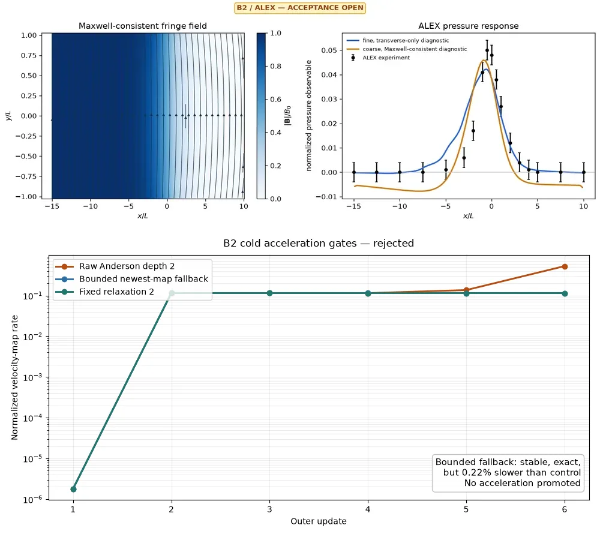

# Fringing-field workflows

LMX includes a research-stage 3D inductionless solver for liquid metal moving
through an imposed spatially varying magnetic field. It is suitable for bounded
laminar studies and method development; it is not yet a generally validated
production fringing-field solver.

## Start with a curated case

```bash
lmx examples/cases/fringing/fringing_rect_case.toml
lmx examples/cases/fringing/fringing_layered_case.toml
lmx examples/cases/fringing/fringing_pipe_case.toml
```

Or run the benchmark-oriented Python workflow:

```bash
python examples/fringing_benchmark_demo.py --help
```

The paired restart input is
`examples/cases/fringing/fringing_layered_restart_case.toml`; a minimal Python
restart workflow is `examples/extruded_restart_demo.py`.

## Model

For prescribed magnetic field `B(x)` and low magnetic Reynolds number,

```text
div(u) = 0
rho (du/dt + u.grad(u)) = -grad(p) + rho nu laplacian(u) + J x B
J = sigma (-grad(phi) + u x B)
div(J) = 0
```

The electric-potential solve enforces current continuity at each update. The
field is imposed and is not evolved. See [Theory](theory.md) for assumptions and
[Numerics](numerics.md) for discretization.

## Supported geometry and fields

- extruded rectangular and layered rectangular ducts;
- mapped pipe O-grid construction and preview;
- analytical axial fringe profiles;
- analytic full-volume fields with streamwise and transverse components;
- divergence-free cross-section fields;
- checked tabulated fields from NPZ data;
- restartable steady/transient outer iterations.

The tabulated example is:

```bash
lmx examples/cases/fringing/fringing_tabulated_case.toml
```

LMX validates coordinates, units, shape, finite values, interpolation bounds,
and field-quality metrics before a tabulated field reaches the solver.

For source-free fringe regions, use
`make_maxwell_consistent_fringe_field(...)` from `lmx.field_models` as a
`FringingProfile.volume_field`. Its complex-analytic tanh reconstruction is
JAX-differentiable and satisfies both `div(B) = 0` and `curl(B) = 0`; the
one-dimensional station scale remains the simpler transverse-only option.

## Diagnostics and acceptance


This internal solver-family check compares `Ha = 10/20` rectangular and
layered ducts at two small cross-section resolutions. It exposes charge,
current, velocity, and pressure changes; it is conservation/refinement
diagnosis, not ALEX or FreeMHD parity and not production convergence.

Every reported run should include:

- normalized `div(J)` and boundary-normal current;
- normalized `div(u)` and mass-flux mismatch;
- electric, pressure, and momentum solver convergence;
- pressure drop and flow-rate station histories;
- viscous, Lorentz, pressure, and Joule power terms;
- mesh, time-step, source, and restart fingerprints.

B2 stores each mixed-pressure PCG result as
`iteration_pressure_linear_history[step] = [residual, relative_residual,
iterations, converged, status]`. The values come from the existing SOLVAX
result, so recording them adds no solve or synchronization phase and only 40
uncompressed bytes per float64 update.

Schema 5 also stores `iteration_momentum_defect_history`: the post-map discrete
balance `L max|C-D-E-JxB-f+Gp|/(rho U0^2 N)`. Despite the historical field name,
this is a nonlinear physical residual evaluated on the raw mapped state—not the
exact predictor/projection fixed-point defect. It remains a validation diagnostic
and does not stop a run. B2 stopping uses the normalized velocity-map rate with
three sustained passes; pressure and potential updates remain diagnostics. The
metric is implemented, but no physical threshold is accepted yet.

Small conservation residuals establish internal consistency, not agreement with
an experiment. Experimental promotion additionally requires mesh/time
convergence and a frozen pressure observable from independent data.

## ALEX benchmarks

The retained specifications and references are:

| Case | Geometry | Reference | Status |
|---|---|---|---|
| B1 | conducting circular pipe | `alex-b1-pipe.csv` | pressure solver accepted; experimental observable open |
| B2 | conducting square duct | `alex-b2-square.csv` | research-stage; bounded 1/2-GPU calibration passes, steady scaling open |

Files live in `lmx/data/benchmarks/specs/` and
`lmx/data/benchmarks/references/`. Construction and
observable extraction are implemented in `lmx/benchmarks.py`.



The panel uses only frozen, checksummed evidence. Both LMX curves are
diagnostics; B2 experimental, three-mesh, and production-mesh matched-FreeMHD
acceptance remain open. The exact tiny matched smoke is complete.

B1 uses SOLVAX's exact cyclic azimuthal line solve and retained modal factors. A
one-cycle physical-convergence pilot now reduces the large solve-plus-restart
pressure ceiling from 768 to 669 Krylov iterations while preserving divergence,
fixed-flow, charge, and restart gates. Experimental pressure-observable and mesh
acceptance remain open.

The compatible retained-modal solver is the sole frozen B1 pressure path after
small factor parity, medium and large field/pressure-observable parity, and a
large solve/restart gate passed. No B1 environment switch is required.

B2 supports named axial sharding. The current canonical tiny path has equivalent
observables and exact restart on one, two, and four CPU devices. The
pre-schema-6 replacement passed exact 1/2-GPU repeat/restart, conservation,
placement, and equivalence gates. Current schema-6 topology, placement, and
exact serialized replay pass on one and two GPUs. The `128 x 67 x 67` pre-schema-6 calibration has low-variance warm medians of 2.780
and 2.400 seconds. Its 1.159x speedup misses the 1.2x promotion gate.
The doubled-axial `256 x 67 x 67` rung is stable but reaches only 1.125x, below
the promotion threshold. Production scaling remains open. A superseded
formulation's fixed-size timing improved from 36.96 s to 22.23 s; this is not a
current scaling claim. The fine-checkpoint transverse Galerkin
gate separately reduces electric iterations 5.18x and matched two-update time
1.87x with equivalent fields and residuals. The resulting fine baseline plus
doubled-iteration and wall confirmations pass; its tighter-tolerance variant
remains open. These are solver and numerical results, not experimental
validation.

The raw depth-two B2 Anderson path is not promoted: its six-update cold rate
ends 4.61 times above fixed relaxation two and its largest coefficient is
24.39. A separately predeclared newest-map fallback bounds all applied
coefficients and preserves linear, conservation, and exact-replay gates, but
ends 0.22% slower than the control. It is rejected without adding a SOLVAX or
LMX option. Zero of five adjacent residual pairs then passes the frozen
gain/stability/conditioning rationale gate; potential contributes
98.254--99.887% of the minimized energy. Shared-norm Anderson is therefore
closed as physically misaligned with velocity-map acceptance.
An exact velocity-block minimax check closes the broader bounded depth-two
affine family: the best possible predicted gains at updates three and four are
only 0.0377% and 0.213%, below the predeclared 15% per-pair gate regardless of
the residual metric. Fixed relaxation two remains the control; no new LMX or
SOLVAX accelerator API is justified by this trajectory.

The ALEX normalization and pressure-orientation audit passes: B2 compares the
side and top walls at the same axial station using the sourced 4.39 cm
half-width. Pressure-hole transfer remains open because the available reports
do not specify hole diameter, voltage samples, sign, raw/corrected status, or
instrument uncertainty. A bounded, checksummed B2 pilot
with the full Maxwell-consistent field improved peak-pressure underprediction
from 15.6% to 8.2%, but a far-field offset worsened the aggregate experimental
error. It therefore remains diagnostic pending production-mesh matched-field
FreeMHD and three-mesh evidence.

## Limitations

- laminar inductionless formulation only;
- no evolved magnetic field or full MHD induction;
- no validated turbulence, heat transfer, or free surface;
- mapped-pipe and fringe-pressure validation remains incomplete;
- only solver paths with explicit equivalence gates may use multiple devices.

Large field dumps and movies are release assets. Compact specifications,
references, and accepted summaries remain in Git.
