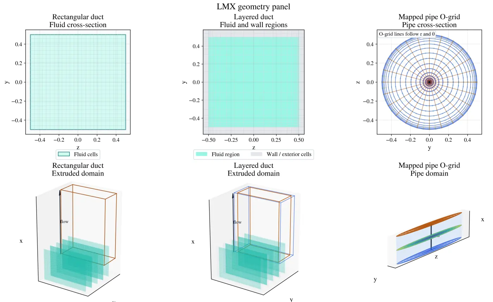
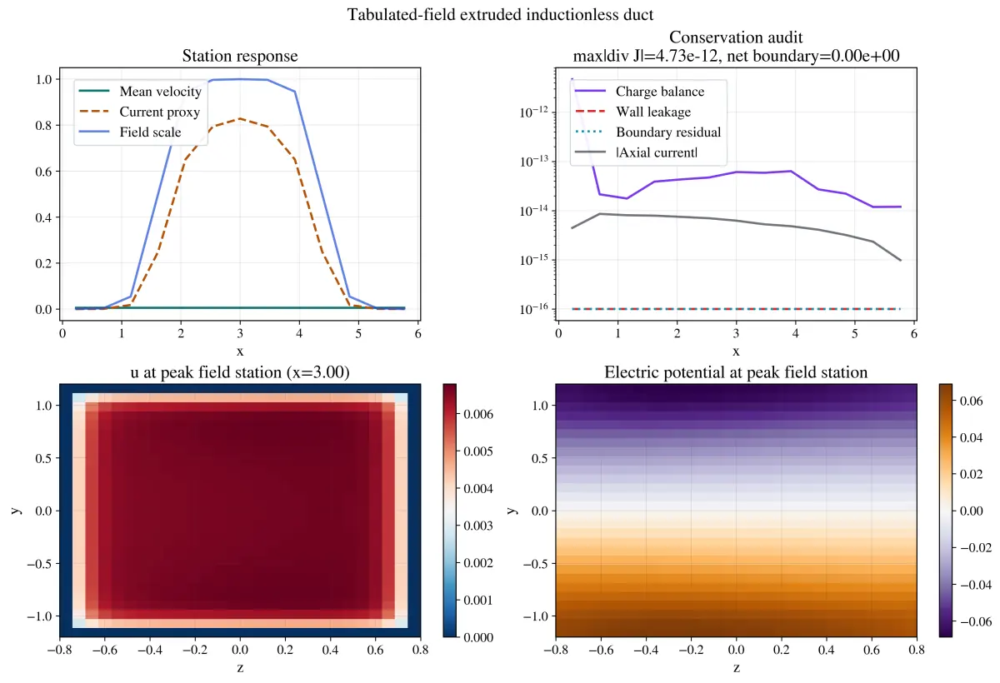
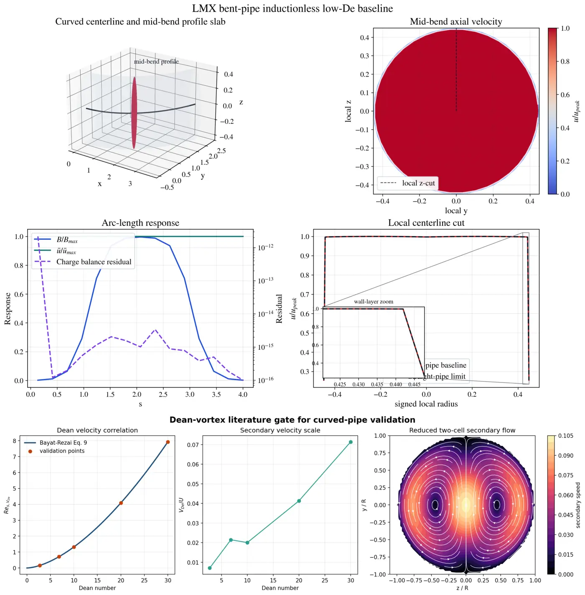
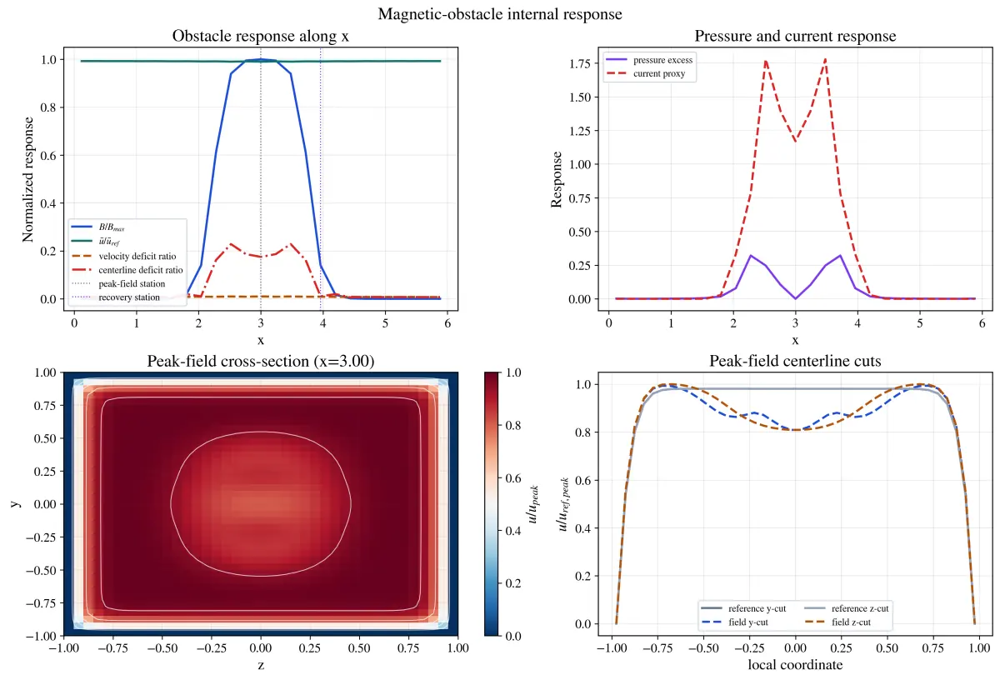

# Geometry and field workflows

LMX keeps geometry construction separate from physics and field sampling. A
case should be inspectable before an expensive solve begins.

<p align="center">
  
  
</p>

## Supported geometry

- structured rectangular ducts;
- nested layered rectangular walls;
- extruded axial domains;
- mapped pipe O-grids for research-stage fringing workflows.

Stable duct cases are easiest to create with `lmx.cases`:

```python
from lmx.cases import make_hunt_case
from lmx.solvers import solve_steady

case = make_hunt_case(ha=20.0, ny=64, nz=64)
solution = solve_steady(case)
```

TOML inputs under `examples/cases/` expose the same concepts without Python
boilerplate.

### Curved-pipe status



The mapped-pipe workflow currently provides a low-De inductionless baseline
with geometry, charge-balance, and straight-pipe-limit checks. The lower panel
records the Dean-vortex literature gate required before secondary-flow physics
can be promoted; it is not a claim that the current baseline resolves those
vortices.

## Imposed magnetic fields

`lmx.field_models` supports analytical, divergence-free, tabulated, and
externally sampled imposed fields. The compact custom-field workflow is:

```bash
python examples/variable_field_extruded_demo.py
```

Edit the field callable, duct geometry, axial envelope, and solver controls at
the top of the file; the complete `CaseSpec` and problem composition are shown.

Tabulated field input must provide monotone coordinates, component arrays with
matching shapes, explicit units, finite values, and adequate coverage of the
solver mesh. LMX reports reconstruction and divergence metrics before use.

## Geometry checks

Before solving, verify:

- positive cell volumes and valid coordinate orientation;
- expected fluid and wall masks;
- wall-layer thickness and conductivity ratios;
- cross-section and axial resolution of Hartmann, side, and fringe layers;
- magnetic-field coverage and divergence metrics;
- partition compatibility when sharding the axial direction.

Geometry plots are diagnostics, not substitutes for these numerical checks.

## Mesh guidance

Resolve the smallest physical layer with several cells and demonstrate that the
reported observable changes acceptably on refinement. Stretching may reduce
cost, but excessive ratios degrade operators and solver conditioning. A
publication result should report grid dimensions, minimum/maximum spacing,
stretching, field-transition resolution, and an observable-based refinement
study.

## Outputs

Plotting helpers live in `lmx.plotting`; solver fields and metadata are written
by `lmx.io`. Bounded examples write into ignored `artifacts/` directories.
Compressed showcase images and movies are embedded in their feature pages;
source media, raw meshes, and volume fields remain in versioned releases.

WHAM-specific blanket geometry and field adapters remain available through
`lmx.blanket_geometry`, `lmx.blanket_flow`, and `lmx.field_models`, but they are
research APIs rather than first-run examples. Their promotion requires an
independent geometry/field reference and a closed physics benchmark.


