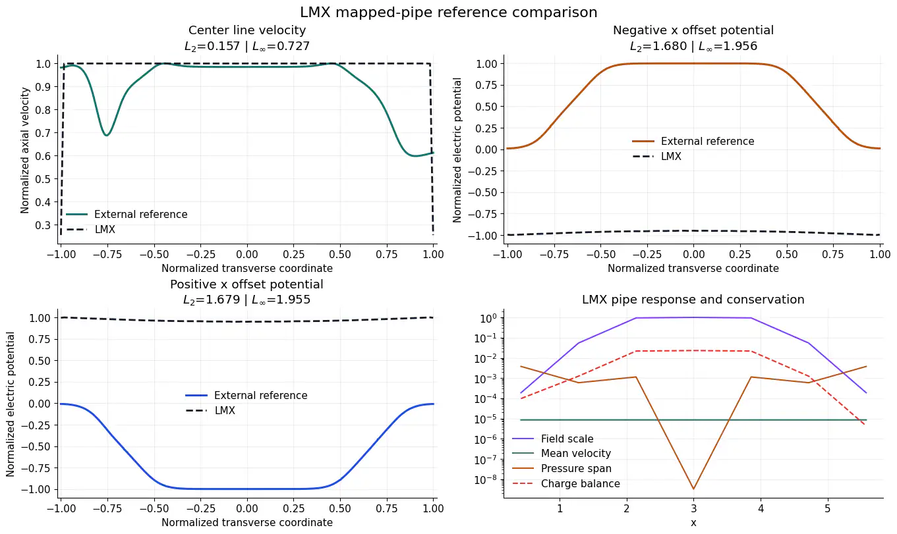

# Figures and movies

LMX keeps source, compact reference observables, tests, and a sub-megabyte web
media set in Git. Generated fields, meshes, full tables, and full-resolution
media are checksummed release assets. The package wheel contains no media.

## Selected results

## Movies

  

The Hunt poster links to a 130 KB H.264 movie derived from the original
10.6 MB GIF with the duration preserved (SHA-256
`6dfcb77f5c849b9a3858ce0b82df05bae1bf0294a4111abd32798696f0a4c073`).

Examples write new media beneath `artifacts/`. Before publication, compress
PNG files, encode movies for the web, create a poster image, and upload the
bundle to a versioned GitHub or Zenodo release. The release record must include
the generating commit, command, environment, input hashes, and output hashes.
Only add a docs-local derivative when it is required for anonymous access and
the complete web-media set remains within the architecture byte budget.
