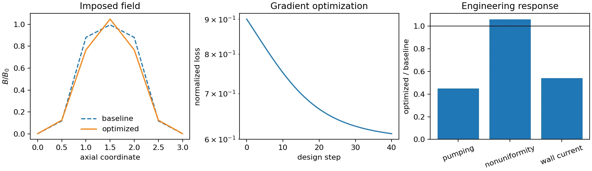

# Differentiate physical solves

LMX separates traced numerical fields from host-side validation, status, I/O,
and plotting. An accepted field core must carry continuous physical parameters
through the production discretization; mesh counts, iteration limits, and
output policies remain static controls. The accepted field cores are the
steady duct, finite 3-D rectangular/layered-duct, and transient Q2D models.

SOLVAX-backed linear systems use implicit differentiation: a VJP solves one
transposed system instead of recording PCG or GMRES iterations. A coupled
steady-flow interface is documented as end-to-end differentiable only when its
production field equations use that contract and pass independent gradient,
residual, runtime, and memory gates.

## Steady duct response

```python
import jax
import jax.numpy as jnp
import lmx

case = lmx.make_shercliff_case(ha=20, ny=48, nz=48)


def objective(forcing, field_scale):
    velocity, potential, jy, jz, lorentz = lmx.solve_fully_developed_fields(
        case,
        forcing=forcing,
        magnetic_field_scale=field_scale,
    )
    return jnp.mean(velocity) + 1e-3 * jnp.mean(jy**2 + jz**2)


value, gradient = jax.jit(jax.value_and_grad(objective, argnums=(0, 1)))(1.0, 1.0)
```

This path assembles the same mesh, material coefficients, potential equation,
momentum equation, no-slip interpolation, and current/Lorentz fields as
`solve`. The coupled affine state and its nested linear systems use implicit
SOLVAX derivatives, so iteration histories are absent from the reverse tape.
The current continuous inputs are pressure forcing and a scalar multiplier on
the imposed magnetic field. Rectangular Hartmann/Shercliff and layered Hunt
cases pass production-field and independent adjoint gates. Fixed-flow and 3-D
cases remain outside this API until their own gates pass.

## Three-dimensional fringe response

`evolve_extruded_fields` returns the production generic-duct velocity,
pressure, potential, current, and Lorentz-force fields after a static number of
steps. Pressure forcing, material conductivity, and either a scalar or one
coefficient per axial station for the imposed field are continuous. The
accompanying reducer keeps engineering objectives in the same traced program:

```python
import jax
import jax.numpy as jnp
from lmx.fringing import (
    build_layered_duct_extruded_problem,
    evolve_extruded_fields,
    extruded_engineering_objectives,
)

problem = build_layered_duct_extruded_problem(
    nx_stations=7, ny=6, nz=6, wall_cells=1
)


def objective(parameters):
    field_coefficients, material_scale = parameters[:-2], parameters[-2:]
    fields = evolve_extruded_fields(
        problem,
        magnetic_field_scale=field_coefficients,
        material_conductivity_scale=material_scale,
        steps=8,
    )
    metrics = extruded_engineering_objectives(problem, fields)
    return metrics["pumping_power"] + 0.1 * metrics["flow_nonuniformity"]


value, gradient = jax.jit(jax.value_and_grad(objective))(jnp.ones(9))

# Evaluate independent designs in bounded vectorized chunks.
designs = jnp.stack((jnp.ones(9), jnp.linspace(0.9, 1.1, 9)))
batched = jax.jit(
    lambda batch: jax.lax.map(jax.value_and_grad(objective), batch, batch_size=2)
)
values, gradients = batched(designs)
```

Electric closure uses an implicit SOLVAX VJP. The finite collocated projection
and outer recurrence use exact two-level checkpoint schedules with
`O(N/C + C)` retained states and square-root defaults. Tests require parity
with the ordinary production solve, independent finite differences, JVP/VJP
duality, and lower compiled reverse temporary memory than a full tape.
The material coefficients are ``(fluid, solid)`` multipliers, so a layered
case exposes wall conductance without rebuilding its mesh or region topology.
`jax.vmap` and bounded `jax.lax.map` compose directly, so LMX needs no ensemble
API. Choose the chunk size from measured accelerator memory; each row retains
its own exact production derivative.
Geometry, material layout, step count, and checkpoint width are static. Choose
the case timestep for the largest field and conductivity scales in the design
domain so every differentiated evaluation uses the same stable recurrence.
Specialized ALEX B2 and pipe paths fail closed until their coupled operators
have independent derivative gates. `extruded_engineering_objectives` also
reports signed pressure drop, outlet flow rate, wall-current-density RMS, and a
smooth recirculation fraction. Its wall-current quantity is a cell-centered
design proxy; use the conservative boundary-flux diagnostics for validation.

## Reproduce a bounded field and wall design

```console
python examples/variable_field_extruded_demo.py
```

The executable study uses seven axial field coefficients with an exactly fixed
mean and one wall-conductivity scale constrained to 0.5–1.5. Its normalized
loss balances pumping-power magnitude, outlet nonuniformity, wall-current RMS,
and a flow-preservation penalty. The example runs 40 compiled gradient steps
and independently checks every design derivative with centered differences.

On the portable 7×6×6 demonstration mesh, the loss falls from 0.900 to 0.611,
pumping-power magnitude falls by 55%, wall-current RMS falls by 46%, and flow
changes by 0.067%; outlet nonuniformity rises by about 6%, making the tradeoff
visible rather than hiding it in the aggregate loss. This is workflow and
derivative evidence, not a resolution-independent blanket optimum. A physical
claim requires mesh refinement, uncertainty bands, production GPU evidence,
and independent B1/B2 validation.



## Transient Q2D response

For a time-dependent field objective, call the field-only core:

```python
import jax.numpy as jnp
import lmx

case = lmx.make_q2d_case(shape=(32, 32), steps=80)


def objective(parameters):
    viscosity, friction = parameters
    vorticity, _, _ = lmx.evolve_q2d(
        case.initial_vorticity,
        viscosity=viscosity,
        hartmann_friction=friction,
        dt=case.dt,
        steps=case.steps,
    )
    return jnp.mean(vorticity**2)


value, gradient = jax.value_and_grad(objective)(
    jnp.asarray([case.viscosity, case.hartmann_friction])
)
```

This derivative is exact for the finite dealiased IFRK4 evolution. Its default
SOLVAX checkpoint schedule stores `O(sqrt(steps))` trajectory states instead of
the full tape. The analytical decay, JVP/VJP identity, and compiled reverse
memory tests in `tests/test_physics.py` are the executable acceptance contract.

The explicit field-level optimization surfaces are
`solve_fully_developed_fields`, `evolve_extruded_fields`, and `evolve_q2d`.
Other result objects are host orchestration unless their API reference
explicitly identifies a traced field core and derivative evidence.
