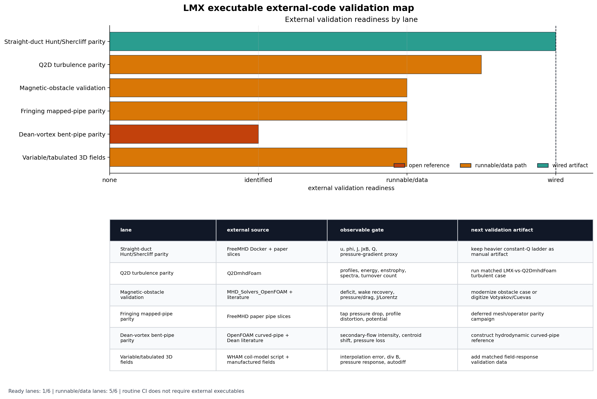
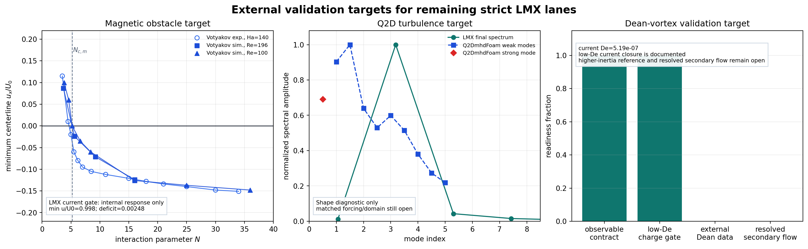
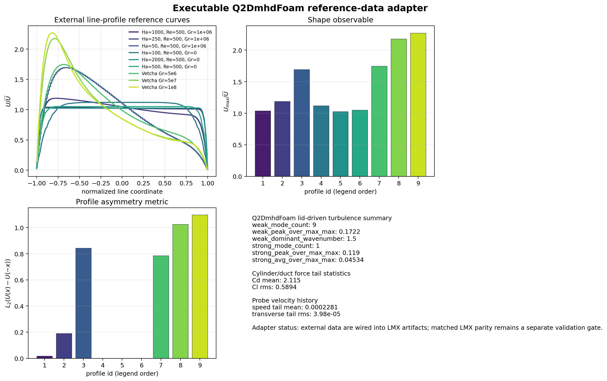
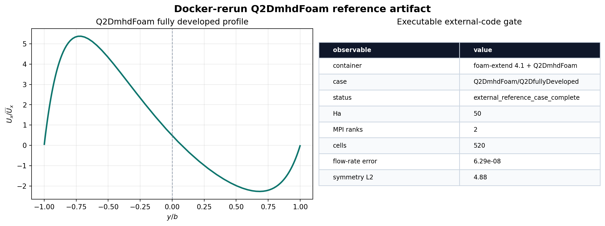
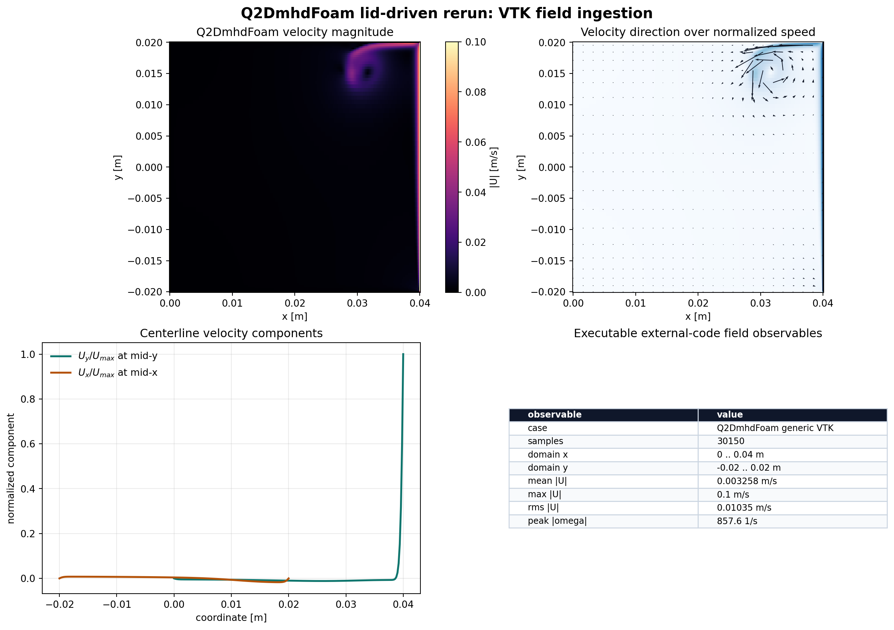
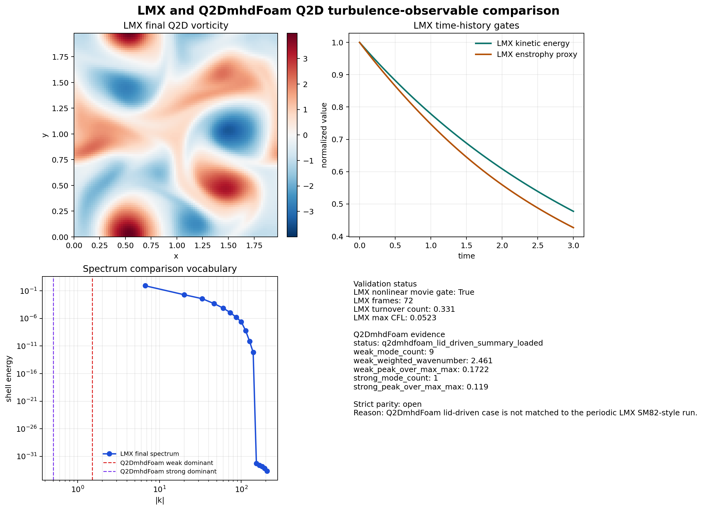
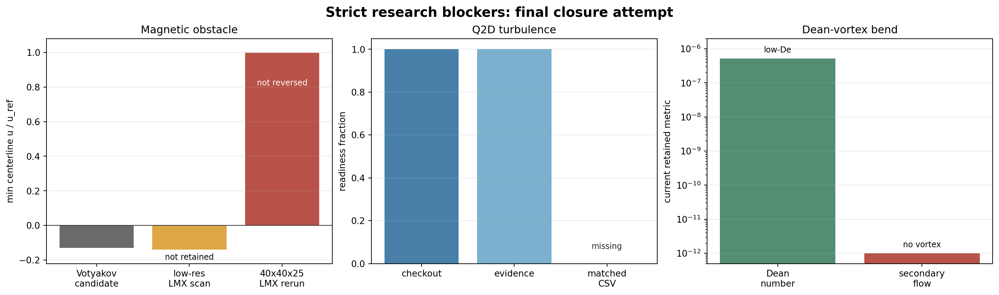
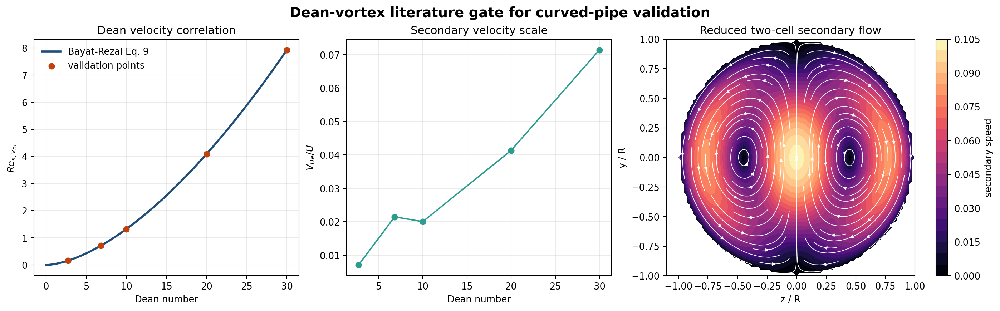

# Validation Report

## Validation tiers

LMX uses a layered validation strategy.

### Tier 1: analytical and semi-analytical benchmarks

- Hartmann
- Shercliff
- Hunt

Primary observables:

- velocity profiles
- electric-potential profiles
- current-density profiles
- integral flow-rate and pressure-gradient surrogates

### Tier 2: convergence and conservation

- mesh refinement
- time-step refinement
- linear residual histories
- current-divergence and interface-current residuals

### Tier 3: external reference-output comparisons

External executable results can be compared through exported fields, slices,
and profile files. These are benchmark cross-checks, not the definition of the
governing model.

## Current acceptance focus

The `1.0` release is aiming for:

- stable Hartmann analytical acceptance across representative meshes
- stable Shercliff analytical acceptance across representative meshes
- Hunt validation that is judged from literature-matched wall modeling,
  profile errors, and integral observables, not from ad hoc scalar trace tuning
- low-De bent-pipe current closure that is locally conservative, not only
  globally balanced

The latest closure details are collected in [](closure_notes.md). That page is
the audit trail for the two recent blockers: Hunt `Ha = 100` side-layer
agreement and bent-pipe local `div J`.

## Recently Closed Release Lanes

| Lane | Closure evidence |
| --- | --- |
| Hunt `Ha = 100` side-layer | Thin-wall reference model `t_w=0.001`, `sigma_w/sigma=5`, `c=0.05`; retained `z_l2 = 2.89e-3` |
| Bent-pipe low-De charge closure | Conservative mapped-pipe potential sign fixed; retained `max_charge_balance_residual = 2.16e-12` |
| Reader-facing straight-duct profiles | Hartmann, Shercliff, and Hunt retained cuts below `L2 <= 1.2e-2` |
| Bounded release readiness | `scripts/run_release_readiness.py` reports no hard blockers |

The strict research-grade deferred lanes remain matched external Q2D
turbulence parity, external magnetic-obstacle reference data, and
higher-inertia Dean-vortex bent-pipe validation. The Q2D lane now has an
executable Q2DmhdFoam/Vetcha ingestion artifact; it is still not a matched LMX
turbulence parity claim.

The closure criteria and execution order for those three lanes are now tracked
in [](research_grade_closure_plan.md). That page defines the external-reference
provenance, physics gates, convergence checks, publication artifacts, and
strict release-readiness conditions needed before any lane can be marked
research-grade closed.

The executable external-code audit now has a generated map that separates
available solver/data paths from completed observable-level parity:



The current target-acquisition panel records candidate observables for the
remaining strict lanes. It is evidence for the next validation runs, not a
replacement for matched reference CSVs:





The Q2DmhdFoam executable path is now reproducible through
`docker/q2dmhdfoam`. The container builds the foam-extend 4.1 solver, runs the
fully developed reference case with MPI, exports VTK fields, and writes the
profile/summary artifact shown below. This closes the external-code rerun
plumbing; it remains separate from the stricter matched turbulent parity gate.



The same container can run non-default Q2DmhdFoam cases through
`CASE_RELATIVE_PATH`. The lid-driven smoke below was rerun from the pinned
Q2DmhdFoam checkout, exported through `foamToVTK`, parsed without a VTK
dependency, and reduced to field observables. This is executable external-code
evidence and a post-processing gate; it is not yet a matched LMX turbulence
parity claim.



The current LMX/Q2DmhdFoam Q2D comparison artifact overlays the LMX nonlinear
SM82-style movie observables with the available Q2DmhdFoam lid-driven spectral
summary. It is useful for manuscript planning and parser testing, but its
summary records `matched_parity = false` because the physical cases are not
identical.



The latest strict closure attempt keeps the research-grade tag blocked. The
magnetic-obstacle escalation did not retain a Votyakov-scale reverse-flow
signal on the current grid, the available Q2DmhdFoam outputs are not matched to
the LMX turbulence case, and the current bent-pipe example remains a low-De
current-closure baseline rather than a Dean-vortex validation:



Two blocker-support artifacts were added after that audit. The Q2DmhdFoam
adapter now ingests saved force coefficients and probe histories in addition to
profile and spectral summaries, and the Dean-flow literature gate records the
Bayat-Rezai correlation plus a reduced two-cell secondary-flow field. These
artifacts strengthen the external-data and model-reference side of the open
lanes; they do not change the strict closure status until matched LMX solved
physics is compared against the references.



## Combined validation workflow

The top-level executable validation driver is:

```bash
python scripts/run_full_validation_exercise.py \
  --output artifacts/validation/full_validation_exercise \
  --ha-values 10,20 \
  --resolution 12 \
  --fringing-resolutions 8,12 \
  --skip-paraview \
  --write-plot
```

This combines Benchmark A artifact generation with Benchmark B fringing gate
checks and writes JSON, CSV, and Markdown summaries for the current thresholds.

## Runtime diagnostics now exposed

The default solver writes or reports:

- `linear_residual_history`
- `linear_iterations_history`
- `volumetric_flow_rate_history`
- `mean_current_magnitude_history`
- `lorentz_power_history`
- `div_current_max_history`
- `charge_balance_residual_history`
- `gauge_residual_history`
- `interface_current_residual_history`

These quantities are available through the solver log, JSON summaries, and NPZ
state bundles.

## External benchmark policy

Comparisons against external executables should use:

- matched field slices
- matched line cuts
- current-density and Lorentz-force observables
- flow-rate and pressure-drop surrogates

They should avoid relying on backend-specific pressure-correction traces as the
primary acceptance signal for the reduced fully developed solver.
