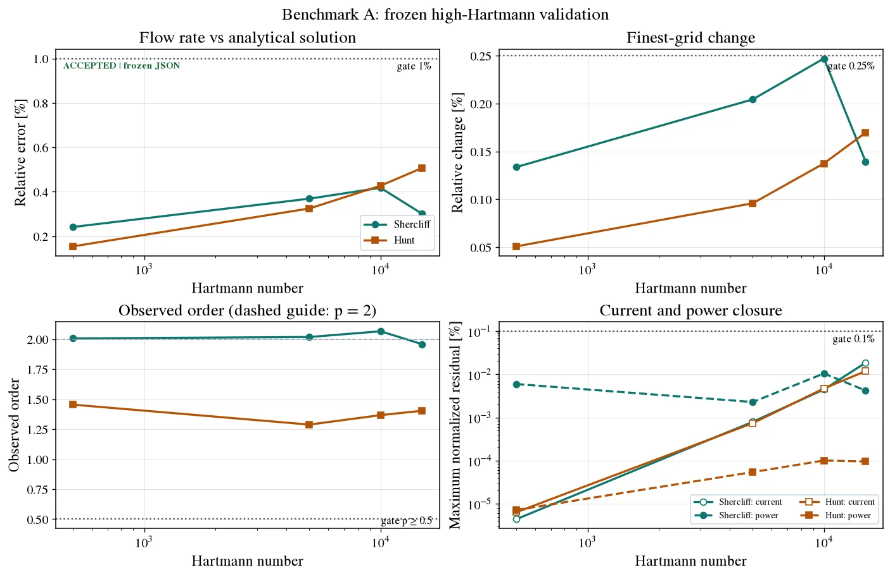
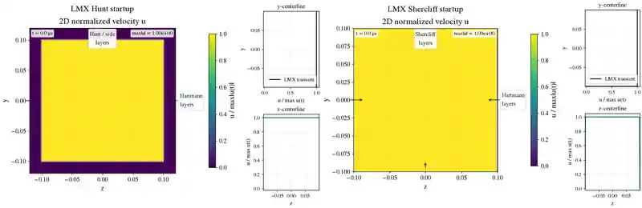

# Validation report

This page summarizes current claims. Machine-readable records in `benchmarks/`
are authoritative when prose and results differ.

<p align="center">
  
</p>
<p align="center">
  
</p>

The composite combines the released Ha=20/100 analytical validation ladder
with accepted `85 x 63` FreeMHD observables from
`benchmarks/results/benchmark-a-acceptance.json`; no solver was rerun.

<p align="center">
  
</p>

The accepted Benchmark A composite reads the frozen eight-row Samper Table I
aggregate only. It shows the analytical-flow, refinement, observed-order,
current-closure, and power-closure gates; no solver was rerun for presentation.

<p align="center">
  
</p>

## Accepted

- Hartmann, Shercliff, and Hunt fully developed inductionless duct cases have
  analytical profile, mesh-convergence, current-closure, and power-balance
  tests.
- All eight frozen Samper Table I Shercliff/Hunt rows at
  `Ha = 500, 5000, 10000, 15000` pass.
- Audited `85 x 63` FreeMHD closed-channel Shercliff and Hunt observables pass
  the 1% finite-grid gate.
- SOLVAX integration, including symmetric additive-line composition,
  passes primal, implicit-gradient, independent transpose, CPU/GPU, and bounded
  end-to-end gates.
- The portable package gate passes 865 tests with 8 expected external-data
  skips and 95.39% combined line/branch coverage in 125.8 seconds on the
  reference Mac.
- The B2 projection now preserves predictor cells and reconstructs only its
  pressure correction. The corrected warm 64x/32x/16x map-rate ladder spans
  0.0768% against the 0.5% gate, raw updates halve, restart is exact, and the
  current native FreeMHD smoke passes. The 64x cap is refrozen; its versioned
  normalized metric is implemented, but `0.05` fails all three outcome limits
  and `0.005` does not cross by step 96. No threshold is accepted. A post-map nonlinear physical
  momentum residual replays exactly and decreases from 0.976 to 0.310, but it
  is not the split fixed-point defect and does not stop the solve. The normalized
  map-rate threshold and ALEX pressure-hole metadata remain open.

## Research-stage

- ALEX B1 conducting-pipe fringing flow: conservation, restart, and bounded
  large-grid pressure convergence pass; experimental pressure agreement and
  the final mesh/observable acceptance record remain open.
- ALEX B2 square-duct fringing flow: the earlier no-inertia, stationwise-flow
  formulation has conservation, two-GPU numerical equivalence, a 1.87x
  fine-checkpoint solver promotion, and fine numerical gates. These are
  diagnostics, not validation of the canonical finite-inertia formulation.
  That formulation and its independently observed LMX/FreeMHD tiny inputs are
  implemented. Its exact two-update LMX/FreeMHD harness passes every frozen
  smoke gate, and its current production path has exact restart plus equivalent
  observables on 1/2/4 CPU devices. The prior 1/2 deterministic-GPU ladder
  predates the terminal-restart fix. The replacement pre-schema-6 ladder passed
  exact repeat/restart and 1/2-GPU equivalence. Current schema-6 topology and
  exact serialized replay pass on one and two GPUs. The `128 x 67 x 67`
  pre-schema-6 calibration has
  equivalent observables and exact state/flux replay. A trace-authorized
  validation fusion raises its low-variance speedup to 1.159x, still below the
  promotion gate. A historical doubled-axial rung
  reaches only 1.125x, below the scaling-promotion threshold. A three-update
  trajectory preserves all primary fields exactly. This is not production
  parity or steady scaling. The current schema-6 depth-two Anderson path also
  fails its six-update cold outcome gate (`0.5281` versus `0.1145` fixed-control
  map rate; `max|weight|=24.39`), despite exact replay and green linear and
  conservation gates. Its predeclared bounded newest-map fallback is stable
  but ends 0.22% worse than the control, so that API is also rejected. Step 29
  is therefore blocked. The residual audit closes further shared-norm tuning:
  zero of five pairs passes its rationale gate and potential owns at least
  98.254% of the norm despite velocity-based acceptance. The first fresh current-formulation coarse
  trajectory and one exact continuation pass conservation and all 256 pressure
  solves, but stop at step 256 with residual `7.1081e-4`, above both its
  precommitted continuation gate and the `5e-5` steady criterion. It is not
  promoted, and more stepping, larger, or independence runs remain blocked.
  The legacy fine pressure curve misses every frozen ALEX
  literature-error limit. A checksummed
  Maxwell-consistent coarse-field diagnostic improves peak underprediction from
  15.6% to 8.2% but worsens the plateau-sensitive aggregate error, so it is not
  validation evidence; production-mesh matched-field FreeMHD and three-mesh
  gates remain required.
- Q2D turbulence, magnetic-obstacle, mapped blanket, and Dean-vortex workflows
  provide model or adapter checks but do not yet support quantitative claims.

## Not implemented or claimed

- full magnetic induction;
- validated 3D turbulence;
- coupled heat transfer and buoyancy;
- free surfaces;
- complete FreeMHD feature parity.

## Evidence hierarchy

1. Analytical/manufactured solutions verify equations and operators.
2. Mesh/time convergence and conservation quantify numerical error.
3. Independent-code comparison detects implementation disagreement.
4. Experimental comparison assesses model validity.

Each level answers a different question. Agreement with one code cannot replace
convergence or experimental validation.

## Reproduce

Portable source gate:

```bash
.venv/bin/python scripts/run_full_test_suite.py
```

Benchmark A aggregate:

```bash
python scripts/run_samper_table_i.py
python scripts/run_samper_table_i.py \
  --freeze-summary artifacts/samper/table-i-summary.json \
  --output benchmarks/results/samper-table-i-accepted.json
python scripts/build_benchmark_a_acceptance.py
```

External and accelerator runs are explicit because they require separately
installed software, reference data, or hardware. See [External benchmarks](external_benchmarks.md),
[Performance](performance.md), and the [Benchmark matrix](benchmark_matrix.md).
